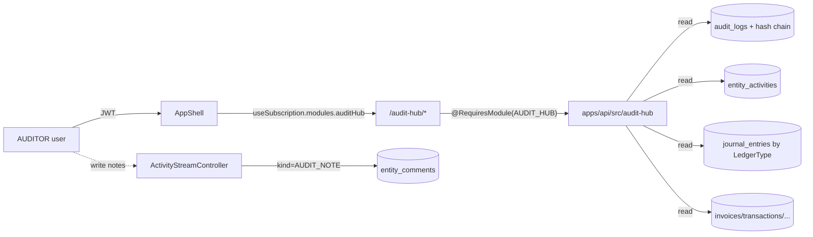

# Audit Hub — план реализации

## 1. Концепция и модель доступа

- Отдельный платный модуль (entitlement `audit_hub` в `ModuleEntitlement`), активируется на `OrganizationSubscription.activeModules`. Оплачивает организация.
- Доступ: пользователь с ролью `AUDITOR` (внутреннее приглашение через существующий flow); опционально OWNER/ADMIN/ACCOUNTANT тоже видят раздел для self-audit.
- Аудитор остаётся read-only глобально; единственное расширение прав — писать audit notes через существующий `EntityComment` (исключение в `AuditorMutationGuard`).



## 2. Биллинг и subscription gating

- В `apps/api/src/subscription/subscription.constants.ts` добавить `AUDIT_HUB = "audit_hub"` к `ModuleEntitlement`; не включать в `DEFAULT_NEW_ORGANIZATION_ACTIVE_MODULES` (платная фича).
- В `Pricing` через сидер `packages/database/prisma/seed*` или admin catalog (`apps/api/src/admin/admin-catalog.service.ts`) добавить позицию `kind=MODULE`, ключ `audit_hub`, AZN-цена (значение уточнит [Product Owner]).
- На фронте: расширить `SubscriptionSnapshot.modules` (`apps/web/lib/subscription-context.tsx`) флагом `auditHub`; пробросить в `MainSidebar` для замка/тултипа.
- На API: все контроллеры модуля помечаем `@RequiresModule(ModuleEntitlement.AUDIT_HUB)`; `ENTERPRISE` tier уже даёт доступ без явного списка через `SubscriptionAccessService.hasModule`.

## 3. Бэкенд — новый модуль `apps/api/src/audit-hub/`

Структура:

```
apps/api/src/audit-hub/
  audit-hub.module.ts
  audit-hub.controller.ts            # фасад /api/audit-hub/*
  audit-timeline.service.ts          # объединённый timeline по entity
  audit-sampling.service.ts          # random / materiality sampling
  backdating.service.ts              # documentDate vs createdAt
  nas-ifrs-reconciliation.service.ts # diff NAS vs IFRS (Phase 2)
  audit-bulk-export.service.ts       # ZIP вложений по выборке
  risk-dashboard.service.ts          # аномалии (Phase 2)
  calculation-rationale.service.ts   # explain auto-postings (Phase 2)
  dto/
    list-timeline.dto.ts
    create-sampling.dto.ts
    backdating-report.dto.ts
    nas-ifrs-diff.dto.ts
    bulk-export.dto.ts
```

Эндпоинты (все за `@RequiresModule(AUDIT_HUB)` + `@Roles(AUDITOR, OWNER, ADMIN, ACCOUNTANT)`):

- `GET /api/audit-hub/timeline?entityType=&entityId=` — мердж `AuditLog` (по `entityType/entityId`) и `EntityActivity` в единый стрим с пагинацией и фильтрами по `userId`, `action`, `from`/`to`.
- `GET /api/audit-hub/backdating?from=&to=&entityType=&thresholdDays=` — список документов, где разрыв между `documentDate`/`Transaction.date`/`Invoice.issueDate` и `createdAt` превышает порог.
- `POST /api/audit-hub/sampling` — генерирует выборку: `{ scope, period, mode: "random"|"materiality", percent?, thresholdAmount?, currency? }`. Возвращает sample-id + ссылки на документы (без копии данных; список идемпотентен через seed).
- `GET /api/audit-hub/sampling/:id` — детализация сохранённой выборки.
- `POST /api/audit-hub/bulk-export` (sample-id или фильтр) → стрим `application/zip` через `archiver`; вложения тянем из `apps/api/src/storage/` по известным ключам (`CustomsDeclaration.attachmentKey`, OCR `fileKey`, инвойсные PDF и т.д.).
- `GET /api/audit-hub/reconciliation/nas-ifrs?from=&to=` — Phase 2; группируем `JournalEntry` по бизнес-операции и находим записи, где `LedgerType=NAS` есть, а `IFRS` нет (и наоборот), и vice versa по `AccountMapping`.
- `GET /api/audit-hub/risk` — Phase 2; набор детекторов: duplicate payments (одинаковая сумма + счёт + контрагент в окне), z-score аномалий по контрагенту, всплески расходов по статье.
- `GET /api/audit-hub/calculation/:type/:id` — Phase 2; справки-расчёты для FX (snapshot курса ЦБ AR, формула), депреcации ОС, payroll-выплат.

Multi-tenancy: все запросы проходят через `PrismaService` с tenant-extension; фильтр `organizationId` явно ставим в `where` для каждой выборки (TZ §16).

## 4. Audit Notes — расширение `EntityComment`

- Prisma миграция: в `EntityComment` добавить `kind EntityCommentKind @default(NORMAL)` и enum `EntityCommentKind { NORMAL, AUDIT_NOTE }`; индекс `@@index([organizationId, kind, createdAt])`. Файл: `packages/database/prisma/schema.prisma` (модель `EntityComment` ~1441–1488). Миграция через `npm run db:migrate:dev --name add_entity_comment_kind`.
- `apps/api/src/activity-stream/activity-stream.controller.ts`: добавить `UserRole.AUDITOR` в `@Roles(...)` на POST/PATCH/DELETE комментариев; в DTO принять `kind?: "AUDIT_NOTE"` (для AUDITOR форсим `AUDIT_NOTE` на сервисе).
- `apps/api/src/auth/guards/auditor-mutation.guard.ts`: добавить whitelist по regex `^\/api\/activity\/[^/]+\/[^/]+\/comments(\/[^/]+)?$` — POST/PATCH/DELETE разрешены для AUDITOR, только если в payload `kind=AUDIT_NOTE`. Цитата места правки:

```7:60:apps/api/src/auth/guards/auditor-mutation.guard.ts
// ... добавить whitelist для audit notes
```

- UI: в `EntityActivityFeed` (компонент комментариев документа) — бейдж «Audit Note» и фильтр «Только audit notes» когда модуль активен. Notes счётчиком отображаются на главной Audit Hub.

## 5. Web — `apps/web/app/audit-hub/`

Маршруты внутри существующей оболочки `AppShell`:

- `apps/web/app/audit-hub/page.tsx` — дашборд: KPI (mutations за период, open audit notes, backdated docs, risk score), быстрые ссылки.
- `apps/web/app/audit-hub/timeline/page.tsx` — глобальный лог + per-entity (модалка/drawer).
- `apps/web/app/audit-hub/sampling/page.tsx` — конструктор выборки, история выборок.
- `apps/web/app/audit-hub/backdating/page.tsx` — таблица «задних чисел» с экспортом.
- `apps/web/app/audit-hub/bulk-export/page.tsx` — выбор выборки/фильтра → скачивание ZIP.
- `apps/web/app/audit-hub/reconciliation/page.tsx` — Phase 2.
- `apps/web/app/audit-hub/risk/page.tsx` — Phase 2.

Навигация:

- В `apps/web/components/layout/Sidebar.tsx` добавить секцию «Аудит» с пунктом «Audit Hub» (`href="/audit-hub"`), видимым для ролей `AUDITOR/OWNER/ADMIN/ACCOUNTANT`, с замком, если `subscription.modules.auditHub === false`.
- Дизайн: следовать `DESIGN.md` и `erafinance-ui-design.mdc` (палитра/радиусы/типографика, без эмодзи).

## 6. i18n

В `apps/web/lib/i18n/resources.ts` добавить ветку `auditHub.*` (`nav`, `timeline`, `sampling`, `backdating`, `bulkExport`, `notes`, `errors`) с переводами `ru` и `az` (иначе сборка падает на `npm run i18n:audit`). После — `npm run i18n:catalog` и коммит обновлённого `apps/api/src/admin/i18n-default-catalog-data.json`; для прода/локалки — `npm run db:sync-i18n`.

## 7. Безопасность и compliance

- Все мутации модуля (создание sample, экспорт) проходят `AuditMutationInterceptor` (без новых исключений).
- DTO с `class-validator`, glob-валидация уже в `main.ts` (`whitelist`, `forbidNonWhitelisted`).
- `bulk-export`: rate-limit (per-org), ограничение размера/числа файлов; ключи доступа берём через существующий `StorageService` (S3 presigned не отдаём наружу).
- Sampling сохраняется в таблицу `AuditSample` (новая Prisma-модель: `id`, `organizationId`, `createdById`, `scope`, `mode`, `params JSONB`, `documentRefs JSONB`, `seed`, `createdAt`) для воспроизводимости выборки.
- Все запросы — с явным `organizationId` (TZ §2, §16); BullMQ не задействуем в MVP.

## 8. Документация

- В `PRD.md`: новый раздел «§4.10 Audit Hub» (модули 1–9 → 1–10 либо как 9.x), правки §7 (платный модуль, цена), §8 (модель `AuditSample`).
- В `TZ.md`: §9.x «Audit Hub API», §14 (subscription: добавление `AUDIT_HUB`), §16 (multi-tenancy для новых таблиц/эндпоинтов).
- В `.cursor/rules/erafinance-module-map.mdc`: строка «Рабочее место аудитора (`audit-hub`) | `audit-hub/` | `audit-hub/` | платный модуль».

## 9. Фазирование

- Фаза 1 (MVP, один PR): entitlement + module skeleton + timeline + audit notes (kind + guard) + backdating + sampling + bulk export + UI дашборд + i18n + PRD/TZ.
- Фаза 2: NAS/IFRS reconciliation, risk dashboard, calculation rationale, history of audit engagements.
- Фаза 3 (опционально): внешний аудитор (cross-org engagement) — детализация и юридический контур в том же треке, что и Фаза 2.

## 10. Чеклист Фазы 2 + Фазы 3 (актуальный)

В этом файле остаётся продуктовое описание и фазирование «высоким уровнем». **Пошаговый чеклист** (Фаза 2 и Фаза 3 в одном документе, с отметками `[x]` / `[~]` / `[ ]` и подзадачами) ведём здесь:

**[`audit_hub_phase2_3_unified.plan.md`](./audit_hub_phase2_3_unified.plan.md)**

Там же зафиксированы решения стейкхолдеров (сроки P3, биллинг, `AUDIT_NOTE` для внешнего аудитора, флаг NAS/IFRS v2).
