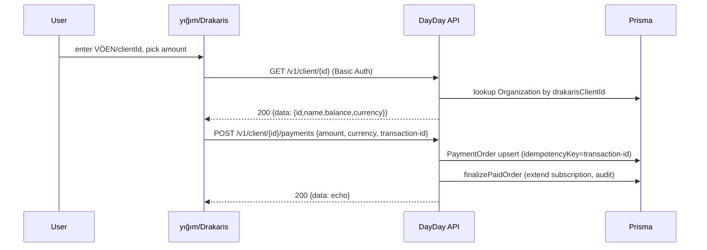

## Контекст и принятые решения

- **Drakaris/yığım = второй провайдер оплаты подписки.** Расширяем `PaymentOrder.provider` слогом `"drakaris"`, повторяем структуру `PashaBankPaymentProvider`, регистрируем slug в webhook. Семантика по spec: yığım — внешний агрегатор, который **вызывает наш API** (Basic Auth), сам спрашивает клиента и инициирует пополнение; мы у себя удерживаем статусы spec (200/401/402/404/405/406/407/408) — они блокируют ошибки на стороне yığım, поэтому мы реализуем их как ответы нашего REST-эндпоинта, а не как обработку чужих кодов.
- **Амортизация:** в `apps/api/src/fixed-assets/depreciation.service.ts` уже есть полная линейная логика (`(purchasePrice − salvage) / usefulLifeMonths`, проводка **Дт 713 / Кт 112** через `accounting.postJournalInTransaction`, идемпотентность по `FixedAssetDepreciationMonth`, `prisma.$transaction`). Добавляем только BullMQ ежемесячный воркер; **`AmortizationService` не создаём**.
- **Профиль:** только `az` и `ru` (соответствует `TZ.md` и i18n-бандлу). EN откладывается. PII имени остаётся в `firstNameCipher` / `lastNameCipher` через `encryptText`/`decryptText`.

## Mermaid: поток Drakaris/yığım

---

## Task 1 — Drakaris (yığım) provider

### Prisma / схема
- В `packages/database/prisma/schema.prisma` модель `PaymentOrder.provider` уже **строка** (default `"pasha_bank"`) — миграция **не нужна**.
- На `Organization` добавить опциональное поле для идентификатора клиента yığım (если ещё нет): `drakarisClientId String? @unique`. Миграция: `add_organization_drakaris_client_id`. По нему резолвится клиент в `GET /v1/client/{id}` (значение можно проинициировать как `Organization.id` или VÖEN — решим в реализации, но колонка нужна, чтобы развязать публичный id от UUID).

### API: модуль и файлы
Папка `apps/api/src/integrations/payment-providers/drakaris/`:

- `drakaris.module.ts` — Nest-модуль (импортируется в `app.module.ts`); реэкспорт `DrakarisPaymentProvider` для `BillingModule`.
- `drakaris-basic-auth.guard.ts` — `Guard`, читает `Authorization: Basic <base64>`, сверяет `timingSafeEqual` с `DRAKARIS_BASIC_USER`/`DRAKARIS_BASIC_PASS` из `ConfigService`. На неуспех — статус по spec (`401`).
- `drakaris.controller.ts` — `@Controller('integrations/drakaris/v1')`, `@Public()` + `DrakarisBasicAuthGuard`, `@Throttle`:
  - `GET 'client/:id'` → `DrakarisService.checkClient`
  - `POST 'client/:id/payments'` → `DrakarisService.topUpBalance`
  - Возвращает строго формат `{status, description, data}` (см. spec, страницы 1–3 PDF).
- `drakaris.service.ts` — внутренние хэндлеры:
  - `checkClient(externalId)`: ищет `Organization` по `drakarisClientId`; если нет — `401`; если yığım глобально выключен (`DRAKARIS_ENABLED !== "1"`) — `402`; если у организации не куплен модуль yığım — `404`; иначе возвращает маскированное имя владельца (по `firstNameCipher`+`lastNameCipher` через `decryptText`) и текущий «баланс» (например, `0` для prepaid-модели или сумма ожидающих `PaymentOrder`).
  - `topUpBalance({externalId, amountCoins, currency, transactionId})`: проверяет `currency === "AZN"` (`407`); валидирует входы (`408`); upsert по `idempotencyKey = transactionId` (`406` если уже есть). Создаёт `PaymentOrder { provider: "drakaris", providerTxnId: transactionId, idempotencyKey: transactionId, amountAzn: amountCoins/100, monthsApplied: <посчитан из тарифа> }` и далее вызывает приватный аналог `PaymentProviderService.finalizePaidOrder` (выносим в публичный `finalizePaidOrderInTx(tx, orderId)` или вызываем существующий метод). Любая внутренняя ошибка → `405`.
- `drakaris-status.ts` — enum/константа кодов из spec (`200/401/402/404/405/406/407/408`) и helper `respondWithDrakarisStatus(http, code, payload)` чтобы маршрут отдавал HTTP-200 с JSON-полями `status`/`description`/`data` как требует spec (HTTP-код всегда 200, признак ошибки — поле `status`).
- `drakaris-payment.provider.ts` — для симметрии с `PashaBankPaymentProvider`: реализует `createPaymentSession` для `provider: "drakaris"` в `PaymentProviderService.createOrder`. Так как yığım не редиректит на платёжку, метод возвращает `paymentUrl: null` + инструкцию: `instructions` (RU/AZ) + `clientId` для отображения в UI «оплатите в yığım по этому ID». Этот файл — **расширение**, не блокирующее: можно отложить, если решим вызывать только webhook-сценарий.

### Интеграция в существующий биллинг
- [apps/api/src/billing/billing-webhooks.controller.ts](apps/api/src/billing/billing-webhooks.controller.ts) — добавить `"drakaris"` в `SUPPORTED_PROVIDERS` (на случай если yığım вместо REST нашего эндпоинта пришлёт по webhook). Текущий `PaymentProviderService.handleWebhook` использует HMAC PAŞА — для Drakaris это не нужно; в `payment-provider.service.ts` сделать `if (provider === 'drakaris')` ветку, делегирующую в `DrakarisService.topUpBalance`.
- [apps/api/src/billing/payment-provider.service.ts](apps/api/src/billing/payment-provider.service.ts) — добавить выбор провайдера в `createOrder` (по `dto.provider` или по фиче-флагу), и сделать `finalizePaidOrder` доступным для `DrakarisService` (либо `public`, либо вынесенный helper в `BillingPlatformService`).
- [apps/api/src/audit/audit-mutation.interceptor.ts](apps/api/src/audit/audit-mutation.interceptor.ts) — добавить `pathRaw.includes('/integrations/drakaris/')` в исключения (yığım не имеет нашего user/org контекста). Аудит платежа продолжит идти через `auditService.logPlatformBillingPaymentApplied`.

### Конфиг и env
- Корневой `.env.example` (и `apps/api/.env.example` если есть) дополнить:
  - `DRAKARIS_ENABLED=0`
  - `DRAKARIS_ENV=test` (`test|live`, для будущих outbound-вызовов и логов)
  - `DRAKARIS_BASIC_USER=`
  - `DRAKARIS_BASIC_PASS=`
  - `DRAKARIS_TEST_BASE_URL=https://test-api.provider-url.com/v1`
  - `DRAKARIS_LIVE_BASE_URL=https://live-api.provider-url.com/v1`

### Тесты
- `drakaris.service.spec.ts` (jest, без сети): моки `PrismaService`/`PaymentProviderService`. Покрытие: `200`, `401` (нет org), `402` (`DRAKARIS_ENABLED!=1`), `406` (duplicate `transactionId`), `407` (currency mismatch), `408` (валидация amount/transaction-id), `405` (исключение в `finalize`).
- `drakaris.controller.e2e-spec.ts` (если в репо есть e2e — иначе пропустить): hit `Basic Auth` ok / fail.

---

## Task 2 — Ежемесячная амортизация (BullMQ-воркер)

Существующий код в [apps/api/src/fixed-assets/depreciation.service.ts](apps/api/src/fixed-assets/depreciation.service.ts) и `fixed-assets.service.ts` оставляем без изменений. Воркер только обходит организации.

Новые файлы (паттерн копируется с `billing/billing-monthly.queue.ts` / `billing-monthly.worker.ts`):

- `apps/api/src/fixed-assets/monthly-depreciation.queue.ts`
  - `MONTHLY_DEPRECIATION_QUEUE = "monthly-depreciation"`
  - `Queue.add("monthly_depreciation", {}, { repeat: { pattern: "0 1 1 * *" }, jobId: "fixed-assets-monthly-depreciation", attempts: 3, backoff: exponential(60_000) })`. Cron `0 1 1 * *` — на час позже биллинга, чтобы не конкурировать.
  - Env-флаг `FIXED_ASSETS_MONTHLY_DISABLED=1` для отключения.
- `apps/api/src/fixed-assets/monthly-depreciation.worker.ts`
  - В `handle(job)`:
    1. Берём `year`/`month` = предыдущий месяц от `new Date()`.
    2. `const orgs = await prisma.organization.findMany({ where: { deletedAt: null }, select: { id: true } })` (вне tenant-контекста — extension пропускает запрос без `getTenantContext`).
    3. Для каждой org: `await runWithTenantContextAsync({ organizationId: org.id }, () => fixedAssetsService.runMonthlyDepreciation({ year, month, organizationId: org.id }))`. Существующий `DepreciationService.runMonthlyDepreciation` уже идемпотентен по `FixedAssetDepreciationMonth (assetId, year, month)`.
    4. Ошибка одной org логируется + `attachWorkerFailureAlert`, но воркер продолжает остальные.
- Регистрация в `apps/api/src/fixed-assets/fixed-assets.module.ts`: добавить `MonthlyDepreciationQueueService` и `MonthlyDepreciationWorker` в `providers`. Импорт `BullMQ` и `runWithTenantContextAsync` из `apps/api/src/prisma/tenant-context.ts`.

### Тесты
- `monthly-depreciation.worker.spec.ts`: мок `DepreciationService.runMonthlyDepreciation`, проверить, что вызывается по 1 разу на каждую активную org и что обёрнут в `runWithTenantContextAsync`. Жёсткий smoke без Redis (worker handle вызывается напрямую).

---

## Task 3 — `/api/users/me` + `/settings/profile`

### Prisma миграция (`add_user_profile_fields`)
В `User` (`packages/database/prisma/schema.prisma`):

- `phone String? @map("phone")` — формат E.164 валидируется в DTO (`+994...` для Compliance).
- `locale UserLocale @default(AZ) @map("locale")`
- `enum UserLocale { AZ RU }` (новый enum в schema.prisma).

`preferences Json` пока не вводим — добавим, если потребуется в будущем.

### API: контроллер пользователя в auth-модуле

- `apps/api/src/auth/users.controller.ts` (часть `AuthModule` — добавить в `auth.module.ts`):
  - `@Controller('users')`, `@UseGuards(JwtAuthGuard)`, `@ApiBearerAuth()`
  - `GET 'me'` — возвращает `{ id, email, firstName, lastName, phone, locale, avatarUrl }` (имена через `decryptText`).
  - `PATCH 'me'` — `UpdateMeDto`:
    - `firstName?: string`, `lastName?: string` (`@IsString @MaxLength(80)`), нормализация и `encryptText` через существующие хелперы из `auth.service.ts`.
    - `email?: string` (`@IsEmail`); если меняется — проверка уникальности (`409` на конфликт).
    - `phone?: string` (`@Matches(/^\+994\d{9}$/)`).
    - `locale?: 'az' | 'ru'` (`@IsIn(['az','ru'])`).
    - Для смены пароля — отдельный sub-DTO `PasswordChange { currentPassword, newPassword (MinLength 8) }` с `@ValidateIf`/`@ValidateNested`. Сервер: `bcrypt.compare(currentPassword, user.passwordHash)` → если ок, `bcrypt.hash(newPassword, 10)`. На неверный текущий — `400` с кодом `INVALID_CURRENT_PASSWORD` (без подсказок).
- Сервис: `auth.service.ts` дополнить `updateMe(userId, dto)`. Все мутации — внутри одной `prisma.$transaction`.
- `AuditMutationInterceptor` уже глобален и сработает на `PATCH /api/users/me` автоматически.
- Throttling смены пароля: `@Throttle({ default: { limit: 5, ttl: 60_000 } })` на `PATCH 'me'` (как в `auth.controller.ts` для login/register).

### Web: страница `/settings/profile`

- `apps/web/app/settings/profile/page.tsx` (`"use client"`, `useRequireAuth`, `useTranslation`, `apiFetch`, `useAuth().refreshSession`).
  - `PageHeader` из [apps/web/components/layout/page-header.tsx](apps/web/components/layout/page-header.tsx) с `title={t('profile.title')}`.
  - Layout: одна колонка, sidebar-only — наследуется от `app/layout.tsx`. Карточка-форма по `CARD_CONTAINER_CLASS` (как в `apps/web/app/settings/organization/page.tsx`).
  - Поля: First name / Last name / E-mail / Phone (`+994`) / Locale (`<select>` AZ/RU) / Change password (свернутая секция). Все инпуты с `FORM_INPUT_CLASS`, лейблы — `FORM_LABEL_CLASS`. Кнопки `rounded-lg`.
  - Submit:
    - `apiFetch('/api/users/me', { method: 'PATCH', body: JSON.stringify(payload) })`.
    - На успех: `await refreshSession()`; если изменилась `locale` — `i18n.changeLanguage(newLocale)`.
    - Ошибки `INVALID_CURRENT_PASSWORD` / уникальный e-mail / валидация — toast.
- Sidebar: добавить пункт `'/settings/profile'` в [apps/web/components/layout/Sidebar.tsx](apps/web/components/layout/Sidebar.tsx) рядом с `/settings/organization` (под секцией Admin или отдельной «Аккаунт»).
- i18n: ключи `profile.*` (title, subtitle, fields, save, password, locale.az, locale.ru) в [apps/web/lib/i18n/resources.ts](apps/web/lib/i18n/resources.ts) (ru + az). После правки — `npm run i18n:catalog` и коммит обновлённого `apps/api/src/admin/i18n-default-catalog-data.json` (см. workspace rule `dayday-local-dev.mdc`).
- Тип `AuthUser` в `apps/web/lib/auth-context.tsx` дополнить опциональными `phone?`, `locale?` чтобы `refreshSession` корректно обновлял UI.

### `auth/me` ответ
В `auth.service.ts` — функции `toPublicUser`/`toPublicUserNoOrg` дополнить полями `phone` и `locale`, чтобы и `GET /api/auth/me` возвращал актуальный профиль (фронт уже использует `/auth/me` для refreshSession, так избегаем дополнительного раунд-трипа).

---

## Порядок реализации (когда план будет одобрен и переключимся в Agent)

1. Prisma migrations: `add_user_profile_fields` (User: phone, locale, enum) и `add_organization_drakaris_client_id`.
2. Backend Drakaris: модуль, guard, controller, service, тесты; интеграция в `payment-provider.service.ts` и `billing-webhooks.controller.ts`; env-vars.
3. Backend амортизация: `monthly-depreciation.queue.ts` + `worker.ts`, регистрация в `fixed-assets.module.ts`, тест воркера.
4. Backend профиль: `users.controller.ts` в `AuthModule`, `auth.service.ts.updateMe`, дополнение `toPublicUser`.
5. Frontend профиль: страница, Sidebar, i18n, типы AuthUser, refreshSession-flow; `npm run i18n:catalog` + коммит.
6. Финальный `npm run build` + затронутые `*.spec.ts`.