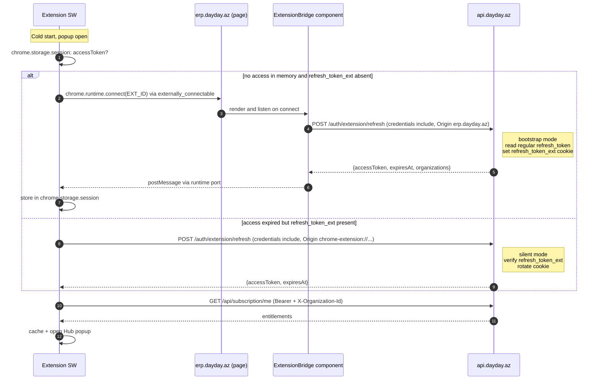
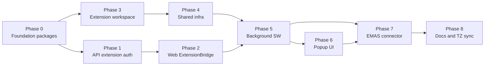

## Goal

Поднять production-ready каркас браузерного расширения для государственных порталов АР. MVP замыкает один сценарий end-to-end (ƏMAS / e-müqavilə) и ставит инфраструктуру так, чтобы добавление DVX/e-qaimə и других порталов было делом «новой папки в `connectors/`».

## Ключевые архитектурные решения (зафиксированы)

- **Stack:** WXT (Vite-native, MV3, cross-browser), React 19, Tailwind, TypeScript, Zod, `webext-bridge`.
- **Magic Auth:** один endpoint `POST /api/auth/extension/refresh` в двух режимах (bootstrap из ERP-origin по обычному `refresh_token`, silent из `chrome-extension://` по `refresh_token_ext`); приоритет проверки cookie + строгий Origin-whitelist.
- **Изоляция API-домена:** новая cookie `refresh_token_ext` с `sameSite: 'none'`, `secure: true`, отдельный `EXT_REFRESH_SECRET`, более короткий `EXT_REFRESH_EXPIRES` (по умолчанию 24h).
- **Shared packages:** `@dayday/api-contracts` (Zod-DTO, общие для web и extension), `@dayday/i18n` (общие RU/AZ-ресурсы).
- **MVP scope:** Hub popup со списком компаний и тарифами; smart-context popup для `emas.sosial.gov.az`; ƏMAS connector с одним flow (`e-muqavile`); 3-шаговый floating widget (Shadow DOM).

## Magic Auth — sequence



## Phasing overview



---

## Phase 0 — Foundation packages

**0.1 `packages/api-contracts/`** (новый workspace `@dayday/api-contracts`)
- `package.json` — `peerDependencies: { zod: "^3" }`, `main: src/index.ts`.
- `src/auth.ts` — Zod-схемы: `AuthSnapshotSchema`, `OrgSummarySchema`, `PublicUserSchema`, `ExtensionRefreshResponseSchema` (соответствуют текущим типам в [apps/api/src/auth/auth.service.ts](apps/api/src/auth/auth.service.ts) `OrgSummary`, `PublicUser`).
- `src/subscription.ts` — `ModuleEntitlementSchema`, `SubscriptionSnapshotSchema` (зеркалит [apps/api/src/subscription/subscription-access.service.ts](apps/api/src/subscription/subscription-access.service.ts)).
- `src/hr.ts` — `EmployeeContractPrefillSchema` (минимальный DTO для ƏMAS e-müqavilə: имя, fin code, position, salary, contract dates).
- `src/index.ts` — barrel.
- Используется в `apps/api` (контроллеры импортируют типы для кастов), `apps/web` (RTK/SWR), `apps/extension` (RPC + API client).

**0.2 `packages/i18n/`** (новый workspace `@dayday/i18n`)
- `package.json` — `main: src/index.ts`.
- `src/resources.ts` — *перенос* содержимого [apps/web/lib/i18n/resources.ts](apps/web/lib/i18n/resources.ts).
- `src/extension.ts` — отдельная карта ключей `extension.*` (Hub, OrgSwitcher, Paywall, шаги виджета); RU + AZ обязательны.
- `src/index.ts` — экспорт `webResources`, `extensionResources`, `flatten()` для аудита.
- [apps/web/lib/i18n/resources.ts](apps/web/lib/i18n/resources.ts) превращается в `re-export from "@dayday/i18n"` чтобы не сломать существующие импорты и `i18n:audit`.

**0.3 Скрипт `scripts/i18n-audit.ts`**
- Расширить аудит так, чтобы он сканировал и `apps/extension/src/**/*.{ts,tsx}` на использование `t("...")` (тот же regex-подход).
- Не ломать текущий аудит web.

**0.4 Workspace plumbing**
- Прописать новые пакеты в [package.json](package.json) ничего менять не надо (`packages/*` уже резолвится).
- Добавить `tsconfig.json` в каждый пакет с `composite: true`, `outDir: dist`, `rootDir: src`.

---

## Phase 1 — API: extension auth endpoint и CORS

**1.1 [apps/api/src/auth/auth.service.ts](apps/api/src/auth/auth.service.ts)** — добавить:
- Константы `REFRESH_EXT_COOKIE = "refresh_token_ext"`, геттер `extRefreshSecret` (читает `EXT_REFRESH_SECRET`, fallback на `JWT_REFRESH_SECRET`).
- `setExtensionRefreshCookie(res, token)`:

```ts
res.cookie(REFRESH_EXT_COOKIE, token, {
  httpOnly: true,
  secure: this.config.get("NODE_ENV") === "production",
  sameSite: "none",
  maxAge: this.parseDurationToMs(this.config.get("EXT_REFRESH_EXPIRES", "1d")),
  path: "/api/auth/extension",
});
```

- `clearExtensionRefreshCookie(res)`.
- `signExtensionTokenPair(userId, organizationId)` — отдельный access (`{ aud: "extension" }` claim) и отдельный refresh (`typ: "refresh-ext"`, `secret = extRefreshSecret`, `expiresIn = EXT_REFRESH_EXPIRES`).
- `refreshExtensionFromBootstrapCookie(refreshToken)` — принимает обычный `refresh_token`, валидирует, выдаёт extension-пару (используется только из ERP-origin).
- `refreshExtensionFromExtCookie(extRefreshToken)` — принимает `refresh_token_ext`, валидирует `typ === "refresh-ext"`, ротирует.

**1.2 [apps/api/src/auth/auth.controller.ts](apps/api/src/auth/auth.controller.ts)** — добавить:

```ts
@Public()
@Post("extension/refresh")
async extensionRefresh(@Req() req, @Res({ passthrough: true }) res) {
  const origin = req.headers.origin as string | undefined;
  const ext = req.cookies?.refresh_token_ext;
  const reg = req.cookies?.refresh_token;
  if (ext) {
    this.assertExtensionOrigin(origin); // chrome-extension://* | moz-extension://*
    const out = await this.auth.refreshExtensionFromExtCookie(ext);
    this.auth.setExtensionRefreshCookie(res, out.refreshToken);
    return this.stripRefresh(out);
  }
  if (reg) {
    this.assertWebOrigin(origin); // erp.dayday.az whitelist
    const out = await this.auth.refreshExtensionFromBootstrapCookie(reg);
    this.auth.setExtensionRefreshCookie(res, out.refreshToken);
    return this.stripRefresh(out);
  }
  throw new UnauthorizedException("Missing refresh credentials");
}

@Public()
@Post("extension/logout")
extensionLogout(@Res({ passthrough: true }) res) {
  this.auth.clearExtensionRefreshCookie(res);
  return { ok: true };
}
```

Хелперы `assertExtensionOrigin` / `assertWebOrigin` живут в `auth.service.ts`, читают whitelist из env.

**1.3 [apps/api/src/main.ts](apps/api/src/main.ts) — CORS**
- Добавить параллельный whitelist для extension origins, читаемый из `CORS_EXTENSION_ORIGINS` (`chrome-extension://<id>,moz-extension://<id>`). В dev — auto-allow по pre-pattern `chrome-extension://*` через regex.
- В блок `origin: (...)` дописать ветку `if (extensionOriginPattern.test(origin)) cb(null, true)`.

**1.4 `.env.example` / корневой `.env`** — добавить:
```
EXT_REFRESH_SECRET=
EXT_REFRESH_EXPIRES=1d
EXT_DEV_ID=dev-extensionId
ERP_WEB_ORIGINS=https://erp.dayday.az,http://localhost:3000
CORS_EXTENSION_ORIGINS=chrome-extension://dev-extensionId
```

**1.5 Защита от misuse**
- `assertExtensionOrigin` отбрасывает запросы с `Origin: https://erp.dayday.az` к silent-mode (cookie attack defense).
- `assertWebOrigin` отбрасывает chrome-extension к bootstrap-mode (extension не должно само инициализировать cookie без явного юзер-жеста на ERP).

---

## Phase 2 — Web: ExtensionBridge component

**2.1 [apps/web/components/extension-bridge.tsx](apps/web/components/extension-bridge.tsx)** (new)
- Tiny client component (`"use client"`).
- Считывает `process.env.NEXT_PUBLIC_DAYDAY_EXT_IDS` (CSV: `dev-extensionId,prod-id`).
- На mount: `chrome?.runtime?.onConnectExternal` НЕЛЬЗЯ (это API расширения). Нужен обратный паттерн: расширение через **page-level** postMessage. Уточнено: фактический канал — расширение запрашивает у ERP не через runtime port, а через CS, инжектируемый в `erp.dayday.az`. См. Phase 5.

*Поправка к архитектурной диаграмме:* `externally_connectable` работает в обратную сторону — это **страница** инициирует connect к расширению, не наоборот. Поэтому ERP-bridge — это **content script расширения** на `erp.dayday.az`, который читает HttpOnly cookie невозможно, но может вызвать `fetch('/api/auth/extension/refresh', { credentials: 'include' })` уже от лица page-origin (CS из расширения наследует page origin для fetch только в `world: "MAIN"`; в isolated world — extension origin). Решение:
- **ERP-bridge — это не CS, а тонкий React-компонент в web app**. Расширение через `externally_connectable` шлёт **запрос** компоненту, компонент сам делает fetch (origin = `erp.dayday.az`, cookies подхватываются как same-site), отдаёт результат через тот же port обратно. Это классический паттерн для MV3.

**2.2 ExtensionBridge корректная реализация:**

```tsx
useEffect(() => {
  const ALLOWED_EXT_IDS = (process.env.NEXT_PUBLIC_DAYDAY_EXT_IDS ?? "")
    .split(",").map(s => s.trim()).filter(Boolean);

  const onMessage = (event: MessageEvent) => {
    if (event.source !== window) return;
    if (event.data?.__dayday !== "ext-handshake-req") return;

    fetch(`${API_URL}/auth/extension/refresh`, {
      method: "POST",
      credentials: "include",
    }).then(r => r.json()).then(payload => {
      window.postMessage({ __dayday: "ext-handshake-ok", payload }, location.origin);
    }).catch(err => {
      window.postMessage({ __dayday: "ext-handshake-err", message: String(err) }, location.origin);
    });
  };

  window.addEventListener("message", onMessage);
  return () => window.removeEventListener("message", onMessage);
}, []);
```

Парный CS расширения на `erp.dayday.az` (Phase 5) делает `window.postMessage({ __dayday: "ext-handshake-req" }, location.origin)` и слушает `ext-handshake-ok`. CS живёт в isolated world, но `window.postMessage` мостится корректно.

**2.3 Mount**
- В [apps/web/app/layout.tsx](apps/web/app/layout.tsx) или в `(app)/layout.tsx` (если есть auth-only group). Безопасно на root, потому что без auth-cookie fetch вернёт 401 и компонент не утечёт ничего.

---

## Phase 3 — Extension workspace bootstrap

**3.1 `apps/extension/package.json`** — `@dayday/extension`, `private: true`.
```json
{
  "name": "@dayday/extension",
  "private": true,
  "scripts": {
    "dev": "wxt",
    "dev:firefox": "wxt -b firefox",
    "build": "wxt build",
    "build:firefox": "wxt build -b firefox",
    "zip": "wxt zip"
  },
  "dependencies": {
    "@dayday/api-contracts": "workspace:*",
    "@dayday/i18n": "workspace:*",
    "@dayday/ui": "workspace:*",
    "react": "19.2.5",
    "react-dom": "19.2.5",
    "webext-bridge": "^6",
    "zod": "^3"
  },
  "devDependencies": {
    "wxt": "latest",
    "@wxt-dev/module-react": "latest",
    "tailwindcss": "...", "postcss": "...", "autoprefixer": "..."
  }
}
```

**3.2 `apps/extension/wxt.config.ts`**
- `manifest`: `name "DayDay Assistant"`, `permissions: ["storage", "alarms", "scripting"]`, `host_permissions: ["https://api.dayday.az/*", "https://erp.dayday.az/*", "https://*.e-taxes.gov.az/*", "https://emas.sosial.gov.az/*", "http://localhost:4000/*", "http://localhost:3000/*"]`.
- `externally_connectable.matches: ["https://erp.dayday.az/*", "http://localhost:3000/*"]`.
- `modules: ["@wxt-dev/module-react"]`.
- `srcDir: "src"`, `entrypointsDir: "entrypoints"`.

**3.3 `apps/extension/tailwind.config.ts`** — extends `@dayday/ui` preset (если такой есть; иначе — минимальный конфиг с теми же токенами цвета, что в `apps/web/tailwind.config.ts`). DESIGN.md соблюдается.

**3.4 Корневые скрипты [package.json](package.json)** — добавить:
```
"dev:ext": "dotenv -e .env -o -- npm run dev -w @dayday/extension",
"build:ext": "dotenv -e .env -o -- npm run build -w @dayday/extension"
```
В `npm run build` *не включаем* — стабилизируем отдельно, чтобы не ломать pipeline web/api.

**3.5 i18n:audit интеграция** — расширить `scripts/i18n-audit.ts` так, чтобы `t("extension.*")` искался в `apps/extension/src/**`.

---

## Phase 4 — Extension shared infra

Папка `apps/extension/src/shared/`:

**4.1 `messaging/contracts.ts`** — Zod-карта RPC:
```ts
export const Rpc = {
  "auth.snapshot":    { req: z.void(),                          res: AuthSnapshotSchema },
  "auth.requestMagic":{ req: z.void(),                          res: AuthSnapshotSchema },
  "auth.switchOrg":   { req: z.object({ organizationId: z.string() }), res: AuthSnapshotSchema },
  "auth.logout":      { req: z.void(),                          res: z.void() },
  "entitlements.get": { req: z.object({ organizationId: z.string() }), res: ModuleEntitlementsSchema },
  "portal.detect":    { req: z.object({ url: z.string() }),     res: PortalDescriptorSchema.nullable() },
  "portal.prefill":   { req: PrefillRequestSchema,              res: EmployeeContractPrefillSchema },
  "telemetry.event":  { req: TelemetryEventSchema,              res: z.void() },
} as const;
```
**4.2 `messaging/rpc.ts`** — обёртка над `webext-bridge` с zod-валидацией на обоих концах. Нарушение схемы → лог + reject.

**4.3 `api-client/client.ts`** — fetch-обёртка:
- Бьёт по `${API_URL}/api/...`, добавляет `Authorization: Bearer ...` из BG state.
- Прозрачный retry один раз через `auth.requestMagic` при 401.
- Кладёт `X-Organization-Id` из active org.
- Никогда не логирует body (TZ §15.0).

**4.4 `storage/session.ts`** — типизированный wrapper над `chrome.storage.session` (только access token, expiresAt).
**4.5 `storage/local.ts`** — `chrome.storage.local`: `activeOrganizationId`, `entitlementsCache`, `popupLastView`.

**4.6 `i18n/index.ts`** — стартовая обёртка вокруг `@dayday/i18n` ресурсов; язык — `chrome.i18n.getUILanguage()` → `'az'|'ru'`, fallback `'ru'`.

---

## Phase 5 — Background Service Worker

**5.1 `entrypoints/background.ts`**
- WXT `defineBackground({ persistent: false })`.
- `chrome.alarms.create("ka", { periodInMinutes: 0.5 })` для keep-alive в долгих операциях.
- Подписка через `webext-bridge` на все RPC.

**5.2 `background/auth/state-machine.ts`**
- Состояния: `IDLE → BOOTSTRAPPING → AUTHED → REFRESHING → ERROR`.
- Простой FSM без xstate (200–300 строк).

**5.3 `background/auth/bootstrap.ts`** — Magic Auth контур A
- Просит ERP-bridge CS (см. 5.6) выполнить page-side fetch `/auth/extension/refresh`.
- Получает `accessToken` через `chrome.tabs.sendMessage` или long-port.

**5.4 `background/auth/silent.ts`** — контур B
- `fetch('/api/auth/extension/refresh', { method: 'POST', credentials: 'include' })`.
- При 401 → fallback на bootstrap (если есть открытая ERP-вкладка), иначе → ERROR + popup показывает «Войдите в DayDay ERP».

**5.5 `background/api/endpoints.ts`** — типизированные вызовы:
- `getAuthSnapshot()` → `GET /api/auth/me`.
- `getSubscription(orgId)` → `GET /api/subscription/me` + `X-Organization-Id`.
- `getEmployeeContractPrefill(orgId, contractId)` → новый endpoint (см. ниже).

**5.6 `entrypoints/erp-bridge.content.ts`**
- `defineContentScript({ matches: ["https://erp.dayday.az/*", "http://localhost:3000/*"], runAt: "document_idle" })`.
- Слушает `webext-bridge` сообщения от BG, делает `window.postMessage({ __dayday: "ext-handshake-req" }, "*")`, ждёт `ext-handshake-ok` от ExtensionBridge компонента, передаёт BG.

**5.7 `background/router.ts`** — связывает RPC handlers с auth/api/entitlements.

---

## Phase 6 — Popup UI

**6.1 `entrypoints/popup/`** — single-page React, без react-router (popup мал).
- `App.tsx` определяет view по trifecta:
  - `chrome.tabs.query({active: true})` → URL → `connectors/registry.match(url)`.
  - Если match — рендерит `<PortalContextView connector={...} />`.
  - Иначе — `<HubView />`.

**6.2 Pages/views:**
- `views/HubView.tsx` — список компаний (Card per Organization из `auth.snapshot.organizations`), для каждой компании — бейджи активных модулей (`tax_pro`, `hr_full` и т.д., из entitlements cache + lazy-fetch при разворачивании). Плитки сервисов (DVX / ƏMAS) — кликабельны: открывают портал в новой вкладке.
- `views/PortalContextView.tsx` — для текущего портала: статус auth на портале, кнопка «Открыть виджет», список доступных flows (с paywall-замочком, если модуль не куплен).
- `views/PaywallView.tsx` — заглушка с deep-link на `https://erp.dayday.az/settings/subscription`.
- `views/OrgSwitcher.tsx` — dropdown в header.

**6.3 Стили:** Tailwind, токены из DESIGN.md / @dayday/ui. Никаких ad-hoc оверлеев — `@dayday/ui` примитивы (`Dialog`, `DropdownMenu`).

**6.4 i18n:** `t("extension.hub.title")`, `t("extension.paywall.cta")` и т.д. — все ключи в `@dayday/i18n` extensionResources, RU + AZ.

---

## Phase 7 — ƏMAS connector + floating widget

**7.1 `connectors/types.ts`**
```ts
export interface PortalConnector {
  readonly id: "etaxes" | "emas";
  readonly entitlement: ModuleEntitlementKey;  // "hr_full" для emas
  readonly matches: (url: URL) => boolean;
  detectAuthState(doc: Document): "anonymous" | "authenticated" | "unknown";
  listFlows(url: URL): PortalFlowDescriptor[];
  // flow runner — возвращает AsyncIterable событий (step transitions, fill events, errors)
  runFlow(flowId: string, ctx: FlowContext): AsyncGenerator<FlowEvent>;
}
```

**7.2 `connectors/emas/`**
- `index.ts` — реализация `PortalConnector`, `entitlement: "hr_full"`.
- `selectors.ts` — централизованные CSS-селекторы (один файл, чтобы при апдейте портала менять в одном месте).
- `auth-detect.ts` — наличие топ-навигации с user menu = `authenticated`.
- `flows/e-muqavile.ts` — описывает шаги: «открыта форма создания трудового договора» → «нажата кнопка автозаполнения» → «поля заполнены, ждём İmzala».
- `adapters/erp-to-muqavile.ts` — pure-функция: `EmployeeContractPrefill` (из api-contracts) → `Record<selector, value>`.

**7.3 `entrypoints/emas.content.ts`**
- `matches: ["https://emas.sosial.gov.az/*"]`.
- Регистрирует в `connectors/registry`, монтирует виджет через `createShadowRootUi` (closed shadow root) с React-tree.

**7.4 `widget/FloatingWidget.tsx`** (Shadow DOM)
- Минимальный header с логотипом, drag handle, индикатором org, ссылкой «Открыть DayDay».
- Контейнер шагов: текущий шаг подсвечен, остальные — серые.

**7.5 Шаги:**
- `steps/AwaitAsanStep.tsx` — polling `auth-detect.ts` каждые 1.5s, пока пользователь не залогинится через ASAN. Никаких автокликов.
- `steps/AutofillStep.tsx` — кнопка «Заполнить из DayDay»: рендерит селектор сотрудника (по org), при клике вызывает RPC `portal.prefill`, применяет адаптер, проставляет значения через нативные input-events (React-форма портала переотрисуется), подсвечивает заполненные поля зелёной обводкой 1.5s.
- `steps/AwaitSignStep.tsx` — пассивный: показывает «Нажмите İmzala на портале», polls ASAN-state, переходит в `Done` при отсутствии формы.

**7.6 Backend addition (минимально нужно для прифилла):**
- `apps/api/src/hr/contracts.controller.ts` — `GET /api/hr/contracts/:id/prefill` (существующий контроллер контрактов или новый эндпоинт), отдаёт `EmployeeContractPrefillSchema` DTO. Если такого endpoint нет — добавить thin wrapper над уже существующим `EmploymentContract` getter с маппингом полей. *Уточню при имплементации, нужен ли новый endpoint или достаточно расширить существующий.*

---

## Phase 8 — Docs & TZ sync

**8.1 [TZ.md](TZ.md) §13.6** — обновить:
- «Plasmo **или WXT**» (вместо «Plasmo или эквивалент»).
- Зафиксировать схему `POST /api/auth/extension/refresh` (двойной режим), cookie `refresh_token_ext`, новые env (`EXT_REFRESH_SECRET`, `EXT_REFRESH_EXPIRES`, `CORS_EXTENSION_ORIGINS`).
- Зафиксировать обязательность `@dayday/api-contracts` и `@dayday/i18n`.
- Ссылка на `apps/extension/README.md`.

**8.2 [.cursor/rules/dayday-module-map.mdc](.cursor/rules/dayday-module-map.mdc)** — добавить строку про `apps/extension/` и пакеты `api-contracts`, `i18n`.

**8.3 [apps/extension/README.md](apps/extension/README.md)** — quick-start: `npm run dev:ext`, как загрузить unpacked в Chrome (`chrome://extensions` → Developer mode → Load unpacked → `apps/extension/.output/chrome-mv3`), как настроить `dev-extensionId` (через `key` в manifest для стабильного ID в dev).

**8.4 [.env.example](.env.example)** — все новые переменные с комментариями.

**8.5 [PRD.md](PRD.md)** — *проверить*, нужно ли уточнять §6.1.1 / §13.0 / §13.6 на product-уровне (Sync Master). Скорее всего достаточно TZ.

---

## Что вне scope MVP (намеренно)

- DVX (e-taxes) connector и виджет — следующая итерация.
- Production extension ID и публикация в CWS / AMO.
- Server-side telemetry sink (пока — только client logger без backend endpoint).
- Полный paywall checkout (из popup открываем deep-link на ERP `/settings/subscription`).
- Любое автоподписание / автоклик по «İmzala» — категорически out of scope (TZ §13.6 NFR).

## Validation gates

- `npm run build` (web + api) проходит — нашими правками не сломали core pipeline.
- `npm run i18n:audit` — нет пустых ключей в `@dayday/i18n`, включая `extension.*` для RU + AZ.
- `npm run dev:ext` запускает WXT, расширение можно подгрузить unpacked.
- E2E smoke: открыть `localhost:3000` (ERP залогинен) → попап расширения показывает Hub со списком орг + бейджами модулей; открыть `https://emas.sosial.gov.az` → попап переключается в PortalContextView; виджет монтируется в DOM.

## Risks & mitigations

- **WXT manifest для cross-browser MV3 на Firefox (`background.scripts` vs `background.service_worker`)** — WXT решает автоматически, но проверить на firefox build в Phase 3.
- **Стабильный dev `extensionId`** — через `"key"` в manifest (RSA pub key); сгенерировать одноразово и зафиксировать в `wxt.config.ts` под флагом `MODE === 'development'`.
- **`sameSite: 'none'` ломается в Safari/iOS** — для MVP только Chrome + Firefox; iOS extensions out of scope.
- **`apps/web/lib/i18n/resources.ts` re-export** — может сломать tree-shaking; делаем re-export через `export *`, проверяем bundle size в Phase 0.
- **Selector drift на `emas.sosial.gov.az`** — все селекторы централизованы в `connectors/emas/selectors.ts`, попадают в один PR при изменении портала. Telemetry (фейлы автозаполнения) попадают в local logger; переход на server-side sink — следующая итерация.

