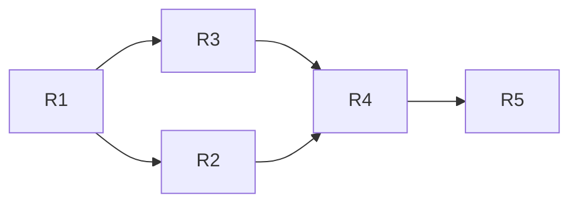

# Dispute & Recovery — пошаговое внедрение R1–R5

## Глобальные принципы

- **Источник истины:** новый домен `apps/api/src/platform-recovery/` (модули `recovery`, `dispute`, `snapshot`, `rollback`, `dual-approval`, `step-up`). Прикладные модули 1–9 не правим, кроме точечного добавления `deletedAt` в Prisma.
- **Audit chain тенанта (`AuditLog` + `computeAuditHash` в [apps/api/src/audit/audit.service.ts](apps/api/src/audit/audit.service.ts)) — машинный «дневник», на нём строится R4/R5.
- **Tenant-фильтр** уже работает через [apps/api/src/prisma/prisma-tenant.extension.ts](apps/api/src/prisma/prisma-tenant.extension.ts). Расширяем soft-delete extension по тому же паттерну.
- **Super-admin UI:** новый раздел `apps/web/app/super-admin/organizations/[id]/security/`.

```mermaid
flowchart LR
  subgraph PlatformRecovery[apps/api/src/platform-recovery]
    DA[DualApprovalService]
    SU[StepUpAuthService email-OTP]
    DSP[DisputeService + Guard]
    SNAP[SnapshotService + BullMQ]
    RB[RollbackService snapshot-restore]
  end
  subgraph Audit[Existing AuditService]
    AL[AuditLog hash chain]
  end
  subgraph Storage[S3 + KMS]
    Lock[Object Lock + Versioning]
    SnapBucket[snapshots bucket]
  end
  subgraph SuperAdminUI[apps/web/app/super-admin/organizations/[id]/security]
    OwnCard[Ownership card]
    DispCard[Dispute timeline]
    SnapCard[Snapshots card]
    TimeCard[Time-travel card]
    ChainCard[Audit chain verify]
  end

  DSP --> AL
  DSP --> DA
  DA --> SU
  RB --> SNAP
  RB --> AL
  SNAP --> SnapBucket
  SnapBucket --> Lock
  OwnCard --> DSP
  DispCard --> DSP
  SnapCard --> SNAP
  TimeCard --> RB
  ChainCard --> AL
```

---

## R1 — Foundations: soft delete + audit pre-images + S3 lock

Цель: ни одна разрушительная операция не теряет данные на физическом уровне.

### R1.1 Soft Delete schema (~30 моделей)

- В [packages/database/prisma/schema.prisma](packages/database/prisma/schema.prisma) на каждой модели из «широкого» списка добавить:
  ```prisma
  deletedAt        DateTime? @map("deleted_at") @db.Timestamptz(6)
  deletedByUserId  String?   @map("deleted_by_user_id") @db.Uuid
  deletedReason    String?   @map("deleted_reason")
  @@index([organizationId, deletedAt]) // если поле уже tenant-scoped
  ```
- Список (без append-only бухгалтерии): `Invoice`, `InvoiceItem`, `InvoicePayment`, `Counterparty`, `CounterpartyBankAccount`, `Product`, `ProductRecipe`, `ProductRecipeLine`, `ProductRecipeByproduct`, `Employee`, `Department`, `JobPosition`, `Warehouse`, `WarehouseBin`, `StockItem`, `Timesheet`, `TimesheetEntry`, `Absence`, `PayrollRun`, `PayrollSlip`, `SalaryRegistry`, `FixedAsset`, `FixedAssetDepreciationMonth`, `CustomsDeclaration`, `Account`, `AccountMapping`, `IfrsMappingRule`, `OrganizationBankAccount`, `OrganizationMembership`, `OrganizationInvite`, `AccessRequest`, `CashDesk`, `CashFlowItem`, `CashOrder`, `AdvanceReport`, `BankPaymentDraft`, `InventoryAudit`, `InventoryAuditLine`, `InventoryAdjustment`, `InventoryAdjustmentLine`, `Notification`, `TaxDeclarationExport`.
- НЕ трогаем: `Transaction`, `JournalEntry`, `BankStatement*`, `IntegrationSyncRun`, `OcrJob`, `PaymentAllocation`, `DigitalSignatureLog`, `AuditLog*`, `StockMovement` (последний — операционный лог; сохраняем как есть).
- Миграция `20260508xxxxxx_dispute_recovery_soft_delete.sql`: `ALTER TABLE … ADD COLUMN IF NOT EXISTS deleted_at TIMESTAMPTZ(6)` + индексы.

### R1.2 Расширение Prisma soft-delete extension

- В [apps/api/src/prisma/prisma-soft-delete.extension.ts](apps/api/src/prisma/prisma-soft-delete.extension.ts):
  - Сделать generic helper `softDeletedTable(modelKey, deletedField)` чтобы не плодить копи-паст; покрыть все 30+ моделей (поле `deletedAt`).
  - Перехват `delete` / `deleteMany` → `update({ data: { deletedAt: now, deletedByUserId } })`. `deletedByUserId` берётся из `AsyncLocalStorage` actor-context (новый узкий слой `apps/api/src/common/actor-context.ts` рядом с `tenant-context.ts`).
  - Опция bypass: `prisma.$extends` + `withSoftDeleted: true` для super-admin / recovery-флоу — реализовать через ExtensionContextStorage (модель `apps/api/src/prisma/recovery-context.ts`).
- Миграция бизнес-кода: НЕ требуется. Сервисы продолжают вызывать `prisma.invoice.delete()` — extension сам подменит.

### R1.3 Audit pre-images full coverage

- Расширить [apps/api/src/audit/audit.service.ts](apps/api/src/audit/audit.service.ts) метод `loadOldSnapshot` так, чтобы он покрывал все tenant-write пути (на текущий момент — только Invoice/Product/Employee/CustomsDeclaration). Добавить generic resolver через карту:
  ```ts
  const ENTITY_RESOLVERS: Record<string, (orgId, id) => Promise<unknown>> = {
    counterparty: ..., warehouse: ..., department: ..., /* etc */
  };
  ```
- Аналогично `resolveNewValues` — после `POST/PATCH` дочитывать полную сущность с включениями.
- Покрытие проверяется тестом `audit-coverage.spec.ts`: для каждой tenant-модели создать → обновить → удалить и убедиться, что `oldValues` + `newValues` не `null`.

### R1.4 S3 Object Lock + Versioning

- В [apps/api/src/storage/s3-storage.service.ts](apps/api/src/storage/s3-storage.service.ts) добавить методы:
  - `enableBucketVersioning()`, `enableObjectLock()` (вызываются из платформенного `bootstrap-storage` cron при первом старте и идемпотентны).
  - При `putObject` для префиксов `invoices/pdf/`, `attachments/`, `evidence/`, `snapshots/` — параметр `ObjectLockMode: COMPLIANCE`, `ObjectLockRetainUntilDate: now + retention`.
- Конфиг ретеншна в `SystemConfig` (по ключу) + дефолт в `apps/api/src/storage/storage.constants.ts`:
  - `invoices/pdf` — 7 лет
  - `evidence` — 7 лет
  - `attachments` — 1 год
  - `snapshots` — 1 год
- Новый smoke-test [apps/api/src/storage/s3-object-lock.spec.ts](apps/api/src/storage/s3-object-lock.spec.ts).

### R1.5 Линт-правило: запрет `$queryRaw` / `$executeRaw` для tenant-write

- ESLint custom rule `no-raw-tenant-mutation` в `apps/api/eslint-rules/`:
  - Запрет `prisma.$executeRaw*` в файлах под `apps/api/src/{invoices,hr,inventory,...}/**` (whitelist для `platform-recovery`, `migration`, `audit`).
  - В `apps/api/.eslintrc.json` подключить.

---

## R2 — Dispute Pipeline

Цель: легально и тех. защищённо передать `ownerId` с многоканальным уведомлением, cooldown и DualApproval.

### R2.1 Step-up email-OTP

- Новый модуль `apps/api/src/platform-recovery/step-up/`:
  - DTO: `RequestStepUpOtpDto`, `VerifyStepUpOtpDto`.
  - Сервис: 6-значный код, TTL 5 мин, 3 попытки, lockout 30 мин на email; HMAC-хранение в Redis (`stepup:<userId>:<purpose>`).
  - Декоратор `@RequiresStepUp(purpose: string)` + `StepUpGuard` — проверяет header `X-StepUp-Token` (короткоживущий JWT, выпускается при verify).
  - Re-use `MailService`.

### R2.2 DualApproval сервис

- Таблица `DualApprovalRequest` (новая модель в `schema.prisma`):
  - `id, purpose, payload Json, requesterId, approverIds[], status (PENDING/APPROVED/REJECTED/EXPIRED/EXECUTED), expiresAt, executedAt, createdAt`.
- Сервис в `apps/api/src/platform-recovery/dual-approval/dual-approval.service.ts`:
  - `request(purpose, payload)` — создаёт запись, шлёт уведомление другим super-admin.
  - `approve(id, approverId)` — добавляет в `approverIds`, требует `purpose === stepUpToken.purpose`.
  - `executeIfApproved(id, fn)` — гарантирует ≥2 разных `approverIds`, иначе `ForbiddenException`.
- Декоратор `@RequiresDualApproval(purpose)` + `DualApprovalGuard` для контроллера.

### R2.3 OwnershipDispute + OrganizationSecurityState

- Новые модели в [packages/database/prisma/schema.prisma](packages/database/prisma/schema.prisma):
  ```prisma
  model OwnershipDispute {
    id              String   @id @default(dbgenerated("uuid_generate_v4()")) @db.Uuid
    organizationId  String   @db.Uuid
    claimantUserId  String   @db.Uuid
    incumbentUserId String   @db.Uuid
    status          DisputeStatus
    severity        DisputeSeverity
    evidenceKeys    String[]
    verifiedAgainst Json?
    cooldownEndsAt  DateTime?
    approvalRequestId String? @db.Uuid
    legalCaseRef    String?
    signedCertificateKey String?
    createdAt       DateTime @default(now())
    executedAt      DateTime?
    @@index([organizationId, status])
  }
  enum DisputeStatus { EVIDENCE_REQUIRED EVIDENCE_REVIEW INCUMBENT_NOTIFIED COOLDOWN APPROVED REJECTED EXECUTED REVERTED }
  enum DisputeSeverity { SOFT HARD } // SOFT — incumbent остаётся ADMIN; HARD — revoke

  model OrganizationSecurityState {
    organizationId String @id @db.Uuid
    mode           SecurityMode @default(NORMAL)
    lockUntil      DateTime?
    activeDisputeId String? @db.Uuid
    updatedAt      DateTime @updatedAt
  }
  enum SecurityMode { NORMAL DISPUTE POST_TRANSFER_LOCK ROLLBACK_IN_PROGRESS HARD_BLOCK_PLATFORM }
  ```
- Миграция `20260508xxxxxx_dispute_state.sql`.

### R2.4 DisputeFreezeGuard

- Новый guard `apps/api/src/platform-recovery/dispute/dispute-freeze.guard.ts`, регистрируется в `app.module.ts` рядом с `SubscriptionReadOnlyGuard`.
- Источник правды — `OrganizationSecurityState.mode`. При `DISPUTE` или `ROLLBACK_IN_PROGRESS`:
  - Запрещены: `DELETE *`, `POST /*/archive`, `PATCH /subscription/*`, `PATCH /organizations/:id/owner`, `POST /migration/*`, `POST /super-admin/organizations/*/hard-delete`.
  - Бухгалтерские проводки разрешены, но получают `auditCategory='platform.tenant.disputed'`.
- Декоратор `@AllowInDisputeMode()` для исключений (например, чтение).

### R2.5 DisputeService + контроллер Super-Admin

- `apps/api/src/platform-recovery/dispute/dispute.service.ts`:
  - `openDispute(orgId, claimantId, evidenceKeys[], severity)` — создаёт запись, переводит `securityMode='DISPUTE'`, рассылает уведомления incumbent.
  - `notifyIncumbent(disputeId)` — email + SMS (через провайдера +994) + in-app `Notification` + persistent banner.
  - `requestExecution(disputeId)` — после `APPROVED` создаёт `DualApprovalRequest(purpose='ownership_transfer')`.
  - `executeTransfer(disputeId, approverId)` — внутри `prisma.$transaction`:
    1. `dualApproval.executeIfApproved(...)` гарантирует 2 подписи.
    2. `stepUp.requirePurpose('ownership_transfer')` (header X-StepUp-Token).
    3. Снять snapshot S_before (см. R3) — обязательное условие.
    4. `organization.update({ ownerId: claimantId })`.
    5. `organizationMembership.update` для incumbent (SOFT → ADMIN, HARD → revokedAt).
    6. `organizationSecurityState.update({ mode: 'POST_TRANSFER_LOCK', lockUntil: +30d })`.
    7. Сгенерировать подписанный PDF certificate (`apps/api/src/platform-recovery/dispute/transfer-certificate.service.ts`, переиспользовать `pdfkit` + HMAC + QR).
    8. Audit: `platform.tenant.ownership.transferred` с обоими `approverIds` и SHA-256 evidence.
- Контроллер `apps/api/src/platform-recovery/dispute/dispute.admin.controller.ts` (под `SuperAdminGuard`):
  - `POST /super-admin/organizations/:id/disputes`, `PATCH /super-admin/disputes/:id/status`, `POST /super-admin/disputes/:id/execute`.

### R2.6 Web Super-Admin UI — Ownership / Dispute

- Новый раздел `apps/web/app/super-admin/organizations/[id]/security/page.tsx`:
  - Карточка **Ownership** с историей `ownerId`, кнопка «Open dispute» → wizard (выбор claimant из `User`, upload evidence, severity, cooldown 7/14d).
  - Карточка **Dispute timeline** с pill `EVIDENCE_REQUIRED → … → EXECUTED`, списком уведомлений, кнопкой «Force transfer» (видна только в `APPROVED`, открывает step-up + dual-approval modal).
  - Карточка **Security mode** показывает текущий `SecurityMode` + `lockUntil`.
- Reuse существующих компонентов из `apps/web/components/super-admin/*`.
- i18n keys: добавлять в **`packages/i18n/src/resources.ts`** (source) и проверить, что бандл веба тянет их через **`apps/web/lib/i18n/resources.ts`** (re-export). Префикс — `superAdmin.security.*` (RU **и** AZ обязательно). Дальше — общий i18n-конвейер из секции «Documentation, i18n, deploy & Cursor rules».

### R2.7 Multichannel notifications

- Расширить `apps/api/src/notifications/notification.service.ts`:
  - Новый template `OWNERSHIP_DISPUTE_OPENED` (email + SMS + in-app + persistent banner).
  - SMS-шаблон с +994 и текстом RU/AZ (заглушка провайдера если ещё нет — лог + queue для последующей реальной отправки).
- Public-page `apps/web/app/(public)/dispute/[id]/page.tsx` — incumbent может подать контр-заявление по одноразовой ссылке без логина.

---

## R3 — Logical Snapshots per tenant

Цель: воспроизводимая «известная безопасная точка» при риск-событиях.

### R3.1 Модель + S3 layout

- В schema.prisma:
  ```prisma
  model OrganizationDataSnapshot {
    id              String   @id @default(dbgenerated("uuid_generate_v4()")) @db.Uuid
    organizationId  String   @db.Uuid
    reason          String   // dispute_open / pre_transfer / pre_hard_delete / pre_migration / manual
    s3Key           String
    sha256          String
    sizeBytes       BigInt
    takenAt         DateTime @default(now())
    expiresAt       DateTime
    triggeredByUserId String? @db.Uuid
    @@index([organizationId, takenAt])
  }
  ```
- S3 префикс: `snapshots/<orgId>/<yyyy>/<mm>/<snapshotId>.tar.gz.kms` под Object Lock COMPLIANCE на retention из R1.4.

### R3.2 BullMQ worker `LogicalTenantSnapshotWorker`

- Новый worker `apps/api/src/platform-recovery/snapshot/snapshot.worker.ts`:
  - Подключается к **read-replica** (если есть) или к основной БД через отдельный pool с `application_name='snapshot-worker'` (минимизировать лок).
  - Для каждой tenant-таблицы из карты `TENANT_TABLES` (генерируется из Prisma DMMF): `COPY (SELECT * FROM <table> WHERE organization_id = $1) TO STDOUT WITH BINARY`.
  - Stream → tar → gzip → KMS encrypt → upload S3 multipart.
  - SHA-256 считается стримом, пишется в `OrganizationDataSnapshot`.
- Триггеры в коде (`SnapshotService.takeSnapshot(orgId, reason)`):
  - `DisputeService.openDispute` → `reason='dispute_open'`.
  - `DisputeService.executeTransfer` (внутри транзакции, перед самим transfer) → `reason='pre_transfer'`.
  - Hard-delete tenant route → `reason='pre_hard_delete'`.
  - Migration wizard → `reason='pre_migration'`.
  - Manual из UI → `reason='manual'`.

### R3.3 Список tenant-таблиц + topological order

- Сгенерировать на старте API через `Prisma.dmmf` → массив моделей с `organizationId`-полем + порядок по FK (топосортинг).
- Сохранить в `apps/api/src/platform-recovery/snapshot/tenant-tables.ts` (build-time generated через `tsx` script + commit, чтобы не зависеть от runtime).

### R3.4 Super-Admin UI — Snapshots card

- В `security/page.tsx` карточка **Snapshots**:
  - Список с timestamp, reason, size, sha256 (короткий), expires.
  - Кнопка «Take snapshot now» (под StepUp).
  - Кнопка «Download evidence ZIP» — для legal (зашифрованный архив всех evidence + snapshot manifest).

---

## R4 — Tenant Time-Travel (MVP: snapshot-restore)

Цель: реалистичный однотенантный rollback БЕЗ форварда replay (advanced replay → R5).

### R4.1 RollbackService

- `apps/api/src/platform-recovery/rollback/rollback.service.ts` — точка входа `restoreFromSnapshot(orgId, snapshotId, requesterId)`:
  1. `dualApproval.executeIfApproved(purpose='tenant_rollback')` + step-up.
  2. Перевод `securityMode='ROLLBACK_IN_PROGRESS'` + revoke active sessions для тенанта.
  3. Снять страховочный snapshot S_now (`reason='pre_rollback_insurance'`).
  4. Stream snapshot из S3 → ETL в TEMP-схему `recovery_<orgId_short>_<ts>` (`CREATE SCHEMA IF NOT EXISTS …`, COPY FROM STDIN per table в порядке FK).
  5. Verify: hash совпал, число строк, балансы (бухгалтерская сходимость по `Transaction` сумм по периоду).
  6. **Atomic swap** одной транзакцией:
     ```sql
     SET CONSTRAINTS ALL DEFERRED;
     -- В обратном порядке FK:
     DELETE FROM <child_table> WHERE organization_id = $1;
     ...
     -- В прямом порядке FK:
     INSERT INTO <parent_table> SELECT * FROM recovery_xxx.<table>;
     ...
     COMMIT;
     ```
  7. Записать `TenantRollbackRecord` (новая таблица, аналогичная `OrganizationDataSnapshot`).
  8. Сгенерировать **Post-rollback report** PDF: что восстановлено, что НЕ восстанавливается автоматически (внешние эффекты — отправленные письма, проведённые в DVX/e-customs/Birbank операции, удалённые S3-объекты с уже истекшим Object Lock).
  9. `securityMode='POST_TRANSFER_LOCK'` (если был связан со спором) или `'NORMAL'`.

### R4.2 Diff-preview

- Метод `previewRestore(orgId, snapshotId)`: загружает snapshot во временную схему, делает `SELECT count(*)` per table из снапшота vs прод и возвращает структурированный diff (added/removed/modified counts + по периоду — суммы proвodок).
- Возвращается в UI до execute.

### R4.3 Bypass extensions для recovery-флоу

- Recovery sets `RecoveryContextStorage.bypass=true` → `prisma-tenant.extension` и `prisma-soft-delete.extension` пропускают фильтры. См. R1.2.

### R4.4 Super-Admin UI — Time-travel card

- В `security/page.tsx`:
  - Selector доступного `OrganizationDataSnapshot` (по `takenAt` desc).
  - Кнопка «Preview restore» → таблица diff (Invoices, Employees, Counterparties, Transactions sum delta).
  - Кнопка «Generate rollback plan» (PDF) и «Execute rollback» (gated by step-up + dual-approval).
  - Live-progress component (читает `TenantRollbackRecord.progressJson` через polling).

### R4.5 TenantRollbackRecord + audit

- Таблица + миграция, аналогично snapshots.
- Запись в `AuditLog` с `entityType='TenantRollback'`, hash chain продолжается без разрывов.

### R4.6 Тесты

- `rollback.service.spec.ts`:
  - Создать тенант, нагенерить данные, сделать snapshot, удалить часть данных, restore — данные вернулись.
  - Cross-tenant isolation: второй тенант не затронут.
  - Atomic swap rollback при падении на этапе verify.

---

## R5 — Hardening, Audit Replay forward, DR drill

Цель: 1) точная Time-Travel до произвольного `T`, 2) операционные доказательства работоспособности.

### R5.1 Audit chain integrity daily cron

- Новый cron `apps/api/src/audit/audit-integrity.cron.ts` (`@nestjs/schedule`):
  - Каждые 24 часа на тенант: пробежать `AuditLog` цепочку, перепроверить hash. На разрыв → создать `Notification` для super-admin + перевести `securityMode='HARD_BLOCK_PLATFORM'`.
- UI: на странице `security` карточка **Audit chain integrity** с кнопкой «Verify now» + last-result.

### R5.2 Audit Replay forward (advanced rollback)

- Расширение `RollbackService.restoreToPointInTime(orgId, T, requesterId)`:
  1. Найти ближайший `OrganizationDataSnapshot` с `takenAt ≤ T`.
  2. Restore в TEMP-схему (как R4).
  3. Проиграть `AuditLog` тенанта от `snapshot.takenAt` до `T` в TEMP-схеме:
     - Для каждой записи аудита, у которой `entityType` известен в `ENTITY_REPLAY_HANDLERS`, применить `newValues` (POST/PATCH) или восстановить из `oldValues` для `DELETE` отсутствующих в момент T.
     - Для INSERT, которых до T не было: пропускать.
  4. Verify (как R4).
  5. Atomic swap.
- Если в `AuditLog` отсутствует pre-image (легаси записи) — replay прерывается с понятным отчётом «replay stops at T'=…».

### R5.3 DR drill — per-tenant rollback rehearsal

- Новый platform-script `scripts/dr-drill-tenant-rollback.ts`:
  - Берёт случайный «sandbox-флаг» тенант на staging.
  - Делает snapshot, портит данные, делает restore, валидирует целостность.
  - Отчёт публикуется в Slack/email.
- Запуск ежемесячно на staging (`platform:dr-validate` уже есть как корневой npm script — расширить).

### R5.4 Compliance / legal docs (final pass)

- В [TZ.md](TZ.md) §21 (новая секция «Phase Recovery — Dispute & Tenant Time-Travel»): финальный полный текст с диаграммой потоков, SLA на каждый шаг (cooldown 7/14d, snapshot ≤5 мин, rollback verify ≤15 мин), retention policy (S3 Object Lock матрица из R1.4), процедура восстановления на staging, ссылка на `scripts/dr-drill-tenant-rollback.ts`.
- В [PRD.md](PRD.md) §7.13 (новая секция «Tenant Recovery Pack»): продуктовая позиция (на ENTERPRISE — без доплат; на STARTER/BUSINESS — opt-in модуль `recovery_pro` с retention длиннее), описание видимости Super-Admin Security Tab, SLA на спор и rollback, упоминание public-portal `/dispute/[id]` для контр-заявлений incumbent.
- Шаблоны юридических уведомлений (RU/AZ) в `apps/api/src/platform-recovery/dispute/legal-templates/` (`incumbent-notification.ru.md`, `incumbent-notification.az.md`, `transfer-certificate.template.ts`).
- **Полный конвейер документации, i18n и Cursor rules** — см. отдельную секцию ниже **«Documentation, i18n, deploy & Cursor rules»** (является обязательной частью R5 финального PR).

### R5.5 Метрики и алерты

- Prometheus / Sentry метрики: `disputeOpenedTotal`, `transferExecutedTotal`, `snapshotTakenSeconds`, `rollbackExecutedSeconds`, `auditChainGapDetectedTotal`.
- Алерты Sentry: cron failures, audit chain gaps, snapshot worker queue depth.

---

## Documentation, i18n, deploy & Cursor rules (cross-cutting)

> Sync Master rule (`.cursor/rules/dayday-agent-roles.mdc`): продуктовые и контрактные изменения **в том же PR** обновляют `PRD.md` и/или `TZ.md`. Ниже — карта правок по фазам, чтобы документы и правила не отставали от кода.

### D1. PRD.md — что писать в каждой фазе

| Фаза | Раздел PRD | Что добавить |
|------|------------|--------------|
| **R1** | **§3.1 (Multi-tenancy)** | Пункт о soft-delete как стандартном поведении tenant-write слоёв (extension перехватывает `delete*`); восстановление — только через платформенный recovery. |
| **R1** | **§7.7 (Data Safety)** | Дополнить: full audit pre-image coverage, S3 Object Lock + Versioning с retention-матрицей, ESLint-правило `no-raw-tenant-mutation`. |
| **R2** | **§7.6 (Super-Admin Back-office)** | Новая строка таблицы: вкладка **Security** (Ownership, Dispute timeline, Snapshots, Time-travel, Audit chain). |
| **R2** | **§7.9 (Advanced RBAC)** | После `executeTransfer`: prev OWNER → ADMIN (SOFT) или revoked (HARD); описать `OrganizationSecurityState.mode` влияние на DELETE/PATCH/POST. |
| **R2** | **§7.13 (Tenant Recovery Pack)** *(создать)* | Каркас: Ownership Dispute pipeline, multichannel notifications (+994 SMS, email, in-app, persistent banner), public counter-claim portal. |
| **R3** | **§7.13** | Подраздел «Logical snapshots»: триггеры (`dispute_open` / `pre_transfer` / `pre_hard_delete` / `pre_migration` / `manual`), retention (S3 Object Lock), evidence ZIP для legal. |
| **R4** | **§7.13** | Подраздел «Tenant Time-Travel (MVP)»: snapshot-restore с diff-preview, post-rollback report, ограничения (внешние эффекты — DVX/e-customs/Birbank — не откатываются автоматически). |
| **R5** | **§7.13** | Финальный пакетинг: на **ENTERPRISE** включён, на **STARTER/BUSINESS** как opt-in модуль `recovery_pro` (более длинный retention); метрики, DR drill, advanced replay forward. |

### D2. TZ.md — что писать в каждой фазе

| Фаза | Раздел TZ | Что добавить |
|------|-----------|--------------|
| **R1** | **§0.0 (реестр REST)** | Пометить, что мутации tenant-write молча конвертируются в soft-delete (без изменения сигнатур контроллеров). |
| **R1** | **§1 (инфраструктура)** | Колонка «Файлы»: S3 Object Lock COMPLIANCE + Versioning, retention-карта (`invoices/pdf` 7y, `evidence` 7y, `attachments` 1y, `snapshots` 1y), идемпотентный bootstrap. |
| **R1** | **§9 (AuditLog)** | Жёсткое требование: для всех tenant-write маршрутов `oldValues` + `newValues` ≠ null (карта `ENTITY_RESOLVERS`); тест `audit-coverage.spec.ts` блокирует CI при пустых полях. |
| **R1** | **§16 (tenant extension)** | Новый подраздел **§16.7** «Soft-delete extension + actor-context»: generic `softDeletedTable(model, field)`, `AsyncLocalStorage` actor-context (`apps/api/src/common/actor-context.ts`), bypass через `RecoveryContextStorage.bypass=true`. |
| **R1** | **§17 (hardening)** | ESLint custom rule `no-raw-tenant-mutation`: запрет `prisma.$executeRaw*` в доменных модулях; whitelist — `platform-recovery`, `migration`, `audit`. |
| **R2** | **§0.0** | Новые строки реестра: `POST /api/auth/step-up/request`, `POST /api/auth/step-up/verify`, `POST /super-admin/organizations/:id/disputes`, `PATCH /super-admin/disputes/:id/status`, `POST /super-admin/disputes/:id/execute`, public `GET /api/public/disputes/:token` + `POST /api/public/disputes/:token/counter-claim`. |
| **R2** | **§2 (IAM)** | Подраздел про step-up email-OTP: TTL 5 мин, 3 попытки, lockout 30 мин, HMAC в Redis (`stepup:<userId>:<purpose>`), guard `@RequiresStepUp(purpose)`. |
| **R2** | **§9** | Запись `platform.tenant.ownership.transferred` обязана содержать `approverIds[]` (≥2), `evidenceSha256[]`, `certificateHash`. |
| **R2** | **§15 (Super-Admin)** | Новая подсекция «Security Tab»: схема страницы и контракт `OrganizationSecurityState` (`mode`, `lockUntil`, `activeDisputeId`). |
| **R3** | **§1.4 (очереди)** | Новая BullMQ-очередь `tenant-snapshot` (worker `LogicalTenantSnapshotWorker`); политика concurrency, отдельный pool с `application_name='snapshot-worker'`, read-replica при наличии. |
| **R3** | **§0.0** | `POST /super-admin/organizations/:id/snapshots`, `GET /super-admin/organizations/:id/snapshots`, `GET /super-admin/snapshots/:id/download` (zip evidence). |
| **R3** | **§16** | Закрепить: топологический порядок tenant-таблиц генерируется build-time из `Prisma.dmmf` в `apps/api/src/platform-recovery/snapshot/tenant-tables.ts` (коммитим). |
| **R4** | **§0.0** | `POST /super-admin/organizations/:id/rollback/preview`, `POST /super-admin/organizations/:id/rollback/execute`, `GET /super-admin/rollbacks/:id`. |
| **R4** | **§1.4** | Очередь `tenant-rollback` (worker применяет atomic swap; при verify-fail — abort транзакции, никаких следов в проде). |
| **R4** | **§17** | Atomic-swap обязателен в одной `prisma.$transaction` с `SET CONSTRAINTS ALL DEFERRED`; verify-checksum + балансы `Transaction` блокируют COMMIT. |
| **R5** | **§9** | Новый daily cron `audit-integrity.cron.ts`: разрыв chain → `securityMode='HARD_BLOCK_PLATFORM'` + super-admin notification. |
| **R5** | **§21** *(создать)* | Полная процедура «Phase Recovery» с диаграммой потоков, SLA, retention policy, ссылкой на DR drill. |

### D3. i18n pipeline (по правилу `.cursor/rules/dayday-local-dev.mdc`)

Новые ключи UI Super-Admin → **три независимых канала** в одном PR:

1. **Источник веба:** добавить ключи в **`packages/i18n/src/resources.ts`** (re-exported из `apps/web/lib/i18n/resources.ts`); префикс `superAdmin.security.*`. **RU и AZ** обязательны (без AZ блокирует сборку через `npm run i18n:audit`).
2. **Снимок дефолтов для Super-Admin:** `npm run i18n:catalog` из корня и **закоммитить** обновлённый `apps/api/src/admin/i18n-default-catalog-data.json`.
3. **Postgres `translation_overrides`:** локально — `npm run db:sync-i18n` (или `:prune`); прод — покрывается шагом `npm run db:deploy` (он же бампит `i18n.cacheVersion`).

Список ключей (минимум): `superAdmin.security.tabTitle`, `…ownershipCard.*`, `…disputeTimeline.*`, `…snapshotsCard.*`, `…timeTravelCard.*`, `…auditChainCard.*`, `…modes.{NORMAL|DISPUTE|POST_TRANSFER_LOCK|ROLLBACK_IN_PROGRESS|HARD_BLOCK_PLATFORM}`, `…actions.openDispute`, `…actions.executeTransfer`, `…actions.takeSnapshot`, `…actions.executeRollback`. Public-portal: `public.dispute.*` (incumbent counter-claim).

### D4. Cursor rules (`.cursor/rules/*.mdc`) — что обновить в R5 финальном PR

| Файл | Что добавить |
|------|--------------|
| **`.cursor/rules/dayday-module-map.mdc`** | Новая строка в «Доменные модули»: **«Платформенный recovery (`platform-recovery`)»** → API: `apps/api/src/platform-recovery/{dispute,dual-approval,step-up,snapshot,rollback}/`, Web: `apps/web/app/super-admin/organizations/[id]/security/`, Prisma: `OwnershipDispute`, `OrganizationSecurityState`, `OrganizationDataSnapshot`, `TenantRollbackRecord`, `DualApprovalRequest`. Примечание: «soft-delete bypass через `RecoveryContextStorage`». |
| **`.cursor/rules/dayday-agent-roles.mdc`** | В персону **[Security Auditor]** — добавить упоминание `no-raw-tenant-mutation` ESLint rule и whitelist для `platform-recovery`. В **[DB Architect]** — упомянуть soft-delete extension + actor-context как часть стандарта. В **[Compliance]** — сослаться на legal templates RU/AZ для уведомлений incumbent. |
| **`.cursor/rules/dayday-local-dev.mdc`** | **Не менять.** Конвейер i18n / `db:deploy` уже описан; новые ключи проходят его без правок правила. |

### D5. Deploy & runbook

В **R5 финальном PR** актуализировать раздел **PRD §11 (NFR) / TZ §1 («Maintenance mode runbook»)** для деплоя фазы Recovery:

```bash
npm run docker:up                    # инфра локально, см. dayday-local-dev.mdc
npm run i18n:audit                   # gate сборки на пустые RU/AZ
npm run i18n:catalog                 # обновить i18n-default-catalog-data.json
git add apps/api/src/admin/i18n-default-catalog-data.json
npm run db:migrate                   # prisma migrate deploy (миграции R1+R2+R3+R4)
npm run db:deploy                    # = migrate deploy + sync translation_overrides + bump i18n.cacheVersion
# Прод-постановка S3 Object Lock — один раз (идемпотентно):
node apps/api/dist/storage/bootstrap-s3-object-lock.js   # вызывается также из startup hook
# DR drill (staging only, ежемесячно):
npm run platform:dr-validate
```

В прод-чеклист добавить пункт «backup БД сделан **до** запуска `db:deploy`, snapshot первого тенанта на staging верифицирован» (часть R5.3).

---

## Dependencies / порядок выполнения



R1 — обязательный фундамент. R2 и R3 можно вести параллельно после R1. R4 зависит от R3 (нужны snapshots). R5 — финальная фаза после ≥1 месяца R4 в проде.

---

## Acceptance criteria

- **R1:** все ~30 моделей имеют `deletedAt`, прикладной код модулей не менялся; покрытие audit pre-image ≥ 95% (тест `audit-coverage.spec.ts` зелёный); S3 buckets подтверждают Object Lock в `aws s3api get-object-lock-configuration`.
- **R2:** super-admin может открыть dispute → notify → cooldown → execute transfer; ownerId в БД сменился, AuditLog содержит запись с обоими approvers и certificate hash; бывший owner получил уведомления по 3 каналам.
- **R3:** snapshot ≤2 GB у среднего тенанта создаётся за <5 мин; SHA-256 в БД совпадает с S3 ETag-checksum.
- **R4:** на staging-стенде после restore данные тенанта совпадают с моментом snapshot bit-to-bit (`md5sum` per table); другой тенант не затронут.
- **R5:** ежедневный cron репортит «chain valid» по 100% тенантов; advanced replay восстанавливает до T с точностью «по последней записи аудита ≤ T».
- **Docs & rules (sync с кодом, без отставания):** в каждом PR фазы — обновлены соответствующие пункты `PRD.md` и `TZ.md` по карте D1/D2; в финальном R5 PR созданы **PRD §7.13** и **TZ §21**, обновлены **`.cursor/rules/dayday-module-map.mdc`** (домен `platform-recovery`) и **`.cursor/rules/dayday-agent-roles.mdc`** (Security Auditor / DB Architect / Compliance). Прогон `npm run i18n:audit` зелёный, `apps/api/src/admin/i18n-default-catalog-data.json` пересобран и закоммичен, `npm run db:deploy` выполнен на проде.

---

## Out of scope (Phase Recovery+1)

- Cluster-level PITR per tenant через WAL / `pg_logical_emit_message` — экзотика, не масштабируется на 5000+ тенантов.
- Cross-region snapshot replication.
- UI для конечного владельца (incumbent claimant): пока только super-admin исполняет; самообслуживание спора — отдельная продуктовая инициатива.
- Soft-delete покрытие `Transaction` / `JournalEntry` (бухгалтерия append-only, обходим сторно — другая инициатива).
