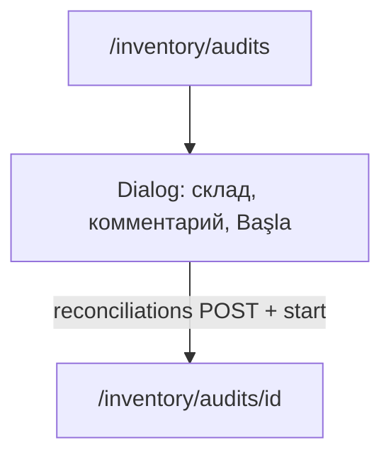

# ERP UX — волна 2 (feedback после batch 1)

**Предшественник:** [erp_ux_polish_batch_700c9475.plan.md](./erp_ux_polish_batch_700c9475.plan.md) (пункты 1–31 — **выполнен**). Batch 2 — уточнения по ревью UI и продуктовые ответы (п.12–14, 22).

**Документы-источник правды:** [PRD.md](../../PRD.md), [TZ.md](../../TZ.md), [DESIGN.md](../../DESIGN.md). Обновление PRD/TZ — **в том же PR**, что и код (Sync Master).

---

## Scope

### Входит в batch 2

| Область | Суть |
|---------|------|
| **Фаза 0** | `ListPaginationFooter`, `EmptySelectOption` («—»), default pageSize **25** |
| **Счета** | Sales + purchase modals — один скролл, компактный VAT |
| **Реестры** | PageHeader.actions, пустой каркас таблицы, футер пагинации всегда |
| **Physical** | Реестр `GET physical-adjustments` + модалка (не форма на всю страницу) |
| **Audits** | Модалка «Yeni inventarizasiya» = шаг 1; мастер на `/audits/[id]` |
| **HR/PSA** | Timesheet toolbar, positions wrapper, PSA table + create modal |
| **Reporting** | P&L dept filter только для P&L; month close; AZ labels |
| **Inventory settings** | Блок FIFO/AVCO org-level + ссылка на org settings |
| **Доки** | PRD §4.10, §4.10.0, §10.1; TZ §10.2.3, §11.1 |

### Не входит

- Слияние `/inventory/physical` и `/inventory/audits` в один URL
- Per-warehouse `valuationMethod` (без PRD + Prisma)
- Смена API `reconciliations/*` и жизненного цикла `InventoryAudit`
- Tax-export browser extension (отдельный тикет)

---

## Продуктовые ответы (зафиксированы)

### п.12 — FIFO/AVCO

**`Organization.valuationMethod`** — на **организацию**, не на склад (PRD §4.10.1). UI: read-only на `/inventory/settings` + ссылка «Изменить в настройках организации» (`/settings/organization`). Radio на двух экранах не дублировать.

### п.13 — Physical vs Audits

**Разные сущности** — не объединять маршруты.

| | **Physical** | **Audits** |
|--|--------------|------------|
| Модель | `InventoryAdjustment` | `InventoryAudit` |
| Статусы | DRAFT → POSTED | DRAFT → COUNTING → REVIEW → COMPLETED |
| Документ | только WRITE_OFF **или** SURPLUS | смешанные расхождения + классификация |
| Склад | без блокировки | блокировка на COUNTING/REVIEW |
| API | `/api/inventory/physical-adjustments` | `/api/inventory/reconciliations/*` |
| UI цель | реестр + модалка | реестр + **короткая** модалка → карточка `[id]` |

**Physical — бэкенд готов:** `POST` → `inventory_adjustments` (DRAFT); `GET ?page&pageSize` — есть; страница **не вызывает GET** — черновик теряется при F5.

**UX physical:** `PageHeader` + `+` → `PhysicalAdjustmentModal`; колонки: дата, склад, тип, статус, строк, действия; subtitle → смешанные расхождения на audits.

**UX audits (реестр):** убрать `auditBack` / «Anbar siyahısına»; `+ Yeni inventarizasiya` в `PageHeader.actions`.

### п.14 — Модалка audits «пустая» — ожидаемое поведение

Модалка = **только старт** (склад, дата, комментарий, CTA). Таблица учёт/факт — на **`/inventory/audits/[id]`** после `POST` + `start` + редиректа.

| Шаг | UI | API |
|-----|-----|-----|
| 1 | Модалка | `POST /api/inventory/reconciliations` |
| 2 | Та же кнопка | `POST …/:id/start` → COUNTING, снимок systemQty, lock склада |
| 3 | Редирект | Карточка: факт, submit → REVIEW, complete |
| 4–5 | Карточка | classify + `complete` → COMPLETED |

**Проблема сейчас:** дубль `h2`/`auditBack` внутри Dialog; CTA «черновик» при том что вызывается `start`.

**Исправление:** `compactForModal` в `apps/web/components/inventory/inventory-audit-create-flow.tsx`; i18n `auditCreateAndStart`, `auditCreateModalHint`, `auditStartAndOpen`.

### п.22 — Reporting

«ƏH xərci departament üzrə» — **фильтр P&L по ЦФО (721)**, не баг. Показывать **только при P&L** + `reporting.plDepartmentHelp`. Закрытие периода: `input type="month"` как banking. AZ: OSV, Mənfəət və zərər — без латинского «P&L» в AZ UI.

---

## Фаза 0 — глобальные примитивы

**Файлы:** `apps/web/components/list-pagination-footer.tsx`, `apps/web/lib/empty-select-option.ts` (или аналог).

1. **`ListPaginationFooter`**
   - Props: `page`, `pageSize`, `total`, `onPageChange`, `onPageSizeChange`, `loading?`
   - Опции: **25, 50, 100** only; default **25**
   - Стиль: `apps/web/app/banking/page.tsx`
   - Рендер при `!loading` **всегда** (включая `total === 0`)

2. **`EmptySelectOption` / `common.emptySelect`**
   - Пустое значение `<select>` = **«—»** (em dash)

3. **Миграция страниц** (убрать pageSize 10/20):

   banking, purchases, sales/invoices, inventory (receipts, transfers, adjustments, audits, balances*, movements*), employees, hr/positions, psa/projects, physical (новый реестр).

---

## Реализация по блокам

### A. Audits (п.14) — todo `audits-create-modal`

| Файл | Действие |
|------|----------|
| `inventory-audit-create-flow.tsx` | `compactForModal`: скрыть title/back/history footer |
| `audits/page.tsx` | `PageHeader.actions`, `ListPaginationFooter`, передать prop |
| `audits/[id]/page.tsx` | Smoke: COUNTING table, submit, complete (без ломания) |
| i18n | `auditCreateAndStart`, `auditCreateModalHint`, `auditStartAndOpen` |

Empty: нет складов → EmptyState + link settings; пустой склад после start → hint на `[id]`.

### B. Physical (п.13) — todo `physical-psa-timesheet` (часть)

| Файл | Действие |
|------|----------|
| `physical/page.tsx` | Реестр + `PhysicalAdjustmentModal` |
| Новый modal component | Вынести форму с page |
| API | `GET /api/inventory/physical-adjustments?page&pageSize` |
| i18n | Колонки реестра, subtitle physicalVsAudits |

### C. Invoice modals (п.4–5) — todo `invoice-modals-scroll`

- **`InvoiceDocumentModalLayout`** → CreateInvoiceModal + PurchaseModal
- Один вертикальный scroll; строки в bordered card `max-h-[min(55vh,22rem)]`
- Компактный VAT/export footer (sales); purchase без export если нет в API

### D. Реестры (п.5, 9–11, 16) — todo `inventory-hr-lists`

| URL | Ключевые правки |
|-----|-----------------|
| `/purchases` | ListPaginationFooter, actions в header |
| `/inventory/receipts` | actions, pagination |
| `/inventory/transfers` | empty table shell, transfer-modal bordered lines |
| `/inventory/adjustments` | footer + empty shell |
| `/employees` | pagination под таблицей, `common.pagination*` |

**Паттерн empty table:** `DATA_TABLE_VIEWPORT` + thead + EmptyState внутри (не замена всей таблицы).

### E. Inventory settings (п.12) — todo `inventory-settings-reporting` (часть)

`inventory/settings/page.tsx`: блок valuation + `inventory.valuationMethodOrgNote` + link org settings.

### F. HR / PSA (п.17, 19, 20)

- **positions:** убрать лишний `CARD_CONTAINER` вокруг таблицы
- **timesheet:** actions в `PageHeader`; month + status в `leading`; полная легенда кодов
- **psa/projects:** table + `PsaProjectCreateModal`, pagination

### G. Reporting (п.22) — todo `inventory-settings-reporting` (часть)

`reporting/page.tsx`: dept filter conditional; month picker close-period; AZ labels.

---

## i18n и документация — todo `i18n-docs-verify`

### Pipeline

1. `packages/i18n/src/resources.ts` — RU + AZ
2. `npm run i18n:audit` + `npm run i18n:catalog`
3. Коммит `apps/api/src/admin/i18n-default-catalog-data.json`
4. Локально: `npm run db:sync-i18n` при необходимости

### PRD.md

| § | Текст |
|---|--------|
| **4.10** Сличительная ведомость | Модалка = старт; карточка `[id]` = пересчёт/REVIEW/complete |
| **4.10.0** Physical | Реестр + modal; redirect mixed → audits |
| **10.1** UX web | Pagination 25/50/100, `ListPaginationFooter`, `common.emptySelect` «—», footer always |
| Changelog | Строка 2026.05.xx — ERP UX batch 2 |

### TZ.md (техспека)

| § | Текст |
|---|--------|
| **10.2.3** | audits: `compactForModal`, reconciliations API, redirect; physical: registry + modal |
| **11.1** | `ListPaginationFooter`, `EmptySelectOption` |
| **10.1** i18n | Новые ключи audits + physical registry |

---

## Порядок выполнения

1. **Фаза 0** — компоненты пагинации и «—»
2. **Audits modal** + черновики PRD/TZ (§4.10)
3. **Invoice modals** layout
4. **Реестры** inventory + purchases + employees
5. **Physical** registry + modal
6. **PSA, timesheet, positions, reporting, inventory settings**
7. **Финал:** полный PRD/TZ pass, `tsc` api/web, `i18n:audit`, smoke

## Smoke URLs

| URL | Проверка |
|-----|----------|
| `/inventory/audits` | Модалка не пустая (поля + hint); create → redirect `[id]` |
| `/inventory/audits/[id]` | Таблица строк, COUNTING → REVIEW |
| `/inventory/physical` | Реестр DRAFT/POSTED; модалка create |
| `/purchases`, `/inventory/transfers`, `/inventory/receipts` | Footer 25/50/100, empty shell |
| `/sales/invoices` | Один скролл в create modal |
| `/hr/timesheet`, `/hr/positions`, `/psa/projects` | Header actions, layout |
| `/reporting` | Dept только P&L; month close |
| `/inventory/settings` | FIFO/AVCO block + link |

## Риски

- Большой diff пагинации — только через общий компонент
- Invoice modals — регресс VAT/export/netting
- Audits: не ломать `onAuditStarted` redirect и `start` chain

## Критерий готовности

- [ ] Все todos `completed`
- [ ] `npm run i18n:audit` green
- [ ] `tsc` api + web green
- [ ] PRD + TZ обновлены в PR
- [ ] Smoke URLs пройдены вручную
