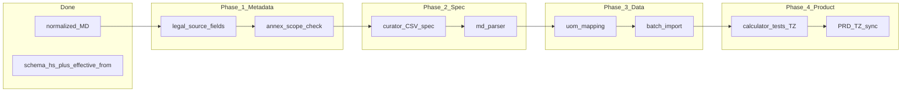

# HS и локальные тарифы AZ: единый план закрытия тем

## Цель

Закрыть весь контур **без публичного XML**: источник правды из официальных приложений к актам → нормализованный артефакт → БД → калькулятор и админка.

## Текущее состояние

| Тема | Статус |
|------|--------|
| Очистка и нормализация markdown-таблиц акта | Сделано (`normalize-az-customs-md.mjs`, файл заменён пользователем) |
| Пайплайн MD → структурированные ставки | Не сделан |
| Маппинг ЕИ закона на продукт | Не сделан |
| Импорт в `customs_tariff_rates` | Частично: есть сид из JSON и Super-admin CRUD |
| Версионирование строк тарифа | Сделано: составной ключ `(hs_code, effective_from)`, см. раздел ниже |
| Алгоритм поиска ставки | Реализован: longest-prefix + fallback `00` — см. ниже |

## Констатация (без изменений по смыслу)

- Единого открытого XML по AZ часто нет; опора на **HTML/PDF приложения** и внутренний процесс.
- В национальной редакции **97 групп (глав)** HS — не путать с устаревшей цифрой 95 в обсуждениях.
- Риск ошибки ставки — продуктовый и правовой; в UI полезно показывать **источник редакции** (минимум через `notes`).

## Версионирование в БД (целевое решение)

**Паттерн:** *temporal many-rows, one logical revision per `(hs_code, as_of)` — выбор последней `effective_from`.*

1. **Схема:** уникальность **`(hs_code, effective_from)`**, не одного `hs_code`. Миграция: [`packages/database/prisma/migrations/20260510190000_customs_tariff_rates_versioning/migration.sql`](packages/database/prisma/migrations/20260510190000_customs_tariff_rates_versioning/migration.sql). Модель: [`CustomsTariffRate`](packages/database/prisma/schema.prisma) с `@@unique([hsCode, effectiveFrom])`.

2. **Загрузка «активных» ставок на дату BGD:** `loadActiveRates(asOf)` выбирает строки с `effective_from <= as_of` и окном `effective_to`, затем **`pickLatestTariffRatePerHsCode`** оставляет для каждого **префикса** `hs_code` ровно одну строку — с **максимальной** `effective_from` среди попавших в фильтр. Так корректно обрабатываются несколько редакций одной позиции и редкие пересечения по окнам дат.

3. **Импорт и API:** upsert по **`hsCode_effectiveFrom`** (идемпотентная повторная загрузка той же пары). Super-admin передаёт дату «с действия»; новая дата для того же префикса = **новая строка**, не перезапись другой редакции.

4. **Опционально (операционная гигиена):** при выходе новой редакции можно проставлять `effective_to` предыдущей строке того же `hs_code`, чтобы не полагаться только на «победу» по дате; на корректность lookup это не обязательно, если правило dedupe соблюдается.

5. **Поиск ставки по товару** (без изменений по смыслу): после dedupe тот же **longest-prefix** по множеству префиксов.

Реализация: [`pickLatestTariffRatePerHsCode`](apps/api/src/customs/customs-tariff-rate-dedupe.ts), [`CustomsTariffRatesService.loadActiveRates`](apps/api/src/customs/customs-tariff-rates.service.ts), [`findBestMatchFromRows`](apps/api/src/customs/customs-tariff-rates.service.ts), [`CustomsTaxCalculatorService.computeLines`](apps/api/src/customs/customs-tax-calculator.service.ts).

Тесты: [`customs-tariff-rate-dedupe.spec.ts`](apps/api/src/customs/customs-tariff-rate-dedupe.spec.ts), [`customs-tariff-rates.service.spec.ts`](apps/api/src/customs/customs-tariff-rates.service.spec.ts), [`customs-tax-calculator.service.spec.ts`](apps/api/src/customs/customs-tax-calculator.service.spec.ts).

## Дорожная карта (все темы в одном потоке)

### Phase 1 — Метаданные и охват

1. **`legal-source-metadata`**: для каждой загрузки — какой акт (URL/номер), дата вступления, при необходимости ссылка на редакцию в `notes`.
2. **`annex-scope-check`**: подтвердить, что из [`docs/tmp/az-customs-act.md`](docs/tmp/az-customs-act.md) извлекается ожидаемый объём (не только 97 строк глав, а полные строки таблицы); согласовать **канон**: только цифры в `hs_code`, длина по WCO/AZ.

### Phase 2 — Спецификация и парсер

3. **`curator-csv-spec`**: колонки для ручной подгонки и для машины — где **сырая строка закона** (процент, USD/ед., сноски), где **Decimal** для калькулятора (если ставка не адвалорная — отдельное решение в продукте).
4. **`md-parser-pipeline`**: скрипт по нормализованному MD:
   - пропуск строк с ~~зачёркиванием~~;
   - пропуск повторяющихся заголовков `XİF MN…`;
   - строки без полного кода в col1 — заголовки иерархии, не строки тарифа;
   - политика **курсива** в col1 (QRUP 97 и сноски): сохранять текст без `*` или пропускать — зафиксировать в парсере;
   - выход: JSON/CSV для ревью и для импорта.

Существующие точки входа в коде:

- Сид: [`packages/database/scripts/seed-customs-tariff-rates.ts`](packages/database/scripts/seed-customs-tariff-rates.ts), данные [`packages/database/data/customs-tariff-seed.json`](packages/database/data/customs-tariff-seed.json).
- UI: [`apps/web/app/super-admin/data/customs-tariffs/page.tsx`](apps/web/app/super-admin/data/customs-tariffs/page.tsx).

### Phase 3 — ЕИ и импорт

5. **`uom-law-mapping`**: блок ЕИ в начале MD → таблица маппинга на [`units-of-measure` seeds](packages/database/prisma/seeds/trade/units-of-measure.ts).
6. **`batch-import-script`**: идемпотентный батч по `(hs_code, effective_from)`, проверки на конфликты; согласованность с `findBestMatchFromRows`.

### Phase 4 — Контракт калькулятора и документация проекта

7. **`calculator-contract-tests`**: кратко описать в **TZ.md** правило longest-prefix и fallback; добавить кейсы (равная длина префиксов не должна возникать при корректном наборе ставок; граница `asOf` и несколько строк из `loadActiveRates`).
8. **`sync-master-docs`**: закрыть тему документации в том же PR/итерации, что и код — не откладывать.

#### Обновление документации проекта (чеклист)

| Документ | Что зафиксировать |
|----------|---------------------|
| [**TZ.md**](TZ.md) | Глобальная модель `CustomsTariffRate`: составной ключ `(hs_code, effective_from)`; выбор строки на дату (`loadActiveRates` + dedupe по последней `effective_from`); затем longest-prefix и fallback `00`; ссылки на сервисы API; контракт Super-admin `POST /admin/customs-tariff-rates` (идемпотентность по паре hs + дата). |
| [**PRD.md**](PRD.md) | Только если меняются пользовательские обещания (источник ставок, Trade Pro, отображение редакции в UI). |
| [**.cursor/rules/dayday-module-map.mdc**](.cursor/rules/dayday-module-map.mdc) | Новые или изменённые пути: парсер MD → импорт, скрипты в `packages/database/scripts`, страница `/super-admin/data/customs-tariffs`. |
| **Ключи i18n** | При добавлении строк в `@dayday/i18n`: из корня `npm run i18n:catalog` и коммит [`apps/api/src/admin/i18n-default-catalog-data.json`](apps/api/src/admin/i18n-default-catalog-data.json) (уже правило репозитория). |

Исключительно справочно (не дублировать простынёй): этот файл плана [`.cursor/plans/hs_tariff_internal_curation.plan.md`](.cursor/plans/hs_tariff_internal_curation.plan.md) остаётся рабочими заметками; **норматив для продукта и контрактов — PRD/TZ.**

## Риски (кратко)

- Ставки «не в процентах» — калькулятор сейчас ожидает **проценты** в Decimal; смешанная номенклатура акта потребует расширения модели или отдельного контура для таможни.

## Итог

Один файл плана закрывает: **источник**, **шаблон**, **парсинг MD**, **ЕИ**, **версии в БД**, **импорт**, **калькулятор**; **PRD/TZ и карта модулей** — в рамках todo **`sync-master-docs`**, не «когда-нибудь потом». Расширение до отдельной `hs_nomenclature` — по объёму описаний в продукте (см. приложение в конце файла).

---

## Приложение: парсинг и MD (сохранённые ответы)

### Парсинг HTML/PDF

- HTML на e-qanun — предпочтительнее для автоматизации; PDF — таблицы с разрывами страниц, нужна сверка выборки.
- Эталон качества — сравнение с PDF приложения на выборке, не «один промпт».

### Номенклатура отдельно от ставок

- Имеет смысл отдельная таблица, если нужны **описания и иерархия** независимо от ставок; ставки остаются версионируемыми плоскими строками.

### ЕИ

- Сиды продукта — минимальный набор; закон задаёт **расширенный перечень** — нужен маппинг на `UnitOfMeasureKind`.

### Конвертация HTML → Markdown

- Типичные поломки: лишние `|`, сноски, заголовки внутри таблицы; для вашего файла после нормализации таблицы приведены к **4 колонкам** — хорошая база для детерминированного парсера.

### Разбор фактического [`docs/tmp/az-customs-act.md`](docs/tmp/az-customs-act.md)

- ~17k строк: номенклатура + ЕИ + символы; редкие битые заголовки — править вручную или эвристикой.
- Блок ЕИ (~стр. 53–85 в исходном конверте) — стабильная трёхколоночная таблица для сидов.
- Опечатка «EYVANLAR» в заголовке секции I на данные тарифных строк не влияет.
