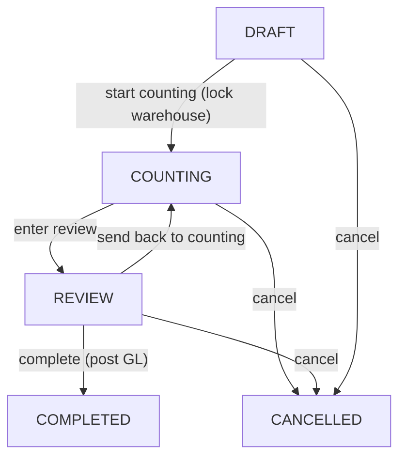

# Inventory Reconciliation — Design Doc (MVP)

## 1. Цели и не-цели

**Цели MVP:**
- Документ "Сличительная ведомость" с зафиксированным `expectedQty` (учётное) и `actualQty` (фактическое) на конкретный склад/дату.
- State machine с явной фазой пересчёта (`COUNTING`) и фазой утверждения (`REVIEW`).
- Построчная классификация расхождений (`SURPLUS`, `SHORTAGE_WRITEOFF`, `SHORTAGE_EMPLOYEE`).
- Автогенерация GL-проводок (NAS) при переводе в `COMPLETED` единым атомарным `prisma.$transaction`.
- Жёсткая блокировка склада на время `COUNTING` от любых движений `StockMovement`/`StockItem`.

**Не-цели (отложено за MVP):**
- Передача недостачи в payroll-удержание (244 → 533) — отдельный пайплайн.
- Bin-level reconciliation (только warehouse-level в MVP; `WarehouseBin` остаётся в данных движений, но MVP считает по складу+продукту).
- Параллельные ведомости по одному складу (явно запрещены).
- IFRS-проводки (только NAS; IFRS-зеркало пойдёт через стандартный механизм).

---

## 2. Архитектурное решение (по подтверждённому выбору)

Выбран `rename-audit`: разворачиваем существующую `InventoryAudit` (сейчас полупустую, статусы `DRAFT/APPROVED`) до полноценной сличительной ведомости. `InventoryAdjustment` остаётся как ручной документ списания/оприходования (`docType = WRITE_OFF | SURPLUS`); `INVENTORY_COUNT` из его `docType` исключаем как deprecated, чтобы не плодить два пути проведения инвентаризации.

Блокировка склада — `hard-lock`: пока есть `InventoryAudit.status IN (COUNTING, REVIEW)` для warehouseId, любые операции через `inventory.service.ts` и `stock.service.ts`, создающие `StockMovement` или меняющие `StockItem`, должны падать с `409 Conflict` (`WAREHOUSE_LOCKED_FOR_RECONCILIATION`).

---

## 3. Prisma schema

Все правки в [packages/database/prisma/schema.prisma](packages/database/prisma/schema.prisma).

### 3.1. Расширить enum `InventoryAuditStatus`

```prisma
enum InventoryAuditStatus {
  DRAFT
  COUNTING
  REVIEW
  COMPLETED
  CANCELLED
}
```

Старое значение `APPROVED` мигрируем в `COMPLETED` через `UPDATE inventory_audits SET status='COMPLETED' WHERE status='APPROVED'` в той же миграции, потом дроп `APPROVED` из enum.

### 3.2. Новый enum для классификации расхождений

```prisma
enum InventoryDiscrepancyKind {
  NONE
  SURPLUS
  SHORTAGE_WRITEOFF
  SHORTAGE_EMPLOYEE
}
```

`NONE` ставится автоматически на строки с `delta = 0` (или `< eps`).

### 3.3. Расширить `InventoryAudit`

Добавить поля (см. строки 584–602 в текущем `schema.prisma`):

```prisma
model InventoryAudit {
  // ... существующие поля
  number                 String?                @map("number")
  startedAt              DateTime?              @map("started_at") @db.Timestamptz(6)
  completedAt            DateTime?              @map("completed_at") @db.Timestamptz(6)
  cancelledAt            DateTime?              @map("cancelled_at") @db.Timestamptz(6)
  responsibleEmployeeId  String?                @map("responsible_employee_id") @db.Uuid
  responsibleEmployee    Employee?              @relation("InventoryAuditResponsible", fields: [responsibleEmployeeId], references: [id])
  notes                  String?                @map("notes")
  postedTransactionId    String?                @map("posted_transaction_id") @db.Uuid
  postedTransaction      Transaction?           @relation("InventoryAuditPosting", fields: [postedTransactionId], references: [id])

  // partial unique: один активный документ на склад
  @@index([organizationId, warehouseId, status], map: "inventory_audits_org_wh_status_idx")
}
```

Дополнительно — partial unique-индекс через `migration.sql`:

```sql
CREATE UNIQUE INDEX inventory_audits_active_per_warehouse_uidx
  ON inventory_audits (organization_id, warehouse_id)
  WHERE status IN ('COUNTING','REVIEW');
```

Это и есть DB-level guard блокировки склада: попытка открыть второй активный документ для одного склада упадёт на `P2002`, который маппим в `409 Conflict`.

### 3.4. Расширить `InventoryAuditLine`

```prisma
model InventoryAuditLine {
  // ... существующие поля
  discrepancyKind         InventoryDiscrepancyKind @default(NONE) @map("discrepancy_kind")
  accountableEmployeeId   String?                  @map("accountable_employee_id") @db.Uuid
  accountableEmployee     Employee?                @relation("InventoryAuditLineAccountable", fields: [accountableEmployeeId], references: [id])
  postedAmountAzn         Decimal                  @default(0) @map("posted_amount_azn") @db.Decimal(19, 4)
  reasonNote              String?                  @map("reason_note")
}
```

CHECK через миграцию:

```sql
ALTER TABLE inventory_audit_lines
  ADD CONSTRAINT inventory_audit_lines_emp_consistency_chk
  CHECK (
    (discrepancy_kind = 'SHORTAGE_EMPLOYEE' AND accountable_employee_id IS NOT NULL)
    OR (discrepancy_kind <> 'SHORTAGE_EMPLOYEE')
  );
```

### 3.5. Депрекейт `InventoryAdjustmentDocType.INVENTORY_COUNT`

Все существующие записи мигрируем в `WRITE_OFF` или `SURPLUS` по знаку `delta`. Из `enum` значение убираем (data-migration script + Prisma schema enum). Соответствующая ветка в [InventoryService.postAdjustmentInTransaction](apps/api/src/inventory/inventory.service.ts) удаляется.



---

## 4. Бизнес-логика (`InventoryAuditService`)

Все методы — в [apps/api/src/inventory/inventory-audit.service.ts](apps/api/src/inventory/inventory-audit.service.ts).

### 4.1. `createDraft(orgId, dto)`
- Создаёт `InventoryAudit` со статусом `DRAFT`. Без снятия снимка остатков — это произойдёт на старте `COUNTING`.

### 4.2. `startCounting(orgId, auditId, actorRole)`
- Guard: `assertMayPostManualJournal(actorRole)`, статус = `DRAFT`.
- В `prisma.$transaction`:
  1. Проверить отсутствие активного `COUNTING/REVIEW` на этом складе (опираемся на partial unique; ловим `P2002`).
  2. Снять snapshot: `inventoryAuditLine.systemQty = stockItem.quantity`, `costPrice = stockItem.averageCost` для всех `Product.isService = false`.
  3. Перевести статус → `COUNTING`, поставить `startedAt = now()`.

### 4.3. `setLineFact(orgId, lineId, dto)`
- Editable только в статусе `COUNTING`. Записывает `factQty`, обновляет `delta = factQty - systemQty`, ставит preliminary `discrepancyKind` (без `accountableEmployeeId` — он задаётся на REVIEW).

### 4.4. `submitForReview(orgId, auditId)`
- Из `COUNTING` → `REVIEW`. Все строки должны иметь установленный `factQty` (даже если 0).

### 4.5. `classifyLine(orgId, lineId, dto)`
- Editable только в `REVIEW`. Принимает `{ discrepancyKind, accountableEmployeeId?, reasonNote? }`.
- Валидации:
  - Для `SURPLUS` строка должна иметь `delta > 0`.
  - Для `SHORTAGE_*` строка должна иметь `delta < 0`.
  - Для `SHORTAGE_EMPLOYEE` обязателен `accountableEmployeeId`, и `Employee.organizationId === orgId`.

### 4.6. `complete(orgId, auditId, actorUserId, actorRole)`
- Guards: `assertMayPostManualJournal`, `access.assertMayPostAccounting`, статус = `REVIEW`, период не закрыт (`getClosedPeriodKeys` + `monthKeyUtc`).
- Все строки с ненулевой `delta` обязаны иметь `discrepancyKind ≠ NONE`.
- В `prisma.$transaction`:
  1. Для каждой строки:
     - **SURPLUS**: `unitCost = line.costPrice` (из snapshot). Сделать `StockMovement(IN, ADJUSTMENT, note=INV_RECON:<auditId>)`, обновить `StockItem.quantity` и пересчитать `averageCost` по weighted-avg.
     - **SHORTAGE_WRITEOFF / SHORTAGE_EMPLOYEE**: `unitCost = StockService.computeIssueUnitCost(...)` (FIFO/AVCO согласно `Organization.valuationMethod`). Сделать `StockMovement(OUT, ADJUSTMENT)`. Если `allowNegativeStock=false` и `available < |delta|` → `BadRequest`.
     - Записать `InventoryAuditLine.postedAmountAzn = qty * unitCost`.
  2. Сгруппировать суммы по типу проводки и вызвать `accounting.postJournalInTransaction(tx, ...)` ровно один раз с агрегированными строками (см. матрицу §5).
  3. `InventoryAudit.status = COMPLETED`, `completedAt = now()`, `postedTransactionId = transactionId`.

### 4.7. `cancel(orgId, auditId, dto)`
- Из `DRAFT/COUNTING/REVIEW` → `CANCELLED`. Никаких проводок и движений. Снимает блокировку склада.

### 4.8. Блокировка склада (warehouse lock)

Реализуется в двух местах:

1. DB-level: partial unique-индекс из §3.3 не даёт открыть второй активный документ.
2. App-level: shared helper `assertWarehouseNotUnderReconciliation(tx, orgId, warehouseId)` — `findFirst` по статусам `COUNTING, REVIEW`. Вызывается в:
   - [InventoryService.recordPurchase / recordWarehouseReceipt / recordWarehouseShipment / recordInventoryTransfers / adjustStockInTransaction / postSaleInventoryInTransaction / postAdjustmentInTransaction](apps/api/src/inventory/inventory.service.ts)
   - [stock.service.ts](apps/api/src/stock/stock.service.ts) — на любой path, где создаётся `StockMovement`.

При срабатывании — кидаем `ConflictException({ code: "WAREHOUSE_LOCKED_FOR_RECONCILIATION", warehouseId, auditId })`.

---

## 5. Матрица проводок (NAS, AZN)

Все проводки идут через [AccountingService.postJournalInTransaction](apps/api/src/accounting/accounting.service.ts) одним вызовом на ведомость с агрегированными суммами. Inventory-account: `Warehouse.inventoryAccountCode` (`201` товары, `204` готовая продукция).

- **SURPLUS** (учёл < факт; ставим на приход):
  - Дт `INVENTORY_GOODS_ACCOUNT_CODE` ("201") или `FINISHED_GOODS_ACCOUNT_CODE` ("204") — на сумму `Σ qty × costPrice`.
  - Кт `INVENTORY_SURPLUS_INCOME_ACCOUNT_CODE` ("631") — той же суммой.
  - Источник: `apps/api/src/ledger.constants.ts` (`INVENTORY_GOODS_ACCOUNT_CODE`, `FINISHED_GOODS_ACCOUNT_CODE`, `INVENTORY_SURPLUS_INCOME_ACCOUNT_CODE`).

- **SHORTAGE_WRITEOFF** (списываем в убыток компании):
  - Дт `MISC_OPERATING_EXPENSE_ACCOUNT_CODE` ("731") — на сумму `Σ qty × unitCost(FIFO/AVCO)`.
  - Кт `INVENTORY_GOODS_ACCOUNT_CODE` / `FINISHED_GOODS_ACCOUNT_CODE` — той же суммой.

- **SHORTAGE_EMPLOYEE** (вешаем долг на МОЛ):
  - Дт `ACCOUNTABLE_PERSONS_ACCOUNT_CODE` ("244") — на сумму `Σ qty × unitCost(FIFO/AVCO)`.
  - Кт `INVENTORY_GOODS_ACCOUNT_CODE` / `FINISHED_GOODS_ACCOUNT_CODE` — той же суммой.
  - В описании журнальной проводки фиксируем `accountableEmployeeId` через `JournalEntry.counterpartyId`/`description`. Субсчёт `244.<employeeCode>` — за рамками MVP, пока работает с агрегированным `244`.

При наличии разных `discrepancyKind` в одной ведомости — это будет одна `Transaction` (`reference = INV-RECON-<auditId>`) с несколькими парами Дт/Кт. Все суммы в AZN.

**Унификация существующего кода:** заменить хардкод `"611"` в [InventoryAuditService.applyApprovedAdjustmentsInTx](apps/api/src/inventory/inventory-audit.service.ts) на `INVENTORY_SURPLUS_INCOME_ACCOUNT_CODE` ("631"), чтобы совпадало с [InventoryService.postAdjustmentInTransaction](apps/api/src/inventory/inventory.service.ts).

---

## 6. API (REST, под существующий префикс)

Контроллер: [apps/api/src/inventory/inventory-audit.controller.ts](apps/api/src/inventory/inventory-audit.controller.ts).

- `POST /api/inventory/reconciliations` — `createDraft`.
- `POST /api/inventory/reconciliations/:id/start` — `startCounting`.
- `PATCH /api/inventory/reconciliations/:id/lines/:lineId` — `setLineFact` (только в `COUNTING`).
- `POST /api/inventory/reconciliations/:id/submit` — `submitForReview`.
- `PATCH /api/inventory/reconciliations/:id/lines/:lineId/classification` — `classifyLine` (только в `REVIEW`).
- `POST /api/inventory/reconciliations/:id/complete` — `complete` (с проводками).
- `POST /api/inventory/reconciliations/:id/cancel` — `cancel`.
- `GET /api/inventory/reconciliations` / `GET /:id` — листинг и карточка.

DTO — в `apps/api/src/inventory/dto/`. Все мутации через `AuditMutationInterceptor` (по правилу [Security Auditor]).

---

## 7. Подводные камни и их обработка

- **Back-dated приход/отгрузка во время COUNTING.** Жёсткий lock запрещает любые `StockMovement` по складу, в т.ч. с `documentDate` задним числом. Кейс "счёт уже выставлен, отгрузка после инвентаризации" — отгрузка оформляется уже после `COMPLETED`, до этого менеджер видит warning при попытке.
- **Параллельные ведомости по одному складу.** Запрещены DB partial unique + app-guard.
- **Закрытый период.** На `complete` сверяем `monthKeyUtc(audit.date)` с `getClosedPeriodKeys(org.settings)`; на `start` — те же checks (нельзя начать пересчёт в закрытом периоде).
- **Negative stock на shortage.** Уважаем `Organization.settings.inventory.allowNegativeStock`. Если `false` и `available < |delta|` — `BadRequest` с указанием продукта.
- **Multi-warehouse.** На каждый склад своя ведомость. Глобальный lock не делаем.
- **Стоимость излишка.** В MVP — `costPrice` из snapshot (на начало COUNTING это `StockItem.averageCost`). Бухгалтер может переопределить в строке вручную через `setLineFact` (опциональное поле в DTO `unitCost`). Это даёт реалистичную оценку и убирает кейс "был 0 в системе → averageCost=0 → излишек оприходован за 0".
- **Стоимость недостачи.** Всегда через `StockService.computeIssueUnitCost` (поддерживает FIFO/AVCO согласно `Organization.valuationMethod`).
- **Услуги.** `Product.isService = true` строки полностью исключаются на этапе snapshot (как сейчас).
- **Идемпотентность `complete`.** Если `postedTransactionId` уже выставлен — повторный вызов кидает `409 Conflict` ("already completed").
- **Soft-delete.** `InventoryAudit.deletedAt` остаётся как сейчас; для активных (`COUNTING/REVIEW`) удаление запрещено (только `cancel`).
- **Backfill для существующих `InventoryAdjustment(docType=INVENTORY_COUNT)`.** Они уже `POSTED` — оставляем как исторические записи, но в статистике/отчётах помечаем как legacy. Новый `INVENTORY_COUNT` через этот путь больше нельзя создать (валидация в DTO).

---

## 8. Migration / data-migration script

1. Prisma schema: расширения из §3.
2. `migration.sql`:
   - `ALTER TYPE inventory_audit_status ADD VALUE 'COUNTING' BEFORE 'APPROVED'`, `ADD VALUE 'REVIEW' BEFORE 'APPROVED'`, `ADD VALUE 'COMPLETED' AFTER 'APPROVED'`, `ADD VALUE 'CANCELLED' AFTER 'COMPLETED'` (Postgres `ALTER TYPE ... ADD VALUE` — отдельные statements).
   - `UPDATE inventory_audits SET status='COMPLETED' WHERE status='APPROVED';`
   - Drop `APPROVED` (через `CREATE TYPE ... AS ENUM ... + ALTER TABLE ... USING ... + DROP TYPE` идиому).
   - Создание `inventory_discrepancy_kind` enum.
   - `ALTER TABLE inventory_audits ADD COLUMN ...` (новые поля).
   - `ALTER TABLE inventory_audit_lines ADD COLUMN discrepancy_kind ... NOT NULL DEFAULT 'NONE', ADD COLUMN accountable_employee_id ..., ADD COLUMN posted_amount_azn ..., ADD COLUMN reason_note ...`.
   - CHECK constraint из §3.4.
   - Partial unique-индекс из §3.3.
3. Data-migration `packages/database/prisma/data-migrate-inventory-count-deprecation.ts`:
   - Все `InventoryAdjustment(docType=INVENTORY_COUNT)` со статусом `POSTED` → `docType` пересчитать: если все строки `delta < 0` → `WRITE_OFF`, если все `delta > 0` → `SURPLUS`, иначе расщепить на два документа (или пометить как legacy с флагом в `reason`). MVP: достаточно перевести в `WRITE_OFF` или `SURPLUS` по знаку суммы.
   - DRAFT-документы с `docType=INVENTORY_COUNT` — отвергнуть с предупреждением (их в живой prod базе быть не должно).
4. Удалить значение `INVENTORY_COUNT` из enum `InventoryAdjustmentDocType` отдельной миграцией.

---

## 9. Что нужно дописать в PRD/TZ

### 9.1. [PRD.md](PRD.md) — модуль "Склад и инвентаризация"

Добавить (или расширить существующий) раздел в §4 "Модули":

- **Сличительная ведомость (Inventory Reconciliation):** документ с `expectedQty / actualQty / delta`, привязка к складу и материально-ответственным лицам. Жизненный цикл `DRAFT → COUNTING → REVIEW → COMPLETED` (плюс `CANCELLED`).
- **Гарантии целостности:** на статусах `COUNTING/REVIEW` склад заблокирован для приходов/отгрузок/перемещений/корректировок (выдаём предупреждение в UI и `409 Conflict` в API).
- **Классификация расхождений:** `SURPLUS`, `SHORTAGE_WRITEOFF`, `SHORTAGE_EMPLOYEE`. Для `SHORTAGE_EMPLOYEE` обязательное поле "Материально-ответственное лицо".
- **Бухгалтерская интеграция:** при `COMPLETED` система автоматически генерирует двойные проводки по NAS (Дт 201/204 — Кт 631 для излишков; Дт 731 — Кт 201/204 для списания; Дт 244 — Кт 201/204 для долга на МОЛ). Не-цели MVP: автоматическое удержание из ЗП.
- В §9 "Сущности" — обновить запись `InventoryAudit` (новые поля и состояния), пометить `InventoryAdjustment.docType=INVENTORY_COUNT` как deprecated.

### 9.2. [TZ.md](TZ.md) — раздел "Inventory & accounting"

В §10 (или ближайший раздел про склад) добавить пункты:

- **State machine ведомости:** перечислить все статусы и переходы; явно зафиксировать, что `complete` идёт в одной `prisma.$transaction` (правило финансовой целостности из `dayday-agent-roles.mdc`).
- **Snapshot expected:** `systemQty` фиксируется в момент перехода `DRAFT → COUNTING`; для излишков `costPrice` берётся из `StockItem.averageCost` (с возможностью переопределения бухгалтером).
- **Warehouse lock:** DB-level через partial unique-индекс `inventory_audits_active_per_warehouse_uidx` + app-level `assertWarehouseNotUnderReconciliation` во всех путях, создающих `StockMovement` (перечислить).
- **Account codes:** ссылка на [apps/api/src/ledger.constants.ts](apps/api/src/ledger.constants.ts) — `INVENTORY_GOODS_ACCOUNT_CODE`, `FINISHED_GOODS_ACCOUNT_CODE`, `INVENTORY_SURPLUS_INCOME_ACCOUNT_CODE`, `MISC_OPERATING_EXPENSE_ACCOUNT_CODE`, `ACCOUNTABLE_PERSONS_ACCOUNT_CODE`.
- **Backward-incompatible notes:** `InventoryAuditStatus.APPROVED` удалён (мигрирован в `COMPLETED`); `InventoryAdjustmentDocType.INVENTORY_COUNT` удалён (миграция в `WRITE_OFF`/`SURPLUS`).
- **API контракт:** перечислить новые эндпоинты (см. §6 этого плана), все мутации идут через `AuditMutationInterceptor`.
- **Валюта/локаль:** все суммы AZN, даты в UTC (правило [Compliance]).

---

## 10. Чек-лист реализации (для последующего execute-фейза)

- [ ] Prisma schema: enum, поля, FK на `Employee` (relations с именами `InventoryAuditResponsible`, `InventoryAuditLineAccountable`, `InventoryAuditPosting`).
- [ ] Migration SQL (включая partial unique, CHECK).
- [ ] Data-migration: `APPROVED → COMPLETED`, `INVENTORY_COUNT → WRITE_OFF/SURPLUS`.
- [ ] `InventoryAuditService`: `createDraft / startCounting / setLineFact / submitForReview / classifyLine / complete / cancel` + `assertWarehouseNotUnderReconciliation` helper.
- [ ] Внедрить `assertWarehouseNotUnderReconciliation` во все места `InventoryService` и `StockService`, создающие `StockMovement`.
- [ ] Контроллер + DTO + `AuditMutationInterceptor`.
- [ ] Унификация: `"611"` → `INVENTORY_SURPLUS_INCOME_ACCOUNT_CODE` в `inventory-audit.service.ts`.
- [ ] Удалить ветку `InventoryAdjustmentDocType.INVENTORY_COUNT` в `inventory.service.ts` после data-migration.
- [ ] Обновить `PRD.md` и `TZ.md` (см. §9).
- [ ] Unit-тесты на матрицу проводок (3 кейса) и на blocked warehouse.
- [ ] `i18n:audit` после правок UI-строк (если будут добавляться UI-ключи).
