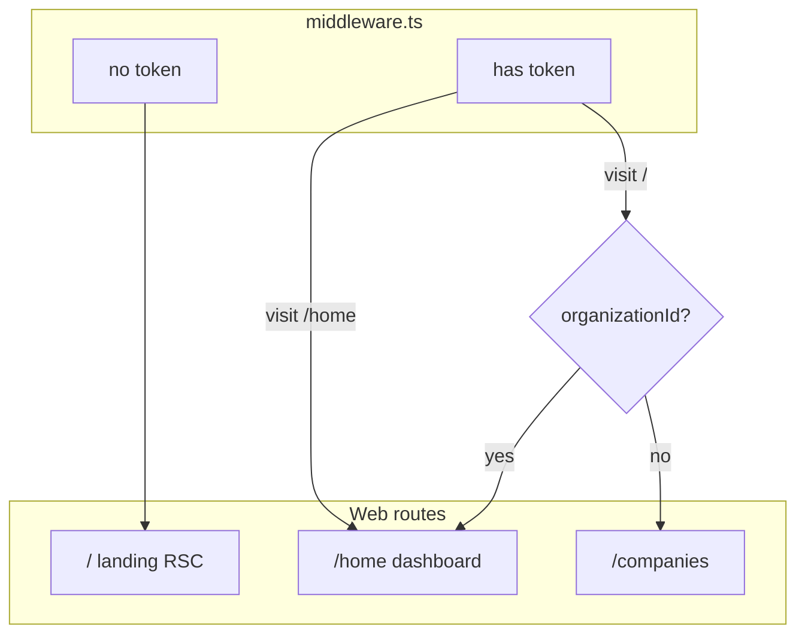

# Landing Page, TRIAL_3_MONTHS, and /home Dashboard

## Baseline (repo facts)

| Area | Current state |
|------|----------------|
| Trial on signup | [`auth.service.ts`](apps/api/src/auth/auth.service.ts) calls [`resolveNewOrganizationTrialSubscription`](apps/api/src/subscription/trial-package.util.ts) — **no** `subscription.service.ts` |
| Trial duration | `PricingBundle.isTrialDefault` + `trialDurationDays`, fallback **90** days UTC via `computeTrialExpiresAtUtc` |
| Trial modules | [`DEFAULT_TRIAL_MODULE_SLUGS`](apps/api/src/subscription/trial-package.util.ts) — already excludes `tax_pro` / `trade_pro`; **does not** exclude `compliance_pro` |
| `PricingBundle` | No `slug` field — only `name`, `moduleKeys`, `isTrialDefault` ([`schema.prisma`](packages/database/prisma/schema.prisma) ~L842) |
| `/` | Client dashboard in [`apps/web/app/page.tsx`](apps/web/app/page.tsx); unauthenticated users never see it — [`layout.tsx`](apps/web/app/layout.tsx) renders `LoginPage` for non-public paths |
| Public marketing pattern | [`/pricing`](apps/web/app/pricing/page.tsx) + [`GET /api/public/pricing`](apps/api/src/admin/public-pricing.controller.ts) |
| Org picker | [`/companies`](apps/web/app/companies/page.tsx) (not `/organizations`) |



---

## Task 1 — Database: `LandingModuleMarketing` + seed

### Prisma model ([`schema.prisma`](packages/database/prisma/schema.prisma))

```prisma
model LandingModuleMarketing {
  id           String   @id @default(dbgenerated("uuid_generate_v4()")) @db.Uuid
  moduleSlug   String   @unique @map("module_slug")
  sortOrder    Int      @default(0) @map("sort_order")
  /// { "az": "...", "ru": "..." }
  names        Json
  /// { "az": "...", "ru": "..." }
  descriptions Json
  /// { "az": ["..."], "ru": ["..."] }
  tasks        Json
  createdAt    DateTime @default(now()) @map("created_at")
  updatedAt    DateTime @updatedAt @map("updated_at")

  @@map("landing_module_marketing")
}
```

- Migration: idempotent SQL in `packages/database/prisma/migrations/20260522120000_landing_module_marketing/` (`CREATE TABLE IF NOT EXISTS`, unique index on `module_slug`).

### Config + seed

- New file [`packages/database/prisma/lib/config/landing-modules.ts`](packages/database/prisma/lib/config/landing-modules.ts) — typed defaults for 4 cards:
  - `finance` — NAS, treasury, sales/purchases, reporting
  - `manufacturing_wip` — BOM, WIP orders (203/201/204)
  - `fixed_assets` — RB / UoP, monthly usage
  - `industry_solutions` — vertical entitlements (beta)
- New [`seedLandingModuleMarketing`](packages/database/prisma/lib/config/landing-modules-seed.ts): **`upsert` by `moduleSlug`** (not only-if-empty), called from [`prisma/seeds/core/index.ts`](packages/database/prisma/schema.prisma) after pricing seeds.
- Re-export defaults for web fallback via thin [`apps/web/lib/config/landing-modules.ts`](apps/web/lib/config/landing-modules.ts) importing from database package path (or duplicate minimal JSON if export wiring is heavy — prefer single source in `packages/database`).

---

## Task 2 — Trial `TRIAL_3_MONTHS` (extend existing trial util, not new service)

### Schema: `PricingBundle.slug`

Add optional `slug String? @unique` to `PricingBundle` + migration.

### Seed trial bundle

Extend [`pricing-bundle-seed.ts`](packages/database/prisma/lib/core/pricing-bundle-seed.ts) (or dedicated `trial-bundle-seed.ts`) with **upsert**:

| Field | Value |
|-------|--------|
| `slug` | `TRIAL_3_MONTHS` |
| `name` | `3 months free trial` |
| `isTrialDefault` | `true` (clear other defaults first in seed) |
| `trialDurationDays` | `90` |
| `moduleKeys` | Core ops: `nas`, `ifrs`, `ifrs_mapping`, `inventory`, `banking_pro`, `kassa_pro`, `production`, `manufacturing`, `fixed_assets`, `hr_full`, `audit_hub` — **exclude** `tax_pro`, `trade_pro`, `compliance_pro` |

### [`trial-package.util.ts`](apps/api/src/subscription/trial-package.util.ts)

1. **`resolveNewOrganizationTrialSubscription`**: prefer bundle where `slug === 'TRIAL_3_MONTHS'`, else `isTrialDefault: true`, else constants.
2. **`computeTrialExpiresAtBaku(signupAt, months = 3)`**: add calendar months in **Asia/Baku** (reuse `Intl` pattern from [`cbar-fx.service.ts`](apps/api/src/fx/cbar-fx.service.ts)), end-of-day Baku → store as UTC `Date` on `OrganizationSubscription.expiresAt`.
3. Filter exclusions: `tax_pro`, `trade_pro`, `compliance_pro` (update `DEFAULT_TRIAL_MODULE_SLUGS` and filter in resolver).
4. Set `customConfig.trialPlanSlug: 'TRIAL_3_MONTHS'` alongside existing `trialPackageId`.
5. Unit tests: Baku +3 months boundary; module exclusion list.

**Note:** Registration hooks in [`auth.service.ts`](apps/api/src/auth/auth.service.ts) (`register`, `createOrganizationForExistingUser`) already use the resolver — **no new service file**; only util + seed changes.

---

## Task 3 — Public API + landing UI on `/`

### API (Nest)

| Endpoint | Auth | Purpose |
|----------|------|---------|
| `GET /api/public/landing-modules` | `@Public()` | Sorted rows for RSC/client |
| `GET /api/admin/landing-modules` | Super-admin | List all |
| `PATCH /api/admin/landing-modules/:moduleSlug` | Super-admin + audit | Update `names` / `descriptions` / `tasks` / `sortOrder` |

- Controller: [`public-landing.controller.ts`](apps/api/src/admin/public-landing.controller.ts) + admin methods in [`admin.service.ts`](apps/api/src/admin/admin.service.ts) / [`admin.controller.ts`](apps/api/src/admin/admin.controller.ts).
- DTO: `class-validator` JSON shape validation (az/ru keys required).

### Route migration (per your routing spec)

1. **Move** current [`page.tsx`](apps/web/app/page.tsx) → [`apps/web/app/home/page.tsx`](apps/web/app/home/page.tsx) unchanged (widgets + `IN_PROGRESS` counter via existing dashboard components).
2. **New** [`apps/web/app/page.tsx`](apps/web/app/page.tsx) — **async Server Component**:
   - Resolve locale: cookie `erafinance_i18n_lang` → `Accept-Language` → default `az` ([`ui-lang.ts`](apps/web/lib/i18n/ui-lang.ts)).
   - Fetch `GET /api/public/landing-modules` (server `fetch` + `revalidate: 300`); on empty/error → static [`landing-modules.ts`](apps/web/lib/config/landing-modules.ts).
   - **Hero** (bilingual headline per spec): *«ERA Finance — 3 ay tam pulsuz!»* / *«Попробуйте бесплатно: 3 месяца…»* + disclaimer (AI / government add-ons paid).
   - **Module cards**: `rounded-2xl` shells, `text-[13px]` task lists ([`DESIGN.md`](DESIGN.md)); CTA → `/register-org`.
   - Top bar: reuse [`LanguageSwitcher`](apps/web/app/language-switcher.tsx) via small client island `LandingChrome`.
3. **Middleware** [`middleware.ts`](apps/web/middleware.ts):
   - Treat `/` and `/home` as public paths (no forced login).
   - If **token** and pathname **`/`** → redirect `/home` (org selection is enforced later in [`app-shell.tsx`](apps/web/app/app-shell.tsx) → `/companies` when `!user.organizationId`).
   - Optional: authenticated visit to `/home` without org — leave to existing app-shell effect (already redirects to `/companies`).
4. **Layout** [`layout.tsx`](apps/web/app/layout.tsx): add `/` to `publicPath` / `barePublicLayout` (like `/pricing`) so marketing renders without `AppShell` or forced `LoginPage`.
5. **Navigation**: [`Sidebar.tsx`](apps/web/components/layout/Sidebar.tsx) + [`app-shell.tsx`](apps/web/app/app-shell.tsx) breadcrumb — `nav.home` href **`/home`**, `isActive` on `/home`.

### i18n

Add `landing.*` keys to [`packages/i18n/src/resources.ts`](packages/i18n/src/resources.ts) (RU + AZ): hero, disclaimer, CTA; run `npm run i18n:catalog`.

---

## Task 4 — Super-Admin: edit landing content

- New tab `landing` on [`super-admin/page.tsx`](apps/web/app/super-admin/page.tsx) (or sub-route `/super-admin/landing` if tab bar is crowded).
- Table: `moduleSlug`, sort order, name preview (current locale), edit action.
- Modal/form: JSON fields as structured inputs (name AZ/RU, description AZ/RU, tasks as newline-separated lists per locale) → `PATCH /api/admin/landing-modules/:moduleSlug`.
- Follow existing super-admin table/modal patterns from subscription org modal.

---

## Task 5 — Product docs: [`PRD.md`](PRD.md) and [`TZ.md`](TZ.md) (Sync Master)

**Правило репозитория:** изменения продукта/контрактов — **в том же наборе правок**, что и код (не откладывать). Язык документов — как в файлах (RU для продуктовых разделов).

### [`PRD.md`](PRD.md)

| Раздел | Что зафиксировать |
|--------|-------------------|
| **§7.3 Демо-режим** | Trial-пакет с **`slug: TRIAL_3_MONTHS`** (`PricingBundle`); срок **3 календарных месяца** от `Organization.createdAt`, расчёт **`expiresAt` в часовом поясе Asia/Baku** (конец календарного дня Baku); whitelist **операционных** модулей; **явное исключение** `tax_pro`, `trade_pro`, **`compliance_pro`** (платные AI/гос. add-ons); `customConfig.trialPlanSlug`. Заменить формулировку «только UTC», если после внедрения срок считается по Baku. |
| **§7.3.1 Главная** | Маршрут ERP-дашборда — **`/home`** (не `/`); пункт сайдбара «Главная» → `/home`. |
| **§7.6.4 Публичный прайс и лендинг** | Расширить таблицу: корневой маркетинговый маршрут **`/`** (async RSC, AZ/RU); **`GET /api/public/landing-modules`**; таблица **`landing_module_marketing`**; fallback на seed [`landing-modules.ts`](packages/database/prisma/lib/config/landing-modules.ts); Hero «3 ay tam pulsuz / 3 месяца… 0 AZN» + disclaimer; карточки Finance / Manufacturing WIP / Fixed Assets / Industry; CTA `/register-org`; middleware: гость на `/` — лендинг; с токеном на `/` — редирект `/home` (выбор org — `/companies`). Сохранить **`/pricing`** и **`GET /api/public/pricing`**. |
| **§7.6 (Super-Admin)** | Строка в таблице возможностей: вкладка/раздел **редактирования `LandingModuleMarketing`** (названия, описания, списки задач AZ/RU). |
| **§14.2 (task table)** | Новая строка **`MOD-LAND-001`** \| Marketing landing + DB content \| §7.6.4 \| `[x] COMPLETED` после релиза. При необходимости уточнить строку trial в §14.2, если есть отдельный MOD для billing trial. |
| **§15 История версий** | Краткая запись v2026.06: landing `/`, `TRIAL_3_MONTHS`, Baku trial expiry. |

### [`TZ.md`](TZ.md)

| Раздел | Что зафиксировать |
|--------|-------------------|
| **§0.0 / реестр HTTP** | `GET /api/public/landing-modules` (`@Public`, `@SkipThrottle`); `GET /api/admin/landing-modules`, `PATCH /api/admin/landing-modules/:moduleSlug` (super-admin, audit на PATCH). |
| **§14.3 Демо** | `PricingBundle.slug` (уникальный, опциональный); резолвер: `slug === TRIAL_3_MONTHS` → иначе `isTrialDefault`; **`computeTrialExpiresAtBaku(signupAt, 3)`**; фильтр модулей без `tax_pro` / `trade_pro` / `compliance_pro`; `customConfig.trialPlanSlug`. Ссылка на [`trial-package.util.ts`](apps/api/src/subscription/trial-package.util.ts) (не несуществующий `subscription.service.ts`). |
| **§14.8 / `PricingBundle`** | Поле **`slug`**; seed upsert `TRIAL_3_MONTHS`; только один `isTrialDefault=true`. |
| **§15.1 Super-Admin** | Строка UI: marketing blocks editor. |
| **§15.3** | Переименовать/дополнить подзаголовок «Публичные маркетинговые API»: сохранить §15.3.1 pricing; добавить **§15.3.2 Landing modules** — JSON-форма ответа (`moduleSlug`, `names`, `descriptions`, `tasks`, `sortOrder`), веб **`/`**, middleware/layout `publicPath`, server fetch + `revalidate`. |
| **§15.3 (веб-маршруты)** | Таблица: `/` — landing; `/home` — dashboard; `middleware.ts` redirect authenticated `/` → `/home`. |
| **Prisma** | Модель `LandingModuleMarketing` + миграция (идемпотентный SQL). |
| **§15 История версий TZ** | Запись с датой: landing API, `TRIAL_3_MONTHS`, Baku expiry, `/home`. |

### Чеклист перед merge

- [ ] PRD и TZ ссылаются на одни и те же пути API и маршруты web.
- [ ] Нет противоречия «дашборд на `/`» vs «дашборд на `/home`».
- [ ] Trial: Baku в TZ/PRD согласован с реализацией в `trial-package.util.ts`.
- [ ] Упомянуты исключённые slug (`compliance_pro` добавлен к уже описанным `tax_pro` / `trade_pro`).

---


## Verification

| Check | Command / action |
|-------|------------------|
| Migrations | `npm run db:migrate` (after Docker Postgres up) |
| API build | `npm run build -w @erafinance/api` |
| Web build | `npm run build -w @erafinance/web` |
| i18n | `npm run i18n:audit` |
| Manual | Guest `/` → landing AZ/RU; login → `/` redirects to `/home`; signup → subscription `isTrial`, `expiresAt` ~+3mo Baku, no `compliance_pro` in modules |
| Docs | PRD §7.3 / §7.6.4 / §7.3.1 и TZ §14.3 / §15.3.2 — согласованы с кодом |

---

## Out of scope (explicit)

- Full product vertical UIs (industry modules) — marketing copy only.
- Replacing `/pricing` page — remains separate; landing links to it optionally.
- Moving Council of Elders or FA/MFG work from prior plans.
