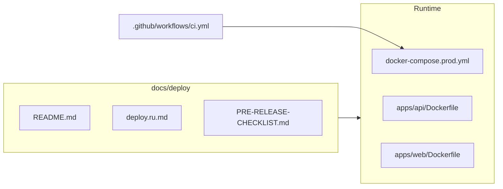

# Подготовка к live: деплой, инфра, миграции, git

## Контекст

- **Батники:** в индексе репозитория нет `*.bat` и каталога `bats`; вы указали, что они **только локально в корне** — проверка будет по чеклисту (пути с пробелами, `cd /d`, вызовы `npm`, порты).
- **Схлопывание миграций:** сценарий **greenfield** (стенд можно пересоздать, reset допустим) — допустимо удалить историю и оставить **одну** миграцию от пустой БД до текущего [`packages/database/prisma/schema.prisma`](packages/database/prisma/schema.prisma).

## 1) Деплоймент-файлы (свести в одно состояние)

Пройти и при необходимости поправить согласованность **версий и шагов** (Node **22**, Postgres **16**, Redis **7**, Prisma 7 / `prisma.config.ts`):

| Область | Файлы |
|--------|--------|
| Compose | [`docker-compose.yml`](docker-compose.yml), [`docker-compose.prod.yml`](docker-compose.prod.yml) |
| Образы | [`apps/api/Dockerfile`](apps/api/Dockerfile), [`apps/web/Dockerfile`](apps/web/Dockerfile) |
| Env-шаблоны | [`.env.example`](.env.example), [`env.production.example`](env.production.example) |
| CI | [`.github/workflows/ci.yml`](.github/workflows/ci.yml) (сервисы Postgres/Redis, `npm run db:migrate:deploy`) |
| Доки | [`docs/deploy/README.md`](docs/deploy/README.md), [`docs/deploy/deploy.md`](docs/deploy/deploy.md), [`docs/deploy/deploy.ru.md`](docs/deploy/deploy.ru.md), [`docs/deploy/PRE-RELEASE-CHECKLIST.md`](docs/deploy/PRE-RELEASE-CHECKLIST.md), [`docs/deploy/DR_RUNBOOK.md`](docs/deploy/DR_RUNBOOK.md) |
| Скрипты | [`scripts/deploy-prod-db-migrate.sh`](scripts/deploy-prod-db-migrate.sh), [`scripts/deploy-prod-code.sh`](scripts/deploy-prod-code.sh), [`scripts/deploy-prod-db-reset.sh`](scripts/deploy-prod-db-reset.sh) |
| Мониторинг | [`docs/deploy/monitoring/docker-compose.monitoring.yml`](docs/deploy/monitoring/docker-compose.monitoring.yml), [`docs/deploy/monitoring/README.md`](docs/deploy/monitoring/README.md) |

Критерий «обновлено»: одинаковые упоминания стека, нет устаревших команд (например расхождение `db:migrate` vs `db:migrate:deploy` — в корневом [`package.json`](package.json) `db:migrate` уже ведёт на `prisma migrate deploy` в workspace database).

## 2) Локальные .bat в корне проекта (не в git)

Поскольку файлов в репо нет, выполнить **ручной аудит** ваших скриптов (например `START-ERP.bat`, `START-WEB.bat` из локальной практики):

- Рабочая директория: переход в корень монорепо (`cd /d "D:\My Projects\dayday_erp"`).
- Вызовы `npm run ...` совпадают с [`package.json`](package.json); для API/Web — `dev:api` / `dev:web` / `dev` по назначению.
- Перед стартом: `stop:api` / `stop:next` или освобождение портов **4000** / **3000**, если скрипт это делает.
- Подмешивание `.env`: как в правилах — корневой `.env` для `dotenv-cli` скриптов npm.

Результат: короткая заметка в репо **только если вы попросите** (иначе не трогаем markdown без запроса) — либо ограничимся комментарием в существующем deploy README.

## 3) Инфраструктурные файлы

Перепроверить согласованность с прод-compose и безопасностью:

- [`.dockerignore`](.dockerignore) — не тащить `.env`, лишние артефакты в образ.
- Корневой compose: тома, `DOCKER_DATA_ROOT`, healthchecks.
- Примеры nginx: [`docs/nginx-erafinance-production.example.conf`](docs/nginx-erafinance-production.example.conf), [`docs/nginx-maintenance.conf`](docs/nginx-maintenance.conf) — upstream-порты и TLS-заглушки.
- [`packages/database/prisma.config.ts`](packages/database/prisma.config.ts) (если есть) и пути миграций относительно `packages/database`.

## 4) Схлопывание всех миграций (greenfield)

Сейчас в [`packages/database/prisma/migrations`](packages/database/prisma/migrations) десятки папок поверх уже существующего [`20260505120000_squashed_init`](packages/database/prisma/migrations/20260505120000_squashed_init/migration.sql).

**Процедура (целевая):**

1. Ветка от `main`/`master`, бэкап: скопировать текущую папку `migrations` в архив/ветку (на случай отката).
2. Удалить **все** подкаталоги в `packages/database/prisma/migrations` (или переименовать старую папку целиком).
3. Сгенерировать **один** SQL от пустой БД до текущей схемы, из каталога `packages/database`, через Prisma CLI, например `prisma migrate diff --from-empty --to-schema-datamodel prisma/schema.prisma` (точные флаги сверить с версией Prisma в lockfile).
4. Создать одну новую папку миграции с корректным timestamp и `migration.sql` из вывода diff.
5. **Риск:** отдельные старые `migration.sql` могли содержать не только DDL, но и **данные** (INSERT/UPDATE). Перед удалением — быстрый поиск по старым файлам на `INSERT`/`UPDATE`/`DELETE`; если что-то критично не покрыто `schema.prisma` + seed — перенести в [`packages/database/prisma/seed.ts`](packages/database/prisma/seed.ts) или в хвост единого `migration.sql` осознанно.

## 5) Миграция БД

После появления единственной миграции:

- Локально / на чистом стенде: с пустой Postgres — `npm run db:migrate:deploy` из корня (или `npm run db:migrate` — то же самое для workspace database).
- Полный прод-подобный цикл по runbook: [`npm run db:deploy`](package.json) (migrate deploy + `db:sync-i18n:prune`) и при необходимости сиды — см. [`docs/deploy/deploy.ru.md`](docs/deploy/deploy.ru.md) и [`docker-compose.prod.yml`](docker-compose.prod.yml) комментарии про **не** класть SQL в `docker-entrypoint-initdb.d`.

## 6) Коммиты и пуши

После выполнения пунктов 1–5 в **Agent mode** (не в Plan):

- Разнести изменения по **логическим коммитам** (например: `chore(infra): align deploy docs and compose`, `chore(db): squash prisma migrations to single init`) или один атомарный коммит — по вашему предпочтению.
- **Пуш:** только с вашей авторизацией к `origin`; не делать `git push --force` на общую ветку без явного согласия.
- Учесть текущий большой набор незакоммиченных изменений (audit-hub, i18n, тесты и т.д.) — либо отдельная ветка релиза, либо слияние с основной фича-веткой по вашей модели Git.

## 7) Выход на live (системная готовность)

Опираться на [`docs/deploy/PRE-RELEASE-CHECKLIST.md`](docs/deploy/PRE-RELEASE-CHECKLIST.md) и [`docs/deploy/deploy.ru.md`](docs/deploy/deploy.ru.md):

- Заполненный `.env` из [`env.production.example`](env.production.example): `POSTGRES_PASSWORD`, `JWT_*`, `CORS_ORIGINS`, при необходимости SMTP/Sentry/storage paths.
- Сборка образов из корня (как в [`docs/deploy/README.md`](docs/deploy/README.md)).
- Резервное копирование БД, план отката, healthchecks `api`/`web`, опционально monitoring compose.

---

**Важно:** этот план зафиксирован в режиме планирования — **исполнение** (правки файлов, squash, `npm run`, `git commit/push`) начнётся после вашего подтверждения плана и переключения в обычный Agent mode.
