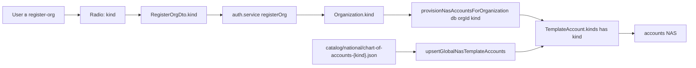

## NAS plans by org kind

### 1. Schema: единый enum `OrganizationKind`

В [packages/database/prisma/schema.prisma](packages/database/prisma/schema.prisma):

- Переименовать `enum CoaTemplateProfile { COMMERCIAL_FULL, COMMERCIAL_SMALL }` → `enum OrganizationKind { COMMERCIAL, BUDGET, NCO }` (строка 135).
- Переименовать `enum TemplateGroup { COMMERCIAL, GOVERNMENT, SMALL_BUSINESS }` (строка 3385) — удалить, использовать `OrganizationKind` везде.
- `Organization.coaTemplateProfile` → `Organization.kind: OrganizationKind` (строка 53). `@@index([coaTemplateProfile])` → `@@index([kind])` (строка 130).
- `TemplateAccount.templateGroups: CoaTemplateProfile[]` → `kinds: OrganizationKind[] @map("kinds")` (строка 153).
- `ChartOfAccountsEntry.templateGroup: TemplateGroup` → `kind: OrganizationKind` (строка 2729).

### 2. Prisma migrations: schema + data

В [packages/database/prisma/migrations/](packages/database/prisma/migrations/) — новая SQL-миграция:

- `ALTER TYPE coa_template_profile RENAME TO organization_kind;`
- Добавить значения `BUDGET`, `NCO`; удалить `COMMERCIAL_SMALL` (после data-step) и переименовать `COMMERCIAL_FULL` → `COMMERCIAL`. (PostgreSQL: `ALTER TYPE ... RENAME VALUE 'COMMERCIAL_FULL' TO 'COMMERCIAL';` и затем удалить старое значение через temp enum + rewrite столбцов).
- Data-step (single-statement в той же миграции): `UPDATE organizations SET coa_template_profile = 'COMMERCIAL'` для всех `COMMERCIAL_FULL`/`COMMERCIAL_SMALL` (после deploy SMALL не должно остаться).
- `RENAME COLUMN coa_template_profile TO kind`; индекс пересоздать.
- `template_accounts.template_groups` → `kinds`; rewrite значений массива.
- Удалить `chart_of_accounts_entries.template_group` (или переименовать в `kind`); тип менять через temp column.

Это самая чувствительная часть — миграция должна выполняться idempotent в `prisma migrate deploy` и в фасаде `db:prod-init`.

### 3. Каталоги планов счетов

В [packages/database/prisma/catalog/national/](packages/database/prisma/catalog/national/):

- Текущий `chart-of-accounts.json` (commercial RU-flat, упрощённый) → переименовать в `chart-of-accounts-commercial.json` и расширить до полного NAS-COMMERCIAL (199 строк из [docs/NAS-COMMERCIAL.md](docs/NAS-COMMERCIAL.md): section/group/account, поля `code, nameAz, nameRu, type, parentCode`).
- Создать `chart-of-accounts-budget.json` из [docs/NAS-GOV.md](docs/NAS-GOV.md): 4 уровня (section name → group → account → subaccount как `111-1`); `nameAz` из источника, `nameRu` — переводы.
- Создать `chart-of-accounts-nco.json` из [docs/NAS-NCO.md](docs/NAS-NCO.md): 3 уровня; правило извлечения группы из имени строки слева от первого счёта.

Каждый JSON: `{ "meta": { kind, locale: "az+ru", source }, "accounts": [...] }`. Поле `name` (legacy) больше не используется — только `nameAz` + `nameRu` (en пустая, фолбэк на az в `pickAccountDisplayName`).

### 4. Логика загрузки и провижна — `prisma/lib/chart/chart-seed.ts`

В [packages/database/prisma/lib/chart/chart-seed.ts](packages/database/prisma/lib/chart/chart-seed.ts):

- Удалить импорт `getNasCommercialFullAccounts/getNasSmallBusinessAccounts/NAS_SMALL_BUSINESS_CODES` и сам файл [packages/database/prisma/lib/chart/nas-chart-commercial-data.ts](packages/database/prisma/lib/chart/nas-chart-commercial-data.ts) — JSON становится единственным источником.
- Новые функции с подписями на `kind`:
  - `chartOfAccountsJsonPath(kind: OrganizationKind): string` — `national/chart-of-accounts-${kind.toLowerCase()}.json`.
  - `loadChartJson(kind: OrganizationKind): Promise<ChartAccountSeed[]>`.
  - `seedChartOfAccountsForOrganization(db, orgId, accounts, kind)`.
  - `seedChartOfAccountsCatalogEntries(db, accounts, kind)`.
  - `loadChartTemplateFromDb(db, kind)`.
  - `syncChartForOrganization(db, orgId, kind)` (был `syncAzChartForOrganization`).
  - `upsertGlobalNasTemplateAccounts(db)` — теперь циклит по всем kind: грузит каждый JSON, апсёртит `template_accounts` с `kinds = [kind]`. По единому `code` — массив накапливается (если код принадлежит нескольким kind, чего практически не будет — у GOV коды другие).
  - `seedOrganizationNasFromTemplateAccounts(db, orgId, kind)` — фильтр `where: { kinds: { has: kind } }`.
  - `provisionNasAccountsForOrganization(db, orgId, kind)` — обновлённая сигнатура.
- Удалить `resolveCoaTemplateProfileFromDto` и `coaProfileToSettingsTemplateGroup` (DTO теперь возвращает `kind` напрямую).
- Скорректировать `cashProfileForNasCode` — для BUDGET касса = `101`, для NCO/COMMERCIAL = `221`. Карта: `{ COMMERCIAL: { AZN: '221', FX: '222' }, BUDGET: { AZN: '101', FX: '102' }, NCO: { AZN: '221', FX: '222' } }`.

### 5. Слой `seeds/national/`

В [packages/database/prisma/seeds/national/chart-of-accounts.ts](packages/database/prisma/seeds/national/chart-of-accounts.ts) и [packages/database/prisma/seeds/national/index.ts](packages/database/prisma/seeds/national/index.ts):

- Сид прогоняет `upsertGlobalNasTemplateAccounts` (один раз — он уже циклит по 3 kind).
- Каталог `chart_of_accounts_entries` — построчный апсёрт всех 3 JSON с `kind = OrganizationKind`.

### 6. API: онбординг и DTO

- [apps/api/src/auth/dto/register-org.dto.ts](apps/api/src/auth/dto/register-org.dto.ts), [apps/api/src/auth/dto/create-org.dto.ts](apps/api/src/auth/dto/create-org.dto.ts): убрать `coaTemplate: 'full' | 'small'` и `templateGroup`, добавить `kind: OrganizationKind` (`@IsEnum(OrganizationKind)`, default `COMMERCIAL`).
- [apps/api/src/auth/auth.service.ts](apps/api/src/auth/auth.service.ts): передавать `kind` в `Organization.create({ data: { kind } })` и в `provisionNasAccountsForOrganization(db, orgId, kind)`.
- [apps/api/src/organizations/organizations.service.ts](apps/api/src/organizations/organizations.service.ts), [apps/api/src/accounts/accounts.service.ts](apps/api/src/accounts/accounts.service.ts), [apps/api/src/accounting/accounting.service.ts](apps/api/src/accounting/accounting.service.ts), [apps/api/src/admin/admin.service.ts](apps/api/src/admin/admin.service.ts): заменить `coaTemplateProfile`/`TemplateGroup` на `kind`. Payroll-логика (`apps/api/src/hr/payroll.service.ts`, `apps/api/src/payroll/tax-calculator.ts`) — точечный поиск/замена; payroll формулы остаются как есть, меняется только тип параметра.
- [apps/api/src/scripts/local-mock-seed.ts](apps/api/src/scripts/local-mock-seed.ts): создавать demo org с `kind: COMMERCIAL`.

### 7. Web: выбор `kind` при регистрации

- [apps/web/app/register-org/page.tsx](apps/web/app/register-org/page.tsx): три radio-card «Коммерческая / Бюджетная / Некоммерческая» (вместо текущих full/small). Дефолт COMMERCIAL.
- [apps/web/components/companies/create-company-modal.tsx](apps/web/components/companies/create-company-modal.tsx): то же поле `kind`.
- [apps/web/app/accounting/chart/page.tsx](apps/web/app/accounting/chart/page.tsx): подпись плана зависит от `kind` (показать имя профиля в шапке).

### 8. i18n

- [packages/i18n/src/resources.ts](packages/i18n/src/resources.ts): добавить ключи `organizations.kind.commercial`, `organizations.kind.budget`, `organizations.kind.nco` для ru/az; убрать ключи о full/small. Затем `npm run i18n:catalog` и `npm run db:sync-i18n` (см. правило локальной разработки).

### 9. Скрипты

- [packages/database/prisma/scripts/ops/nas/resync-nas-for-user-email.ts](packages/database/prisma/scripts/ops/nas/resync-nas-for-user-email.ts), [packages/database/prisma/scripts/ops/nas/data-migrate-nas-account-names.ts](packages/database/prisma/scripts/ops/nas/data-migrate-nas-account-names.ts): подменить `CoaTemplateProfile/TemplateGroup` на `OrganizationKind`, читать `kind` из самой org.
- [packages/database/prisma/scripts/ops/ifrs/apply-template-ifrs-mapping.ts](packages/database/prisma/scripts/ops/ifrs/apply-template-ifrs-mapping.ts): мапинг IFRS пока остаётся только для COMMERCIAL (template-ifrs-mapping.v1.json опирается на коммерческие коды). Для BUDGET/NCO — placeholder и предупреждение в логах.

### 10. Документация

- [PRD.md](PRD.md) §3.1.2: переписать onboarding с тремя радио-кардами; убрать `full/small`.
- [TZ.md](TZ.md): обновить разделы про `OrganizationKind`, провижн NAS, `template_accounts.kinds`.

### 11. Тесты

- Unit: `chart-seed.spec.ts` — загрузка трёх JSON и валидация (parentCode, нет дубликатов code, иерархия валидна).
- Service: `auth.service.spec.ts` — сценарий регистрации с `kind: BUDGET` приводит к accounts с кодом `101`.
- API e2e (если есть в тестах): POST /auth/register-org `kind=NCO` → организация создаётся, accounts[0].code=`101` (NCO начинается с qeyri-maddi aktivlər).

### Поток данных

### Разделение обязанностей слоёв

- **catalog/national/chart-of-accounts-{kind}.json** — статические данные планов (источник правды).
- **lib/chart/chart-seed.ts** — переиспользуемая TS-логика (используется и API, и `seeds/`).
- **seeds/national/chart-of-accounts.ts** — orchestration: грузит JSON и сидит каталог `template_accounts` + `chart_of_accounts_entries`.
- **API auth.service** — провижн NAS-счетов конкретной организации в `accounts` через `provisionNasAccountsForOrganization`.

### Затраты

- Переводы AZ→RU: ~200 строк (BUDGET) + ~150 строк (NCO). Делается прямо в JSON-файлах при создании.
- Миграция: один прогон `prisma migrate dev` + проверка `prisma migrate deploy` на чистой БД.
- Регрессия: payroll/accounting логика опирается на коды счетов (101, 221, 521 и пр.) — для NAS-COMMERCIAL они остаются. Для BUDGET/NCO модули payroll/customs/etc. в MVP не активируются (gating по `kind`).
