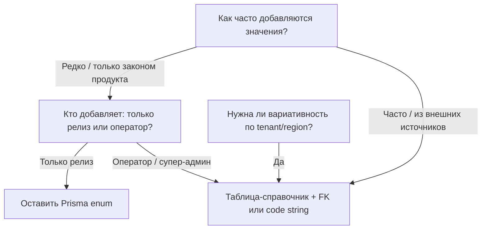

# NCO → NGO и анализ enum vs справочники

## Часть A: переименование NCO → NGO для NAS (`OrganizationKind`)

**Зачем:** единая терминология с **`CounterpartyLegalForm.NGO`** по смыслу «некоммерческий / НКО»; литерал **`NGO`** читается как *Non-Governmental Organization*.

**Важно (не коллизия):** в PostgreSQL два разных типа enum (`OrganizationKind` и `CounterpartyLegalForm`) могут оба содержать значение `NGO`. В TypeScript это **`OrganizationKind.NGO`** vs **`CounterpartyLegalForm.NGO`** — разные перечисления. В UI/доках полезно различать подписи: «план NAS для НКО» vs «ОПФ контрагента НКО».

### Изменения по слоям

1. **Prisma + PostgreSQL**
   - В [packages/database/prisma/schema.prisma](packages/database/prisma/schema.prisma): в `enum OrganizationKind` заменить `NCO` на `NGO`; комментарий к модели `Organization` при необходимости поправить («NGO chart», не NCO).
   - Новая миграция SQL (отдельный файл в `packages/database/prisma/migrations/`):
     - `ALTER TYPE "OrganizationKind" RENAME VALUE 'NCO' TO 'NGO';` ([документация PG](https://www.postgresql.org/docs/current/sql-altertype.html) — `RENAME VALUE` переносит существующие строки).
     - На пустой БД без значения `NCO`: либо та же миграция не выполнится — типичный паттерн: одна миграция только для rename на уже развёрнутых стендах; для «с нуля» историю миграций уже задаёт предыдущий файл с `'NCO'` — после правки enum в schema следующая `migrate dev` создаст новый шаг. Практика: **новая миграция только с `RENAME VALUE`** для прод-существующих БД; если нужна совместимость shadow DB — проверить порядок применения.
   - Альтернатива при проблемах с порядком миграций: в новой миграции использовать безопасный блок `DO $$ ... IF EXISTS ...` вокруг rename (опционально).

2. **Каталог и сборка**
   - Переименовать файл **[packages/database/prisma/catalog/national/chart-of-accounts-nco.json](packages/database/prisma/catalog/national/chart-of-accounts-nco.json)** → `chart-of-accounts-ngo.json`.
   - Внутри JSON: `"meta": { "kind": "NGO", ... }`.
   - [packages/database/prisma/scripts/build-nas-catalog-jsons.ts](packages/database/prisma/scripts/build-nas-catalog-jsons.ts): путь к документу — решить единообразно: переименовать **`docs/NAS-NCO.md`** → **`docs/NAS-NGO.md`** и обновить импорты/комментарии, либо оставить имя файла доки и только поправить заголовок/README (рекомендация: **переименовать док для консистентности** и поправить все ссылки в README).
   - Функции `parseNasNco` / `inferNcoType` → переименовать в `parseNasNgo` / `inferNgoType` (или оставить внутренние имена — по желанию команды).
   - [packages/database/prisma/catalog/README.md](packages/database/prisma/catalog/README.md): строка про `chart-of-accounts-nco.json` → `ngo`.

3. **Логика чартов**
   - [packages/database/prisma/lib/chart/chart-seed.ts](packages/database/prisma/lib/chart/chart-seed.ts): все ветки `OrganizationKind.NCO` → `NGO`; цикл `upsertGlobalNasTemplateAccounts`; `cashProfileForNasCode` для NGO (бывш. NCO).
   - [packages/database/prisma/seeds/national/chart-of-accounts.ts](packages/database/prisma/seeds/national/chart-of-accounts.ts): `OrganizationKind.NGO`.

4. **API и Web**
   - DTO/OpenAPI описания: [apps/api/src/auth/dto/create-org.dto.ts](apps/api/src/auth/dto/create-org.dto.ts), [register-org.dto.ts](apps/api/src/auth/dto/register-org.dto.ts), [apps/api/src/organizations/organizations.controller.ts](apps/api/src/organizations/organizations.controller.ts).
   - Парсинг query: [apps/api/src/accounts/accounts.controller.ts](apps/api/src/accounts/accounts.controller.ts) (`"NCO"` → `"NGO"`).
   - Типы и радио: [apps/web/lib/auth-context.tsx](apps/web/lib/auth-context.tsx), [apps/web/app/register-org/page.tsx](apps/web/app/register-org/page.tsx), [apps/web/components/companies/create-company-modal.tsx](apps/web/components/companies/create-company-modal.tsx), [apps/web/app/accounting/chart/page.tsx](apps/web/app/accounting/chart/page.tsx), [apps/web/app/super-admin/page.tsx](apps/web/app/super-admin/page.tsx) (`<option value="NGO">`, локальный union type).

5. **i18n**
   - В [packages/i18n/src/resources.ts](packages/i18n/src/resources.ts): переименовать ключи **`organizationKindNco`** → **`organizationKindNgo`**, **`planKindNco`** → **`planKindNgo`** (и все `t("…")` на экранах); ru/az строки можно слегка уточнить («НКО / NGO»).
   - После правок: **`npm run i18n:catalog`** и при необходимости **`npm run db:sync-i18n`** по правилам репо.

6. **Тесты и пакет database**
   - [packages/database/prisma/lib/chart/chart-seed.spec.ts](packages/database/prisma/lib/chart/chart-seed.spec.ts): slug `ngo`, `OrganizationKind.NGO`, путь к JSON.
   - Обновить [packages/database/index.d.ts](packages/database/index.d.ts) только если есть ручные экспорты строковых литералов (маловероятно).

7. **Документация продукта**
   - [PRD.md](PRD.md), [TZ.md](TZ.md): все упоминания `NCO` / `nco` в контексте `OrganizationKind` и имён файлов заменить на **NGO** / **`chart-of-accounts-ngo.json`**.

8. **Ops**
   - Скрипты в `packages/database/prisma/scripts/ops/nas/*` и `apply-template-ifrs-mapping.ts`: сообщения «NCO» → «NGO» там, где речь про `OrganizationKind`.

**Не трогать:** файл плана `.cursor/plans/nas_plans_by_org_kind_*.plan.md` (по вашему правилу — не редактировать).

---

## Часть C: Тип компании при регистрации → реестр + план NAS (без отдельного выбора «коммерческая/бюджетная»)

**Продуктовое решение (замена прежнего UX):**

- Раньше пользователь явно выбирал **вариант плана NAS** (коммерческий / бюджетный / …), чтобы подгрузить нужный `chart`.
- **Теперь:** на регистрации пользователь выбирает только **тип компании** = **`CounterpartyLegalForm` (ОПФ)** — MMC, QSC, гос. учреждение, НКО и т.д.
- **Сервер** по таблице соответствия вычисляет **`OrganizationKind`** и вызывает **`provisionChartOfAccountsFromTemplate`** с этим `kind` (как сейчас по смыслу, но `kind` не приходит отдельным полем с клиента).
- Сразу после создания организации тенант попадает в **глобальный реестр**: **`global_company_directory`** + **`global_counterparties`** (и при расширении схемы — с **`legal_form`** для Smart-fill).

**Почему в БД остаётся `organizations.kind`:** быстрые запросы, гейтинг модулей, payroll `settings.templateGroup` через существующий `organizationKindToPayrollSettingsTemplateGroup(kind)` — источник истины для вида учёта остаётся вычисленным и сохранённым полем; **ОПФ** — то, что ввёл пользователь.

### Таблица соответствия ОПФ → `OrganizationKind` (v1, зафиксировать в коде + TZ)

Единая функция, например **`legalFormToOrganizationKind(form: CounterpartyLegalForm): OrganizationKind`** в пакете database или API (один импорт в `auth.service`).

| `CounterpartyLegalForm` | `OrganizationKind` | Комментарий |
|-------------------------|---------------------|-------------|
| `STATE_AGENCY` | `BUDGET` | бюджетный NAS-GOV |
| `NGO` | `NGO` | план для НКО (после переименования NCO→NGO) |
| Все остальные (`INDIVIDUAL`, `LLC`, `CJSC`, `OJSC`, `PUBLIC_LEGAL_ENTITY`, `BRANCH`, `HOA`) | `COMMERCIAL` | коммерческий NAS по умолчанию |

При появлении исключений (например **PHŞ** только под бюджет) — правка одной таблицы/функции и миграция данных при необходимости.

### Текущий разрыв в коде

- У **`Organization`** нет **`legal_form`**; на **`register-org`** отдельно шлётся **`kind`**, а не только ОПФ.
- **`register`** не пишет в **`GlobalCompanyDirectory`** / **`GlobalCounterparty`**.

### Целевое поведение

1. **Данные**
   - **`organizations.legal_form`**: `CounterpartyLegalForm`, NOT NULL после миграции; backfill существующих: например все в `LLC` или эвристика по `kind` (BUDGET → `STATE_AGENCY`, NGO → `NGO`, иначе `LLC`).
   - **`organizations.kind`**: по-прежнему хранится, значение = **`legalFormToOrganizationKind(legalForm)`** при создании (и при смене ОПФ в будущем — отдельная политика: только до первой проводки и т.д., как в PRD).
   - Расширить **`global_company_directory`** и **`global_counterparties`** полем **`legal_form`** (nullable enum или text), чтобы VÖEN-lookup подставлял тип компании.

2. **API**
   - **Убрать** из публичного тела **`RegisterOrgDto` / `CreateOrgDto`** поле **`kind`** (или оставить только как **внутренний/админский** override — по умолчанию не документировать и не использовать в web).
   - Добавить обязательное **`legalForm: CounterpartyLegalForm`**.
   - В `auth.service`: `const kind = legalFormToOrganizationKind(dto.legalForm)`; в `organization.create` передать **`legalForm`** и **`kind`**.
   - После транзакции: **`scheduleUpsert`** directory + **`upsert`** `GlobalCounterparty` с **`name`**, **`taxId`**, **`legalForm`** (и при отсутствии колонок сначала миграция). Вынести общий хелпер при необходимости.

3. **Web**
   - [register-org](apps/web/app/register-org/page.tsx) и [create-company-modal](apps/web/components/companies/create-company-modal.tsx): **убрать** radio «коммерческая / бюджетная / …» (`OrganizationKind`); один блок **«Тип компании / ОПФ»** (как в CRM).
   - Подсказка под полем: кратко, какой план NAS будет (можно через i18n по `legalForm` или общая фраза «план счетов подбирается автоматически»).
   - **`OrgSummary.kind`**: остаётся для UI (шапка плана счетов); приходит с API как вычисленное/сохранённое значение.

4. **i18n**
   - Удалить или не использовать ключи чисто под три карточки `organizationKind*` на регистрации; при необходимости оставить для **настроек** / отображения текущего плана. Добавить заголовок секции регистрации «Тип компании» при необходимости.

5. **Документация**
   - [PRD.md](PRD.md) §4.1: один обязательный выбор **типа компании (ОПФ)**; план NAS и payroll-профиль выводятся автоматически; регистрация создаёт запись в глобальном реестре.
   - [TZ.md](TZ.md): функция маппинга ОПФ→`OrganizationKind`; триггер MDM при `register`.

6. **Тесты**
   - `legalFormToOrganizationKind`: юнит-тесты на все значения enum.
   - Регистрация с `STATE_AGENCY` → `organizations.kind === BUDGET` и строка в обоих глобальных таблицах; с `LLC` → `COMMERCIAL`.

### Зависимость от части A

- После **NCO→NGO** в `OrganizationKind` маппинг **`CounterpartyLegalForm.NGO` → `OrganizationKind.NGO`** выглядит согласованно; в UI текстом различать «ОПФ: НКО» и «учёт: план для НКО».

---

## Часть B: где в PRD/TZ «списки enum» и что уже таблица в БД

Ниже — ориентир для решения «переносить ли enum в структуру БД».

### Уже справочники в PostgreSQL (не enum-списки в коде)

| Область | Модели / источник | PRD/TZ |
|--------|-------------------|--------|
| Валюты | `Currency` | Много ссылок на AZN, FK в операциях |
| Единицы измерения | `UnitOfMeasure` / нормализация `unit_of_measure_code` | TZ smart seeding / UoM |
| Типы отсутствий HR | `AbsenceType`, FK из `Absence` | TZ §7: «пустой справочник → сид» |
| Банки АР | `BankGlossary`, `BankBranch` | PRD §11.0, TZ §14.0.2 |
| NAS шаблоны | `TemplateAccount`, `ChartOfAccountsEntry` | Модуль 2 |
| Ставки налогов | `TaxRate` (+ enum `TaxRateKind` как классификатор) | Гибрид: строки в БД, «вид» — enum |
| Права RBAC | `Permission`, связки ролей | Seeds core/rbac |
| Тарифы / прайс | `Pricing`, конфиг подписки | Billing |
| i18n оверрайды | `translation_overrides` | PRD §7.6 / TZ §17 |

### Зафиксированы как Prisma enum (типично: статусы документов, роли, доменные флаги)

В [packages/database/prisma/schema.prisma](packages/database/prisma/schema.prisma) десятки enum’ов: статусы инвойсов/ведомостей/реестров, `UserRole`, `LedgerType`, виды движений склада, подтипы ПКО/РКО, и т.д. В **TZ** они часто перечислены явно (например `CashOrderPkoSubtype`, `BankStatementLineType`).

**Критерий «оставить enum»:** закрытый набор, меняется только релизом, нужна строгая типизация и миграции; ошибка в значении = ошибка компиляции/миграции.

**Критерий «рассмотреть таблицу-справочник»:**

- Пользователь или Super-Admin должны **добавлять строки без деплоя** (новый тип отсутствия — частично уже через `AbsenceType`; новая ОПФ — сейчас **enum** `CounterpartyLegalForm`).
- Нужны **пер-tenant** или **пер-регион** варианты одного кода.
- Список **растёт часто** (например каталоги гос. кодов, если не захардкожены в законе).

### Особые случаи из PRD/TZ

- **ОПФ контрагента (`CounterpartyLegalForm`):** в TZ §4 перечислены значения как enum в БД; расшифровки RU/AZ — в **i18n**, не в сиде строк. Кандидат на таблицу только если появится требование «новая форма без релиза» или локализации из БД без редеплоя веба.
- **`OrganizationKind` (COMMERCIAL / BUDGET / NGO):** три фиксированных плана NAS — логично оставить **enum**; если когда-нибудь появятся региональные планы как строки — тогда отдельная сущность «chart variant» + FK.
- **Модули early access / интеграции:** `EarlyAccessModuleKey`, `IntegrationPortal` — продуктовые закрытые списки; таблица имеет смысл при админке «включить модуль по ключу» из БД без enum (частично уже через конфиги/флаги).

### Рекомендуемая схема мышления

---

## Часть D: Реализация P0 + P1 + P2 (полный охват)

### P0 (обязательно в этом цикле)

- **ОПФ как основной ввод при регистрации**
  - Убрать отдельный выбор `OrganizationKind` из web-форм регистрации.
  - Ввести обязательный `legalForm` (из `CounterpartyLegalForm`) в DTO регистрации/создания org.
  - Добавить `organizations.legal_form` в схему и миграции.
- **Центральный маппинг `legalForm -> OrganizationKind`**
  - Единая функция `legalFormToOrganizationKind`.
  - Сервер рассчитывает `kind`, UI его не присылает как business-input.
- **MDM при регистрации**
  - При успешном register/create-org делать upsert в `global_company_directory`.
  - Делать upsert в `global_counterparties` тем же VÖEN/наименованием.

### P1 (в этот же цикл, сразу после P0)

- **Перевести частые операционные хардкод-списки в управляемые настройки/справочники**
  - FX dashboard currencies (`DASHBOARD_FX_CODES`) -> system config.
  - FX check currencies (`CHECK_CODES`) -> system config.
  - VAT line rates для UI -> из API/справочника ставок, не из web-хардкода.
  - Поддерживаемые валюты в web -> из API справочника валют.
- **Права/политики списков в UI**
  - `ROLES` в team UI перевести на API-driven список (или policy endpoint).

### P2 (в этом цикле как техдолг-консолидация)

- **Убрать дубли допустимых значений между API и Web**
  - Банковые `ACCOUNT_TYPES`/валюты и прочие whitelist-списки вынести в общий источник (`system-catalog`/shared contract).
  - Док-типы inventory physical и похожие UI-literal списки централизовать.
- **Оставить в коде неизбежные доменные инварианты**
  - Статусы core-документов и критичные бухгалтерские enum не переводить в runtime-справочники.

### Очерёдность поставки (предлагаемый разрез)

1. **PR-1 (P0 + часть A NGO rename):** миграции enum/organization/legal_form, register flow, MDM upsert, web registration UX.
2. **PR-2 (P1):** FX/VAT/currencies/roles как управляемые списки через API/config.
3. **PR-3 (P2):** вычищение дублей и унификация источников списков между API/Web.

### Критерии готовности по P0/P1/P2

- Регистрация работает с единственным выбором типа компании (ОПФ), корректно вычисляет `OrganizationKind`.
- Новая организация сразу попадает в оба глобальных реестра по VÖEN.
- P1-списки меняются без релиза кода (через БД/конфиг/API-источник).
- P2-дубли удалены: web не расходится с API по допустимым значениям.

## Пошаговый файл выполнения (anti-regression checklist)

Ниже последовательность «делай по пунктам», чтобы минимизировать доработки после merge.

### PR-1: NGO rename + P0 (регистрация и MDM)

- [ ] 1. **Schema + migration (enum и organization fields)**
   - `packages/database/prisma/schema.prisma`
     - `OrganizationKind`: `NCO -> NGO`.
     - `Organization`: добавить `legalForm` (`CounterpartyLegalForm`) с `@map("legal_form")`.
     - (опционально, если берем сразу) `GlobalCompanyDirectory` и `GlobalCounterparty`: `legalForm`.
   - Новая migration SQL:
     - `ALTER TYPE "OrganizationKind" RENAME VALUE 'NCO' TO 'NGO';`
     - `ALTER TABLE organizations ADD COLUMN legal_form ...;` + backfill + `NOT NULL`.
     - если добавляем `legal_form` в глобальные таблицы — DDL + backfill.

- [ ] 2. **NAS catalog rename**
   - `packages/database/prisma/catalog/national/chart-of-accounts-nco.json` -> `chart-of-accounts-ngo.json`.
   - Внутри `meta.kind = "NGO"`.
   - `packages/database/prisma/scripts/build-nas-catalog-jsons.ts`:
     - rename `parseNasNco/inferNcoType` -> NGO-имена.
     - пути/комментарии на `ngo`.
   - `docs/NAS-NCO.md` -> `docs/NAS-NGO.md` (если решено переименовывать документ).

- [ ] 3. **Chart/seed runtime adaptation**
   - `packages/database/prisma/lib/chart/chart-seed.ts`
     - все ветки `OrganizationKind.NCO` -> `NGO`.
   - `packages/database/prisma/seeds/national/chart-of-accounts.ts`
     - список kind включает `OrganizationKind.NGO`.
   - `packages/database/prisma/lib/chart/chart-seed.spec.ts`
     - slug `ngo`, enum `NGO`.

- [ ] 4. **Register API contract (single input = legalForm)**
   - `apps/api/src/auth/dto/register-org.dto.ts`
   - `apps/api/src/auth/dto/create-org.dto.ts`
     - убрать публичный `kind`.
     - добавить обязательный `legalForm: CounterpartyLegalForm`.
   - Новый mapper helper:
     - файл `apps/api/src/auth/legal-form-kind.mapper.ts` (или `packages/database/...`), функция `legalFormToOrganizationKind`.
   - `apps/api/src/auth/auth.service.ts`
     - `kind = legalFormToOrganizationKind(dto.legalForm)`;
     - `organization.create({ legalForm, kind, ... })`.

- [ ] 5. **MDM-upsert on register**
   - `apps/api/src/auth/auth.module.ts`
     - импорт `GlobalCompanyDirectoryModule`.
   - `apps/api/src/auth/auth.service.ts`
     - после успешного create:
       - `directory.scheduleUpsert({ taxId, name, ... })`
       - upsert в `globalCounterparty` по VÖEN.
     - не ломать текущую PII-логику (использовать plain taxId из DTO только в MDM upsert).

- [ ] 6. **Web register/create-company**
   - `apps/web/app/register-org/page.tsx`
   - `apps/web/components/companies/create-company-modal.tsx`
     - убрать селектор `kind`;
     - добавить селектор `legalForm` (из существующих legal-form helper).
     - отправлять `legalForm` в API.

- [ ] 7. **Cross-layer NGO rename**
   - `apps/api/src/accounts/accounts.controller.ts` (`NGO` в parse query).
   - `apps/web/lib/auth-context.tsx` union `... | "NGO"`.
   - `apps/web/app/accounting/chart/page.tsx`, `apps/web/app/super-admin/page.tsx` и другие места с `"NCO"`.
   - `packages/i18n/src/resources.ts`: `*Nco -> *Ngo`.
   - `npm run i18n:catalog`.

- [ ] 8. **PR-1 verification gate**
   - `prisma generate`
   - `npm test -w @dayday/database`
   - API smoke:
     - register с `legalForm=STATE_AGENCY` -> `organization.kind=BUDGET`
     - register с `legalForm=NGO` -> `organization.kind=NGO`
     - запись есть в `global_company_directory` и `global_counterparties`.

### PR-2: P1 (сделать списки управляемыми)

- [ ] 1. **FX lists -> system config**
   - убрать hardcode:
     - `apps/api/src/fx/fx-dashboard.types.ts` (`DASHBOARD_FX_CODES`)
     - `apps/api/src/fx/cbar-rate-sync.service.ts` (`CHECK_CODES`)
   - добавить конфиг-ключи в `system_config` + чтение через сервис.

- [ ] 2. **VAT/UI rates -> API-driven**
   - `apps/web/lib/vat-line-rates.ts` перевести на данные из API (`tax_rates` / system catalog endpoint).
   - обеспечить fallback только на пустой ответ API.

- [ ] 3. **Currencies in web -> single source**
   - `apps/web/lib/currencies.ts` и модалки банков/закупок:
     - получать список из API справочника валют.
   - удалить локальные дубли arrays.

- [ ] 4. **Roles in team UI -> policy/API**
   - `apps/web/app/settings/team/page.tsx`:
     - роли не хардкодить, брать из API policy/enum endpoint.

- [ ] 5. **PR-2 verification gate**
   - смена списка в config/справочнике отражается в API/UI без правки кода.

### PR-3: P2 (консолидация и устранение дублей)

- [ ] 1. **Bank/account/currency shared source**
   - `apps/api/src/banking/dto/*.ts`
   - `apps/web/components/settings/organization-bank-account-modal.tsx`
   - `apps/web/components/inventory/modals/purchase-modal.tsx`
   - вынести в единый системный каталог или shared contract.

- [ ] 2. **UI literal doc-type lists**
   - `apps/web/app/inventory/physical/page.tsx` и похожие страницы:
     - перейти на API/shared constants.

- [ ] 3. **Cleanup**
   - удалить устаревшие helper/arrays после миграции источников.
   - проверить, что нет расхождения API/Web по whitelist значениям.

- [ ] 4. **PR-3 verification gate**
   - линтер/тесты + ручной прогон ключевых форм (register, bank account, purchases, inventory physical).

### Финальный checklist перед merge всей волны

- [ ] 1. Миграции применяются на чистой и существующей БД.
- [ ] 2. Нет `NCO` в прод-коде (кроме исторических планов/архивных записей, если оставлены).
- [ ] 3. Регистрация: только выбор ОПФ, `kind` вычисляется, MDM обновляется.
- [ ] 4. P1/P2 списки не дублируются по слоям.
- [ ] 5. PRD/TZ синхронизированы с фактическим контрактом API/UI.

## Часть E: Обязательное заполнение пустых сидов по PRD/TZ

Требование: после этой волны не оставляем «немые» заглушки в `prisma/seeds/**` и `prisma/catalog/**` для модулей, которые уже заявлены в `PRD.md`/`TZ.md`.

### E1. Audit всех пустых мест

- [ ] Собрать инвентаризацию пустых/заглушечных мест:
  - `packages/database/prisma/seeds/**` (файлы с пустыми export, TODO-only содержимым, no-op сиды),
  - `packages/database/prisma/catalog/**` (`.gitkeep`, пустые каталоги/неиспользуемые placeholders),
  - `scripts` генерации, которые не дают фактического датасета.
- [ ] Для каждого пункта добавить статус:
  - `fill-now` (заполняем в этой волне),
  - `defer` (откладываем) + причина + ссылка на PRD/TZ ограничение.

#### Audit-реестр (заполняется по мере обхода)

- [ ] `packages/database/prisma/catalog/core/.gitkeep` | status: `fill-now` | source: `PRD модульные справочники + TZ core dictionaries` | owner: `database`
- [ ] `packages/database/prisma/catalog/geo/.gitkeep` | status: `fill-now` | source: `PRD локализация/страны + TZ geo layer` | owner: `database`
- [ ] `packages/database/prisma/catalog/hr/.gitkeep` | status: `fill-now` | source: `PRD M6 HR + TZ §7` | owner: `database+hr-domain`
- [ ] `packages/database/prisma/catalog/trade/.gitkeep` | status: `fill-now` | source: `PRD trade/customs + TZ trade layer` | owner: `database+trade-domain`
- [ ] `packages/database/prisma/seeds/trade/hs-codes.ts` (текущий no-op: только load+log без upsert) | status: `fill-now` | source: `PRD customs + TZ trade` | owner: `trade-domain`
- [ ] `packages/database/prisma/seeds/README.md` (дополнить явной матрицей: seed-file -> source PRD/TZ) | status: `fill-now` | source: `PRD/TZ sync rule` | owner: `database`
- [ ] `packages/database/prisma/catalog/README.md` (добавить покрытие для core/geo/hr/trade после заполнения) | status: `fill-now` | source: `PRD/TZ sync rule` | owner: `database`
- [ ] Контрольный прогон на пустые заглушки после реализации (`.gitkeep`, пустые/no-op seed modules) | status: `fill-now` | source: `E1/E4 gate` | owner: `database+qa`

### E2. Источник данных только из PRD/TZ

- [ ] Для каждого нового/дополненного seed-набора явно указать раздел-источник:
  - `PRD.md` (бизнес-обязательство модуля),
  - `TZ.md` (контракт полей/кодов/поведение API).
- [ ] Если PRD/TZ недостаточно детализированы для конкретного справочника:
  - сначала дополняем PRD/TZ,
  - потом вносим данные в seed/catalog.

### E3. Приоритет заполнения (в этой волне)

- [ ] Core dictionaries: валюты, UoM, roles/permissions, tax rates — без пробелов.
- [ ] Active module dictionaries: national/bank/hr/trade для уже активных модулей — без `.gitkeep`-заглушек.
- [ ] Для неактивных roadmap-модулей оставить `defer`-лист с критериями активации.

### E4. Контроль качества сидов

- [ ] Idempotency: повторный прогон seed не создаёт дублей/дрейфа.
- [ ] FK/refs: все ссылки валидны, нет «висячих» кодов.
- [ ] Runtime check: API/UI реально читают заполненные справочники без fallback-хардкода.
- [ ] Документация синхронизирована: `PRD.md`, `TZ.md`, README в `prisma/seeds`/`prisma/catalog`.

---

## Итог

1. **NCO → NGO:** скоуп — schema, новая миграция `RENAME VALUE`, JSON/доки/скрипт сборки, API/Web/i18n/PRD/TZ/тесты.
2. **Регистрация одним типом компании:** только **`legalForm`** в UI/DTO; **`kind`** вычисляется (`legalFormToOrganizationKind`); глобальный реестр при register; колонки **`legal_form`** на org + в MDM-таблицах для lookup.
3. **Enum vs БД:** без изменений к части B — критерии те же.
