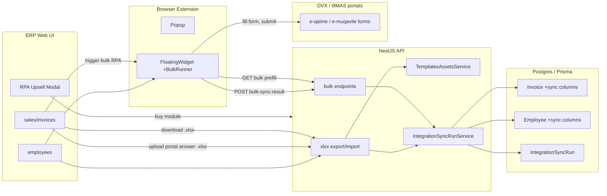

# Phase 10: Bulk RPA & Excel Fallback

Two equal tracks, different monetization:
- **Track 1 (Premium):** Bulk RPA via the extension widget on ƏMAS / DVX, gated by `hr_full` / `tax_pro`.
- **Track 2 (Free):** Excel export/import in the ERP backend, accessible to all subscribers.

Architectural invariants kept from Phase 9.x: `PortalConnector`, VÖEN cross-check, single-tenant `organizationId`, `AuditMutationInterceptor`, NestJS `SubscriptionGuard` + `@RequiresModule`, exceljs already in `apps/api/package.json`.

## High-level architecture



## Track 1: Bulk RPA in extension (premium)

### 1A. Generalize message protocol

File: [apps/extension/src/shared/messages.ts](apps/extension/src/shared/messages.ts)

- Add `MSG.PORTAL_BULK_PREFILL` and `MSG.PORTAL_BULK_RESULT`.
- New union (sketch):

```ts
export type PortalBulkPrefillMsg =
  | { type: typeof MSG.PORTAL_BULK_PREFILL; flow: "eqaime"; invoiceIds: string[] }
  | { type: typeof MSG.PORTAL_BULK_PREFILL; flow: "emuqavile"; employeeIds: string[] };
```

- Single-item types stay as-is for backwards compatibility with current `AutofillStep`.

### 1B. Background dispatcher

File: [apps/extension/entrypoints/background.ts](apps/extension/entrypoints/background.ts)

- Add a handler for `MSG.PORTAL_BULK_PREFILL` that calls new helpers in [apps/extension/src/background/auth-flow.ts](apps/extension/src/background/auth-flow.ts):
  - `getInvoicesBulkPrefill(invoiceIds)`
  - `getEmployeesBulkPrefill(employeeIds)`
- Both call new bulk endpoints (Track-1C). Background does NOT itself loop the portal — it only fetches data + relays results.

### 1C. New API surface

File: [apps/api/src/invoices/invoices.controller.ts](apps/api/src/invoices/invoices.controller.ts)

- `POST /invoices/bulk-prefill` body `{ invoiceIds: string[] }` -> `InvoicePrefill[]` (reuse `InvoicePrefillSchema`).
- `POST /invoices/bulk-sync-result` body `{ runId, items: [{ invoiceId, status, externalId?, error? }] }` -> updates Invoice columns and `IntegrationSyncRun.successCount/errorCount`.
- Both protected by `@UseGuards(SubscriptionGuard)` + `@RequiresModule(ModuleEntitlement.TAX_PRO)`.

File: [apps/api/src/hr/employees.controller.ts](apps/api/src/hr/employees.controller.ts)

- Mirror endpoints for ƏMAS: `POST /hr/employees/bulk-prefill`, `POST /hr/employees/bulk-sync-result`, gated by `ModuleEntitlement.HR_FULL`.

Sync run lifecycle service: new `apps/api/src/integrations/integration-sync-run.service.ts` (handles `START -> COMPLETE`, batched updates per item).

### 1D. Database

File: [packages/database/prisma/schema.prisma](packages/database/prisma/schema.prisma)

- Add enums `IntegrationSyncStatus`, `IntegrationPortal`, `IntegrationTransport`.
- Extend `Invoice` with `dvxSyncStatus`, `dvxSyncedAt`, `dvxSyncError`, `dvxExternalId`.
- Extend `Employee` with `emasSyncStatus`, `emasSyncedAt`, `emasSyncError`, `emasExternalId`.
- New model `IntegrationSyncRun` (organizationId, portal, flow, transport, totals, triggeredByUserId, `notes Json?`).
- Generate Prisma migration `20260506xxxxxx_phase10_integration_sync`.

### 1E. BulkRunner UI inside FloatingWidget

Files: [apps/extension/src/widget/FloatingWidget.tsx](apps/extension/src/widget/FloatingWidget.tsx), new `apps/extension/src/widget/steps/BulkAutofillStep.tsx`, new `apps/extension/src/widget/bulk/BulkRunner.ts`.

- New widget mode `bulk` triggered when content script receives an `init` message from popup or ERP web with `{ flow, ids: string[] }`.
- `BulkRunner` is the orchestrator:
  - sequential queue over `ids[]`
  - per-item: fetch prefill (or use cached batch from `bulk-prefill` call) → fill form via existing adapter (`mapInvoicePrefillToFields` / `mapPrefillToFields`) → wait for user click on portal "submit" or auto-submit (configurable per flow) → record result
  - **safety controls (see architectural Q1):** sequential only; jittered delay 4–8s; exponential backoff on errors; circuit breaker on N consecutive failures or auth/VÖEN drift; hourly cap; persisted state in `chrome.storage.session`; pause/resume/cancel UI
- After completion (or on each batch boundary) calls `POST /…/bulk-sync-result` so ERP DB reflects status.

### 1F. Strict gating

Files: [apps/extension/entrypoints/popup/views/PortalContextView.tsx](apps/extension/entrypoints/popup/views/PortalContextView.tsx), [apps/extension/src/widget/FloatingWidget.tsx](apps/extension/src/widget/FloatingWidget.tsx)

- Reuse existing `entitlementToFlag` map and `connector.entitlement`.
- Bulk button in popup (and ERP web) is disabled / hidden if `tax_pro` (DVX) or `hr_full` (ƏMAS) is off.
- Server-side `SubscriptionGuard` blocks bulk endpoints regardless of UI state.

### 1G. Audit

File: [apps/api/src/audit/audit.service.ts](apps/api/src/audit/audit.service.ts)

- Extend the path-based mapping to set `entityType=IntegrationSyncRun` and `entityId=runId` for `POST /invoices/bulk-sync-result` and `POST /hr/employees/bulk-sync-result`.
- Standard `AuditMutationInterceptor` already covers POST.

## Track 2: Excel fallback (free)

### 2A. Storage convention for blank templates

New folder `apps/api/src/integrations/templates/`:
- `dvx/e-qaime-blank.xlsx`
- `emas/e-muqavile-blank.xlsx`

Build wiring:
- Update `apps/api/nest-cli.json` `compilerOptions.assets` to copy `**/*.xlsx` into `dist/`.
- New `apps/api/src/integrations/templates-assets.service.ts` resolves paths via `path.join(__dirname, "..", "templates", ...)` and serves `StreamableFile`.

### 2B. Excel endpoints (no module gating)

Files: new `apps/api/src/integrations/excel-bulk.controller.ts`, `apps/api/src/integrations/excel-bulk.service.ts` (uses already-installed `exceljs`).

- `GET /integrations/dvx/invoices/export.xlsx?ids=…` — fills the e-qaimə blank template with selected invoices and returns `.xlsx`.
- `POST /integrations/dvx/invoices/import-result` (multipart `.xlsx`) — parses portal-returned IDs/dates and persists results to Invoice columns + creates `IntegrationSyncRun{ transport: EXCEL_IMPORT }`.
- Mirror endpoints for ƏMAS / employees.
- Endpoints are NOT under `SubscriptionGuard` — only standard JWT + role checks. This honors the PRD: Excel must work for everyone.

### 2C. Web UI integration

Files: [apps/web/app/sales/invoices/page.tsx](apps/web/app/sales/invoices/page.tsx), [apps/web/app/employees/page.tsx](apps/web/app/employees/page.tsx)

- Add row multi-select (`selectedIds`) with header checkbox.
- New toolbar group "Массовые операции" with three buttons:
  - "Массовая отправка через виджет" → if module off (`taxPro` / `hrFull`): open RPA upsell modal; else: send selected ids to extension via existing `extension-bridge.tsx` channel.
  - "Экспорт в Excel" → `GET /integrations/.../export.xlsx?ids=...` (always enabled).
  - "Импорт ответа портала" → file picker → `POST /integrations/.../import-result` (always enabled).
- New `apps/web/components/rpa-upsell-modal.tsx` — reusable modal with i18n keys `bulk.upsell.*` and a CTA to subscription page.

### 2D. i18n

File: [packages/i18n/src/resources.ts](packages/i18n/src/resources.ts)

- Add `bulk.invoices.*`, `bulk.employees.*`, `bulk.upsell.*` for RU + AZ.
- Add `extension.widget.bulk.*` (progress, paused, resume, error count) in [packages/i18n/src/extension.ts](packages/i18n/src/extension.ts).
- Run `npm run i18n:audit` and `npm run i18n:catalog`.

## Documentation & rules

- Update [TZ.md](TZ.md) §13.6 with Phase 10 (bulk endpoints, sync schema, RPA safety rules, Excel fallback).
- Update [PRD.md](PRD.md) bulk rollout note + monetization split (`tax_pro` / `hr_full` for RPA, free for Excel).
- Update [apps/extension/README.md](apps/extension/README.md) with `BulkRunner`, message protocol, throttling defaults.
- Update [docs/deploy/EXTENSION_MVP_DEPLOY.md](docs/deploy/EXTENSION_MVP_DEPLOY.md) with new env defaults (e.g. `BULK_RUNNER_BASE_DELAY_MS`, `BULK_RUNNER_HOURLY_CAP`).
- Update [.cursor/rules/dayday-module-map.mdc](.cursor/rules/dayday-module-map.mdc): add `apps/api/src/integrations/**` to integrations row.

## Verification

- Run `npm run build` (web), `npm run build:ext`, API unit tests.
- Add new unit tests:
  - `invoices.service.spec.ts` — bulk-prefill ordering, AZN-only guard still applies per item.
  - `integration-sync-run.service.spec.ts` — totals math, idempotent updates.
  - `excel-bulk.service.spec.ts` — round-trip export/import for a small fixture.
- Lighthouse pass on lists with multiselect (no regressions).