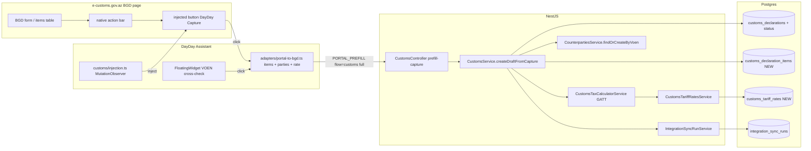

# Phase 12.1 — Trade Pro Universal RPA: full BGD capture, items, GATT calculator

## 0. Context (already shipped, do not redo)

Baseline `trade_pro` Customs is already in repo (Phase 12, see [.cursor/plans/phase_12_customs_rpa_excel_bfc3def9.plan.md](.cursor/plans/phase_12_customs_rpa_excel_bfc3def9.plan.md)):

- Manifest: [apps/extension/wxt.config.ts](apps/extension/wxt.config.ts) lines 23–24 already grant `https://e-customs.gov.az/*` and `https://*.customs.gov.az/*`.
- Connector: [apps/extension/src/connectors/customs/index.ts](apps/extension/src/connectors/customs/index.ts) (registered in [registry.ts](apps/extension/src/connectors/registry.ts)).
- Content script: [apps/extension/entrypoints/customs.content.tsx](apps/extension/entrypoints/customs.content.tsx) (Shadow-DOM `FloatingWidget` flow=customs).
- Capture step: [apps/extension/src/widget/steps/CaptureBgdStep.tsx](apps/extension/src/widget/steps/CaptureBgdStep.tsx).
- Background: [apps/extension/src/background/auth-flow.ts](apps/extension/src/background/auth-flow.ts) `postCustomsCapture` → `POST /api/customs/declarations/prefill-capture` with bearer.
- API: [apps/api/src/customs/customs.controller.ts](apps/api/src/customs/customs.controller.ts) `prefillCapture` guarded by `SubscriptionGuard + @RequiresModule(TRADE_PRO)`; service [customs.service.ts](apps/api/src/customs/customs.service.ts) `createDraftFromCapture` is idempotent on `(orgId, bgdNumber)` and wraps insert + `IntegrationSyncRun` in `$transaction`.
- Contracts: [packages/api-contracts/src/customs.ts](packages/api-contracts/src/customs.ts) — flat money schema only.
- Web: [apps/web/app/customs/page.tsx](apps/web/app/customs/page.tsx) + `RpaUpsellModal` for `trade_pro`.
- TZ §20, PRD §14 entry 2026.06.02 — describes the flat baseline.

This plan extends, not replaces, that baseline.

## 1. Architecture (high level)



## 2. Database (Prisma + migrations)

File: [packages/database/prisma/schema.prisma](packages/database/prisma/schema.prisma).

### 2.1 New enum

```prisma
enum CustomsDeclarationStatus {
  DRAFT
  CAPTURED
  ATTACHED
  ARCHIVED
}
```

### 2.2 Extend `CustomsDeclaration` (current model line 1959)

Add columns (all nullable on existing rows; default `DRAFT`):

- `status CustomsDeclarationStatus @default(DRAFT)`
- `regimeCode String?`
- `currencyRate Decimal? @db.Decimal(19, 6)` (foreign currency → AZN)
- `senderVoen String?` / `senderName String?`
- `receiverVoen String?` / `receiverName String?`
- `senderCounterpartyId String? @db.Uuid` / `receiverCounterpartyId String? @db.Uuid` (FK Counterparty `onDelete: SetNull`)
- `totalInvoiceValue Decimal? @db.Decimal(19, 4)` (foreign ccy)
- `totalStatisticalValueAzn Decimal? @db.Decimal(19, 4)`
- `calculatedDutyAzn Decimal? @db.Decimal(19, 4)`
- `calculatedVatAzn Decimal? @db.Decimal(19, 4)`
- `items CustomsDeclarationItem[]`

### 2.3 New model `CustomsDeclarationItem` (`customs_declaration_items`)

```prisma
model CustomsDeclarationItem {
  id                     String              @id @default(dbgenerated("uuid_generate_v4()")) @db.Uuid
  organizationId         String              @map("organization_id") @db.Uuid
  declarationId          String              @map("declaration_id") @db.Uuid
  sequenceNumber         Int                 @map("sequence_number")
  hsCode                 String              @map("hs_code")
  description            String
  quantity               Decimal             @db.Decimal(19, 4)
  unit                   String?
  weightNetKg            Decimal             @map("weight_net_kg") @db.Decimal(19, 4)
  weightGrossKg          Decimal             @map("weight_gross_kg") @db.Decimal(19, 4)
  invoiceValue           Decimal             @map("invoice_value") @db.Decimal(19, 4)
  statisticalValueAzn    Decimal             @map("statistical_value_azn") @db.Decimal(19, 4)
  dutyRatePercent        Decimal             @map("duty_rate_percent") @db.Decimal(7, 4)
  vatRatePercent         Decimal             @map("vat_rate_percent") @db.Decimal(7, 4)
  excisePercent          Decimal             @map("excise_percent") @db.Decimal(7, 4)
  calculatedDutyAzn      Decimal             @map("calculated_duty_azn") @db.Decimal(19, 4)
  calculatedVatAzn       Decimal             @map("calculated_vat_azn") @db.Decimal(19, 4)
  calculatedExciseAzn    Decimal             @map("calculated_excise_azn") @db.Decimal(19, 4)
  portalDutyAzn          Decimal?            @map("portal_duty_azn") @db.Decimal(19, 4)
  portalVatAzn           Decimal?            @map("portal_vat_azn") @db.Decimal(19, 4)
  notes                  String?
  declaration            CustomsDeclaration  @relation(fields: [declarationId], references: [id], onDelete: Cascade)
  organization           Organization        @relation(fields: [organizationId], references: [id], onDelete: Cascade)
  @@unique([declarationId, sequenceNumber])
  @@index([organizationId, hsCode])
  @@map("customs_declaration_items")
}
```

### 2.4 New model `CustomsTariffRate` (platform-global, super-admin managed)

```prisma
model CustomsTariffRate {
  id              String   @id @default(dbgenerated("uuid_generate_v4()")) @db.Uuid
  hsCode          String   @unique @map("hs_code")
  description     String?
  dutyRatePercent Decimal  @map("duty_rate_percent") @db.Decimal(7, 4)
  vatRatePercent  Decimal  @map("vat_rate_percent")  @db.Decimal(7, 4)
  excisePercent   Decimal  @default(0) @map("excise_percent") @db.Decimal(7, 4)
  effectiveFrom   DateTime @map("effective_from") @db.Date
  effectiveTo     DateTime? @map("effective_to") @db.Date
  notes           String?
  createdAt       DateTime @default(now()) @map("created_at") @db.Timestamptz(6)
  updatedAt       DateTime @updatedAt @map("updated_at") @db.Timestamptz(6)
  @@index([hsCode, effectiveFrom])
  @@map("customs_tariff_rates")
}
```

`hsCode` length is variable (HS-2/HS-4/HS-6/HS-10) — calculator picks longest matching prefix; rows with longer codes win.

### 2.5 Migration

New file `packages/database/prisma/migrations/20260508xxxxxx_phase12_1_customs_full_bgd/migration.sql`:

- `CREATE TYPE "CustomsDeclarationStatus" ...`.
- `ALTER TABLE customs_declarations ADD COLUMN ...` for all 2.2 columns; `UPDATE` to set `status='CAPTURED'` for existing rows (preserves history).
- `CREATE TABLE customs_declaration_items ... + UNIQUE + INDEX`.
- `CREATE TABLE customs_tariff_rates ... + UNIQUE + INDEX`.
- FKs to `organizations`, `counterparties`, `customs_declarations`.

### 2.6 Tariff seed

New script [packages/database/scripts/seed-customs-tariff-rates.ts](packages/database/scripts/seed-customs-tariff-rates.ts) seeded from a small JSON map by HS-2 chapter (≈30 rows: 0–24 food/agri, 25–27 minerals, 28–38 chemistry, 39–40 plastics/rubber, 50–63 textiles, 72–83 metals, 84–85 machinery, 86–89 transport, 90–97 misc) with realistic AZ defaults (most chapters: 15% duty, 18% VAT, 0% excise; alcohol/tobacco: configured non-zero excise). New idempotent npm script in root `package.json`: `db:seed-customs-tariffs`.

## 3. Shared contracts

File: [packages/api-contracts/src/customs.ts](packages/api-contracts/src/customs.ts).

Keep current `CustomsDeclarationPrefillSchema` and `CustomsDeclarationPrefillCaptureSchema` (used by Excel and Phase 12 capture) — required for backward compatibility with `ExcelBulkService` and existing widget code path. Add a parallel **full** schema:

```ts
export const CustomsDeclarationItemPrefillSchema = z.object({
  sequenceNumber: z.number().int().positive(),
  hsCode: z.string().trim().min(2).max(20),
  description: z.string().trim().min(1),
  quantity: z.number().positive(),
  unit: z.string().trim().optional().nullable(),
  weightNetKg: z.number().nonnegative(),
  weightGrossKg: z.number().nonnegative(),
  invoiceValue: z.number().nonnegative(),
  statisticalValueAzn: z.number().nonnegative(),
  portalDutyAzn: z.number().nonnegative().optional().nullable(),
  portalVatAzn: z.number().nonnegative().optional().nullable(),
});

export const CustomsDeclarationFullPrefillSchema =
  CustomsDeclarationPrefillSchema.extend({
    senderVoen: z.string().regex(/^\d{10}$/).optional().nullable(),
    senderName: z.string().trim().optional().nullable(),
    receiverVoen: z.string().regex(/^\d{10}$/).optional().nullable(),
    receiverName: z.string().trim().optional().nullable(),
    currencyRate: z.number().positive().optional().nullable(),
    items: z.array(CustomsDeclarationItemPrefillSchema).min(1).max(200),
  });

export const CustomsDeclarationFullPrefillCaptureSchema =
  CustomsDeclarationFullPrefillSchema.extend({
    source: z.enum(["WIDGET", "EXCEL"]),
    capturedAt: z.string().trim().min(1),
  });
```

Re-export from [packages/api-contracts/src/index.ts](packages/api-contracts/src/index.ts).

## 4. Backend (`apps/api/src/customs/`, `apps/api/src/super-admin/`)

### 4.1 New `CustomsTaxCalculatorService`

[apps/api/src/customs/customs-tax-calculator.service.ts](apps/api/src/customs/customs-tax-calculator.service.ts)

```ts
type ComputedItem = {
  dutyRatePercent: Decimal; vatRatePercent: Decimal; excisePercent: Decimal;
  calculatedDutyAzn: Decimal; calculatedExciseAzn: Decimal; calculatedVatAzn: Decimal;
};
```

GATT formula (Azerbaijan, simplified):

- `dutyBase = statisticalValueAzn`
- `duty = dutyBase * dutyRatePercent / 100`
- `excise = dutyBase * excisePercent / 100`
- `vatBase = dutyBase + duty + excise` (no fees apportioning at item level — fees stay on declaration header for now)
- `vat = vatBase * vatRatePercent / 100`

Rate lookup (`CustomsTariffRatesService`): longest-prefix match on `hsCode` filtered by `effectiveFrom <= bgdDate AND (effectiveTo IS NULL OR effectiveTo >= bgdDate)`. Fallback when no row matches: `dutyRate=0, vatRate=18, excise=0`. Return per-item `Computed` and totals.

### 4.2 New `CustomsTariffRatesService` + super-admin admin

- Service [apps/api/src/customs/customs-tariff-rates.service.ts](apps/api/src/customs/customs-tariff-rates.service.ts): `list`, `lookup(hsCode, asOf)`, `upsert`, `softDelete`.
- Super-admin controller [apps/api/src/super-admin/customs-tariff-rates.controller.ts](apps/api/src/super-admin/customs-tariff-rates.controller.ts) under `/api/super-admin/customs/tariff-rates`, guarded by `SuperAdminGuard` and `AuditMutationInterceptor` already global.
- Module wiring in [customs.module.ts](apps/api/src/customs/customs.module.ts) and [super-admin.module.ts](apps/api/src/super-admin/super-admin.module.ts).

### 4.3 Extend `CustomsService`

In [customs.service.ts](apps/api/src/customs/customs.service.ts):

- Inject `CounterpartiesService` and `CustomsTaxCalculatorService` (extend [customs.module.ts](apps/api/src/customs/customs.module.ts) imports with `CounterpartiesModule`).
- New method `createFullDraftFromCapture(orgId, dto: CustomsDeclarationFullPrefillCapture, userId)`:
  1. Idempotency check: existing declaration on `(orgId, bgdNumber)` → return `{ id, deduplicated: true }` (same contract as today; do **not** mutate items on dedup, leave existing draft untouched).
  2. `prisma.$transaction`:
     - `IntegrationSyncRun.start({ portal: 'CUSTOMS', flow: 'bgd-capture-full', transport: 'RPA_WIDGET', totalCount: items.length, triggeredByUserId })`.
     - For each non-empty `senderVoen`/`receiverVoen` call `counterpartiesService.findOrCreateByVoen({ organizationId, taxId, nameFallback })` (re-use [counterparties.service.ts L39](apps/api/src/counterparties/counterparties.service.ts) — already tx-aware path).
     - Calculator computes per-item duty/VAT/excise + totals.
     - `tx.customsDeclaration.create({ data: { ..., status: 'DRAFT', items: { createMany: { data: itemsRows } } } })`.
     - `IntegrationSyncRun.complete({ runId, successCount: items.length, errorCount: 0 })` on success; on throw — `complete({ errorCount: 1 })` and rethrow.
- Keep existing `createDraftFromCapture` as a thin wrapper that builds a 1-item full DTO from the flat schema (so Excel and the floating-widget flat path continue to work without changes).

### 4.4 Controller

In [customs.controller.ts](apps/api/src/customs/customs.controller.ts):

- Replace flat parser inside `prefillCapture` with discriminated parsing: try `CustomsDeclarationFullPrefillCaptureSchema` first, then fallback to the flat one. Both go through the gated `@RequiresModule(TRADE_PRO)`.
- Add `GET /api/customs/declarations/:id` that returns header + items + computed mismatch flags (`portalDutyAzn` vs `calculatedDutyAzn` per item) for the new web detail page.
- `attach` flow stays the same; later we can adjust accounting to use `calculatedDutyAzn + feesAzn` → already aligned.

### 4.5 Audit / activity stream

Mapping in [apps/api/src/audit/audit.service.ts](apps/api/src/audit/audit.service.ts) already maps `/customs/declarations*` (Phase 12 task `p12-customs-portal-enum`). No change needed.

## 5. Extension (`apps/extension/`)

### 5.1 Schema-aligned adapter

[apps/extension/src/connectors/customs/adapters/portal-to-bgd.ts](apps/extension/src/connectors/customs/adapters/portal-to-bgd.ts):

- Replace `mapDomToPrefill` with `mapDomToFullPrefill(doc): CustomsDeclarationFullPrefill`.
- Iterate `doc.querySelectorAll(SEL.itemsRows)` and emit `items[]` with HS code / description / weights / values (selectors stay TODOs as in the rest of the connector — same approach as `etaxes/selectors.ts`).
- Build sender/receiver from header selectors; build `currencyRate` from page meta.

### 5.2 Selectors

Extend [apps/extension/src/connectors/customs/selectors.ts](apps/extension/src/connectors/customs/selectors.ts) with new groups:

```ts
export const CUSTOMS_SELECTORS = {
  ...existing,
  senderVoen: "[data-dayday-sender-voen], .dayday-sender-voen",
  senderName: "[data-dayday-sender-name], .dayday-sender-name",
  receiverVoen: "[data-dayday-receiver-voen], .dayday-receiver-voen",
  receiverName: "[data-dayday-receiver-name], .dayday-receiver-name",
  currencyRate: "[data-dayday-currency-rate], .dayday-currency-rate",
  itemsRows: "[data-dayday-bgd-item-row]",
  itemHsCode: "[data-dayday-item-hs-code]",
  itemDescription: "[data-dayday-item-description]",
  itemQty: "[data-dayday-item-quantity]",
  itemWeightNet: "[data-dayday-item-weight-net]",
  itemWeightGross: "[data-dayday-item-weight-gross]",
  itemInvoiceValue: "[data-dayday-item-invoice-value]",
  itemStatValueAzn: "[data-dayday-item-stat-value]",
  // action bar anchor for button injection
  portalActionBar: "[data-dayday-bgd-actions], .declaration-actions, .toolbar-actions",
} as const;
```

DOM is not yet available; keep stubs and document the fallback in the existing pattern (TZ §20 already mentions debug badge `daydayAssistantDebug=1`).

### 5.3 Action-bar injection (new)

New file [apps/extension/src/connectors/customs/injection.tsx](apps/extension/src/connectors/customs/injection.tsx). Exports `mountCustomsInjectedButton(doc, onCapture)`:

- `MutationObserver` on `document.body` looking for `CUSTOMS_SELECTORS.portalActionBar`.
- When found, append a `<button>` styled in DayDay brand (inline styles to avoid Tailwind in portal scope) → on click, runs the same `parseOpenBgdPage(doc)` + `chrome.runtime.sendMessage(MSG.PORTAL_PREFILL, flow:'customs')` pipeline as `CaptureBgdStep`.
- Idempotency: bail if `host.querySelector('[data-dayday-injected-capture]')` already exists.
- Disposes observer on `pagehide`.

Wire into the content script [apps/extension/entrypoints/customs.content.tsx](apps/extension/entrypoints/customs.content.tsx) **in addition to** the existing floating widget mount — the user chose the hybrid (button + widget) variant. The floating widget continues to render the VÖEN cross-check + status surface; the injected button is the primary call-to-action.

### 5.4 Floating widget polish

Update [apps/extension/src/widget/steps/CaptureBgdStep.tsx](apps/extension/src/widget/steps/CaptureBgdStep.tsx) to:

- Use `mapDomToFullPrefill` and show a compact preview list (hsCode, qty, statValue) before `Capture to ERP` to make the multi-item nature obvious.
- Render mismatch warning if `portalDutyAzn` (sum) differs from server-side calculated total returned by the API on success (extend response with `mismatchPct` for inline yellow badge).

### 5.5 Messages contract — no breaking change

[apps/extension/src/shared/messages.ts](apps/extension/src/shared/messages.ts) `PORTAL_PREFILL` already has `flow: "customs"; capture: unknown` — payload shape evolves at the Zod boundary. No new message kind.

## 6. Web (`apps/web/`)

### 6.1 List enhancements

[apps/web/app/customs/page.tsx](apps/web/app/customs/page.tsx): add columns `status`, `senderName`, `receiverName`, `itemCount`. Extend `Row` type and `apiFetch('/api/customs/declarations')` projection (small `customs.controller.ts` `list` adjustment to include counts).

### 6.2 Detail page (extend existing)

Existing skeleton at `apps/web/app/customs/[id]/page.tsx` — flesh out:

- Header card: `bgdNumber`, `bgdDate`, `regimeCode`, `status` badge (DRAFT/CAPTURED/ATTACHED), sender / receiver counterparty links.
- Items table: HS code, description, qty, weights, invoice value (foreign), stat value AZN, calc duty AZN, calc VAT AZN, portal duty / VAT (yellow if delta > 0.5%).
- "Attach to purchase transaction" button (existing `PATCH /attach` flow) — surfaces `attached` status.

### 6.3 Super-admin tariff rates

New page `apps/web/app/super-admin/customs-tariff-rates/page.tsx`: CRUD over `/api/super-admin/customs/tariff-rates`. Reuse existing super-admin design patterns (e.g. [apps/web/app/super-admin/billing/page.tsx](apps/web/app/super-admin/billing/page.tsx)).

### 6.4 RPA upsell

No change — `RpaUpsellModal` for `tradePro` is already wired in [apps/web/app/customs/page.tsx](apps/web/app/customs/page.tsx).

## 7. i18n

Add to [apps/web/lib/i18n/resources.ts](apps/web/lib/i18n/resources.ts) and `extension.*` namespace in [packages/i18n](packages/i18n/) (RU + AZ both):

- `trade.customs.status.draft`, `.captured`, `.attached`, `.archived`
- `trade.customs.colSender`, `.colReceiver`, `.colItems`
- `trade.customs.detail.itemsTitle`, `.calcMismatchHint`
- `trade.customs.tariffRates.*` (super-admin page)
- `extension.widget.captureItemsPreview`, `.captureMismatchWarn`

After edits run `npm run i18n:audit`, `npm run i18n:catalog` (commit updated `apps/api/src/admin/i18n-default-catalog-data.json`), `npm run db:sync-i18n` per [.cursor/rules/dayday-local-dev.mdc](.cursor/rules/dayday-local-dev.mdc).

## 8. Tests (Jest, focused)

- `apps/api/src/customs/customs.service.spec.ts`: extend with full-capture fixture (5 items), assert items inserted, sender/receiver counterparties created, calc fields populated, dedup branch leaves items untouched.
- `apps/api/src/customs/customs-tax-calculator.service.spec.ts` (new): seed in-memory rates, verify longest-prefix match, fallback rates, formula.
- `apps/api/src/customs/customs-tariff-rates.service.spec.ts` (new): list + upsert + soft-delete; super-admin guard contract.
- `apps/api/src/integrations/excel-bulk.service.spec.ts`: regression — flat schema still imports.

## 9. Documentation

- [TZ.md](TZ.md) §20: append "Phase 12.1 — Full BGD capture": new schema fields, items table, tariff rates table, calculator formula, action-bar injection contract, super-admin endpoints.
- [PRD.md](PRD.md) §14 history: add 2026.05.08 row pointing to TZ §20 update.
- [.cursor/rules/dayday-module-map.mdc](.cursor/rules/dayday-module-map.mdc): no change (module already listed).
- [apps/extension/README.md](apps/extension/README.md): document the injected-button mode and how to enable debug data-attrs on the portal page for selector testing.

## 10. Definition of Done (mapped to user spec)

- Manifest already covers e-customs hosts (no change needed).
- Action-bar button "DayDay Capture" injected on BGD page (5.3) + floating widget retained (5.4).
- Scraper collects ≥5 items per BGD: enforced by `CustomsDeclarationItemPrefillSchema.items.min(1).max(200)` (3.) plus QA fixture in 8.
- `POST /api/customs/declarations/prefill-capture` accepts the full payload, gated by `trade_pro` (4.4); extension shows "Функция доступна в тарифе Trade Pro" via existing `RpaUpsellModal` and the 403 error path.
- Backend creates `CustomsDeclaration` with `status='DRAFT'`, items, sender/receiver counterparties via `findOrCreateByVoen` (4.3), GATT calc auto-fills `calculated*` columns, all in one `prisma.$transaction` (TZ §17 — "финансовая целостность").
- PRD.md and TZ.md updated (9.).