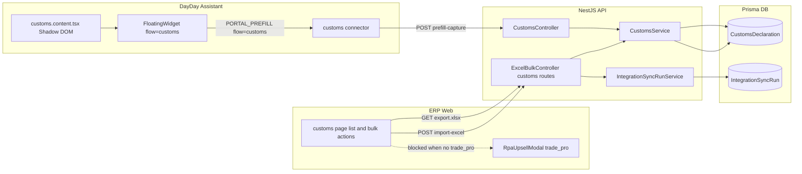

# Phase 12: Customs Widget RPA & Excel Fallback

Two-track delivery, mirroring Phase 10 monetization split:

- **Track 1 (Premium, RPA widget):** new `customs` connector in extension captures an open BGD page on `e-customs.gov.az` and creates an ERP draft via `POST /api/customs/declarations/prefill-capture`. Gated by new `trade_pro` module.
- **Track 2 (Free, Excel):** bulk export of current BGD list to xlsx and bulk import from a customs xlsx template. No subscription gating.

## Architectural decisions (answers above)

- New connector `customs` (do **not** extend `etaxes`): different domain, different auth context, different entitlement.
- New `CustomsDeclarationPrefillSchema` in `@dayday/api-contracts` (do **not** reuse `ForeignInvoicePrefillSchema`): mirrors Prisma `CustomsDeclaration` and decouples customs flow from foreign invoice OCR.
- New pricing module `trade_pro` (separate from `tax_pro`): clear product story (Customs/Trade) vs (Tax/DVX); allows independent pricing.
- Selectors and field maps for portal pages ship as TODO stubs (same approach as Phase 9 DVX) and are stabilized after pilot access.

## High-level flow

## Track 1 — Customs RPA widget (premium, `trade_pro`)

### T1.1 Contracts

- Add `CustomsDeclarationPrefillSchema` and `CustomsDeclarationPrefillCaptureSchema` to [packages/api-contracts/src/invoices.ts](packages/api-contracts/src/invoices.ts) (or a new `customs.ts` re-exported in [packages/api-contracts/src/index.ts](packages/api-contracts/src/index.ts)):
  - Fields: `bgdNumber`, `bgdDate (ISO)`, `currency`, `customsValueAzn`, `customsDutyAzn`, `customsVatAzn`, `feesAzn`, `regimeCode?`, `notes?`, `portalVoen?`.
  - Capture wraps prefill + `source: "WIDGET" | "EXCEL"`, `capturedAt`.

### T1.2 Backend endpoint (`apps/api/src/customs/`)

- New route in [apps/api/src/customs/customs.controller.ts](apps/api/src/customs/customs.controller.ts):
  - `POST /api/customs/declarations/prefill-capture` — body validated by Zod via DTO; protected by `@UseGuards(SubscriptionGuard, RolesGuard)` + `@RequiresModule(ModuleEntitlement.TRADE_PRO)`.
- Service: [apps/api/src/customs/customs.service.ts](apps/api/src/customs/customs.service.ts) `createDraftFromCapture(orgId, dto, userId)`:
  - Idempotency by `(organizationId, bgdNumber)` (already a unique index on the model).
  - Wrap in `prisma.$transaction`: insert draft + `IntegrationSyncRun.start({ portal: "CUSTOMS", flow: "bgd-capture", transport: "RPA_WIDGET" })` then `complete`.
  - Returns `{ id, bgdNumber, deduplicated: boolean }`.
- Add `IntegrationPortal.CUSTOMS` enum value:
  - schema patch in [packages/database/prisma/schema.prisma](packages/database/prisma/schema.prisma) and migration `20260507xxxxxx_phase12_customs_portal_enum`.
- Audit: extend path mapping in [apps/api/src/audit/audit.service.ts](apps/api/src/audit/audit.service.ts) to set `entityType=CustomsDeclaration` for `/customs/declarations*`.

### T1.3 Extension connector

- New folder `apps/extension/src/connectors/customs/`:
  - `index.ts` — `customsConnector: PortalConnector` mirroring [apps/extension/src/connectors/etaxes/index.ts](apps/extension/src/connectors/etaxes/index.ts), `entitlement: "trade_pro"`, `matches`: `e-customs.gov.az` / `*.customs.gov.az`.
  - `auth-detect.ts` — `detectCustomsAuthState`, `detectCustomsActiveVoen` (TODO selectors).
  - `selectors.ts` — placeholder selectors for BGD card.
  - `flows/bgd-capture.ts` — `BgdCaptureFlow`: parses open BGD page DOM into `CustomsDeclarationPrefillSchema`.
  - `adapters/portal-to-bgd.ts` — DOM → DTO mapping.
- Register in [apps/extension/src/connectors/registry.ts](apps/extension/src/connectors/registry.ts).
- New entrypoint `apps/extension/entrypoints/customs.content.tsx` (Shadow DOM mount, same pattern as `etaxes.content.tsx`).
- Update [apps/extension/wxt.config.ts](apps/extension/wxt.config.ts) `host_permissions`: `https://e-customs.gov.az/*`, `https://*.customs.gov.az/*`.
- Extend message protocol in [apps/extension/src/shared/messages.ts](apps/extension/src/shared/messages.ts):
  - `flow: "customs"` discriminator for `MSG.PORTAL_PREFILL` and (later) `MSG.PORTAL_BULK_PREFILL`.
- Background hook in [apps/extension/entrypoints/background.ts](apps/extension/entrypoints/background.ts): for `flow: "customs"` call new `postCustomsCapture(payload)` in `apps/extension/src/background/auth-flow.ts`.
- Widget UI in [apps/extension/src/widget/FloatingWidget.tsx](apps/extension/src/widget/FloatingWidget.tsx):
  - reuses existing VÖEN cross-check (organization VÖEN vs `detectCustomsActiveVoen`);
  - new step copy `extension.widget.stepCaptureBgd` with explicit one-click "Capture to ERP" action;
  - on success: toast + deep link to `/customs/{id}` in ERP.

### T1.4 Subscription / monetization

- Add `TRADE_PRO = "trade_pro"` in [apps/api/src/subscription/subscription.constants.ts](apps/api/src/subscription/subscription.constants.ts).
- Extend `ModuleEntitlementKeySchema` and `OrganizationModuleEntitlementsSchema` in [packages/api-contracts/src/subscription.ts](packages/api-contracts/src/subscription.ts) (`tradePro: boolean`).
- Backend computation in [apps/api/src/subscription/subscription-access.service.ts](apps/api/src/subscription/subscription-access.service.ts) and DTO `update-subscription-modules.dto.ts`.
- Pricing seed: extend [packages/database/prisma/pricing-module-seed.ts](packages/database/prisma/pricing-module-seed.ts) with `trade_pro`; idempotent script `packages/database/scripts/ensure-trade-pro-pricing.ts` and `db:ensure-trade-pro-pricing` npm script.
- Web context: [apps/web/lib/subscription-context.tsx](apps/web/lib/subscription-context.tsx) `tradePro: boolean`; settings page icon in [apps/web/app/settings/subscription/page.tsx](apps/web/app/settings/subscription/page.tsx).

## Track 2 — Customs Excel fallback (free)

### T2.1 API routes

- Extend [apps/api/src/integrations/excel-bulk.controller.ts](apps/api/src/integrations/excel-bulk.controller.ts) (no module gating):
  - `GET /api/integrations/customs/declarations/export.xlsx?ids=...` → uses `ExcelBulkService.exportCustoms(orgId, ids)`; without `ids` exports current org list.
  - `POST /api/integrations/customs/declarations/import-excel` (`multipart/form-data`) → `ExcelBulkService.importCustoms(orgId, file.buffer, userId)`.
- Service additions in [apps/api/src/integrations/excel-bulk.service.ts](apps/api/src/integrations/excel-bulk.service.ts):
  - `exportCustoms` — exceljs sheet with columns `bgdNumber, bgdDate, currency, customsValueAzn, customsDutyAzn, customsVatAzn, feesAzn, notes` and a "Read me" header per existing pattern.
  - `importCustoms` — parse rows, validate via `CustomsDeclarationPrefillSchema`, dedup by `bgdNumber`, transactional bulk insert, log `IntegrationSyncRun({ portal: "CUSTOMS", flow: "bgd-import", transport: "EXCEL_IMPORT" })`.

### T2.2 Template asset

- Add `apps/api/src/integrations/templates/customs/bgd-blank.xlsx` (mirrors GTK header layout placeholder).
- Ensure `nest-cli.json` already copies `**/*.xlsx`; expose via `TemplatesAssetsService` route `GET /api/integrations/customs/declarations/template.xlsx`.

### T2.3 Web UI on `/customs`

- Update [apps/web/app/customs/page.tsx](apps/web/app/customs/page.tsx):
  - Multiselect rows + header "Массовые операции" group (mirrors `apps/web/app/sales/invoices/page.tsx` pattern).
  - Buttons: "Захват с e-customs (виджет)" (gated → opens `RpaUpsellModal` if `!tradePro`), "Экспорт в Excel", "Импорт BGD из Excel", "Скачать пустой шаблон".
  - For RPA-mode show the install banner via `ExtensionInstallBanner` when extension not detected.

## Documentation & ops

- Update sections / files:
  - [TZ.md](TZ.md) §19/§20: add Phase 12 with capture endpoint contract, RPA safety rules (no rate concerns; capture is one-page, but keep VÖEN cross-check).
  - [PRD.md](PRD.md): cross-link Phase 12 row in §14 history; mention `trade_pro` in §7.x pricing.
  - [apps/extension/README.md](apps/extension/README.md): new connector + flow `customs`; updated permission table; debug badge mention.
  - [.cursor/rules/dayday-module-map.mdc](.cursor/rules/dayday-module-map.mdc): customs row already in module map; clarify extension folder split.
  - [docs/deploy/EXTENSION_MVP_DEPLOY.md](docs/deploy/EXTENSION_MVP_DEPLOY.md): Phase 12 env section (no new vars expected), new smoke F: capture BGD via widget, Excel export/import roundtrip, `db:ensure-trade-pro-pricing`.
  - [.env.example](.env.example): no new keys (re-uses existing storage + queue).

## Test plan

- Unit:
  - `apps/api/src/customs/customs.service.spec.ts` — capture creates draft, dedup by `bgdNumber`, `SubscriptionGuard` denies without `trade_pro`.
  - `apps/api/src/integrations/excel-bulk.service.spec.ts` — `exportCustoms` headers + sample row, `importCustoms` accepts schema-valid sheet and rejects malformed.
- Build:
  - `npm run build` (API + Web), `npm run build:ext`.
- Manual smoke (added to deploy doc):
  - Premium org: open `e-customs.gov.az` BGD page → click "Capture to ERP" → BGD row appears in `/customs` with status `DRAFT`.
  - Free org: same action → `RpaUpsellModal` shown; Excel export/import works regardless.

## Out of scope (Phase 12.1+)

- Bulk RPA over BGD list (per-row capture loop with `BulkRunner`) — added once a stable BGD list page is reached.
- Direct DGK B2B/S2S API (currently DGK does not expose a public partner API for SMB SaaS).
- BGD multi-line tariffs (per-HS-code positions) and per-line cost allocation to inventory.
