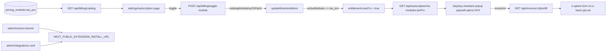

# Phase 9.1: монетизация tax_pro + аудит prefill + CTA на установку плагина

## Архитектура: где замыкается цикл монетизации



## Архитектурные решения, принятые до плана

- **Каталог:** добавляем `tax_pro` в `PRICING_MODULE_SEED_DEFAULTS` (placeholder `12 AZN/мес`); фактическую цену настроит super-admin через конструктор без правок кода.
- **Marketing URL:** через `NEXT_PUBLIC_EXTENSION_INSTALL_URL` (default `/docs/extension`); пост-релиз заменяется на Web Store URL без правок web.
- **Currency политика:** prefill жёстко **AZN-only**. Если `invoice.currency !== "AZN"` — `BadRequestException` с `code: "INVOICE_NOT_AZN"` до Zod-парсинга.
- **Issue date:** оставляем `invoice.createdAt` как MVP; документируем как ограничение.

## A. Billing — провести `tax_pro` через все слои

- **A1 seed каталога**
  - В [packages/database/prisma/pricing-module-seed.ts](packages/database/prisma/pricing-module-seed.ts) добавить запись `tax_pro` в `PRICING_MODULE_SEED_DEFAULTS` с placeholder ценой (`12`) и `sortOrder` рядом с `banking_pro`.
  - Новый idempotent скрипт `packages/database/scripts/ensure-tax-pro-pricing.ts` (upsert строки на работающих стендах, где seed уже отработал).
- **A2 wiring через billing/toggle-module**
  - В [apps/api/src/billing/billing-module-toggle.helpers.ts](apps/api/src/billing/billing-module-toggle.helpers.ts) добавить `case "tax_pro": return { tax_pro: enabled };` и расширить тип возврата `tax_pro?: boolean`.
  - В [apps/api/src/subscription/dto/update-subscription-modules.dto.ts](apps/api/src/subscription/dto/update-subscription-modules.dto.ts) добавить:
    ```ts
    @IsOptional()
    @IsBoolean()
    tax_pro?: boolean;
    ```
    иначе `forbidNonWhitelisted: true` срежет поле при `PATCH /subscription/modules`.
- **A3 bugfix entitlements**
  - В [apps/api/src/subscription/subscription-access.service.ts](apps/api/src/subscription/subscription-access.service.ts) функция `computeEntitlementsLegacy` сейчас возвращает `taxPro: false` всегда. Заменить на `taxPro: has("tax_pro")`. Без этого проданный `tax_pro` не попадает в `modules.taxPro` snapshot, и popup-paywall плагина не открывается.
- **A4 web subscription UI**
  - В [apps/web/lib/subscription-context.tsx](apps/web/lib/subscription-context.tsx) расширить тип `modules` полем `taxPro?: boolean` и протянуть из API.
  - В [apps/web/app/settings/subscription/page.tsx](apps/web/app/settings/subscription/page.tsx) в `moduleIcon(key)` добавить `case "tax_pro"` (например `<ReceiptText />` из `lucide-react`).
- **A5 i18n модуля**
  - В [packages/i18n/src/resources.ts](packages/i18n/src/resources.ts) добавить RU/AZ ключи под `subscriptionSettings.modules.tax_pro.title/description`.

## B. Prefill — сделать корректным под боевые данные

- **B1 currency guard** ([apps/api/src/invoices/invoices.service.ts](apps/api/src/invoices/invoices.service.ts) → `getExtensionPrefill`):
  - Перед маппингом проверить `invoice.currency === "AZN"`, иначе `throw new BadRequestException({ code: "INVOICE_NOT_AZN", ... })`.
- **B2 taxId normalization:**
  - Заменить `taxId: invoice.counterparty.taxId ?? null` на `taxId: /^\d{10}$/.test(invoice.counterparty.taxId ?? "") ? invoice.counterparty.taxId : null`. Закрывает легаси-данные с пустыми/«грязными» VÖEN, чтобы Zod не падал.
- **B3 vatRate exempt normalization:**
  - В [packages/api-contracts/src/invoices.ts](packages/api-contracts/src/invoices.ts) добавить в `InvoicePrefillLineSchema` поле `vatExempt: z.boolean().default(false)`.
  - В сервисе при `vatRate < 0` проставлять `vatExempt: true` и `vatRatePct: 0` в выходном DTO (DVX не понимает `-1`).
- **B4 totals sanity:**
  - После reduce-расчёта проверить `Math.abs(totals.grossAzn - Number(invoice.totalAmount)) > 0.05` → `Logger.warn` с `invoiceId`. Не падаем — отдаём посчитанные по items.
- **B6 unit-тесты** ([apps/api/src/invoices/invoices.service.spec.ts](apps/api/src/invoices/invoices.service.spec.ts) или новый файл):
  - Кейс 1: invoice с `vatRate=18` + `vatRate=-1`, `currency="AZN"` — корректные net/vat/gross, exempt-строка с `vatExempt: true`, `vatRatePct: 0`.
  - Кейс 2: `currency="USD"` → `BadRequestException` с кодом `INVOICE_NOT_AZN`.
  - Кейс 3: `counterparty.taxId=""` → `taxId === null` в выдаче.

## C. Marketing CTA — две точки входа в установку плагина

- **C1 env + i18n:**
  - В корневом `.env.example` (если есть — иначе в `apps/web/.env.example`) добавить `NEXT_PUBLIC_EXTENSION_INSTALL_URL` с default `/docs/extension`.
  - В [packages/i18n/src/resources.ts](packages/i18n/src/resources.ts) добавить RU/AZ:
    - `extension.cta.title`, `extension.cta.body`, `extension.cta.cta`.
- **C2 reusable компонент** — новый `apps/web/components/extension-install-banner.tsx`:
  - Props: `variant: "banner" | "card"`, `dismissible?: boolean`.
  - Dismissible-вариант хранит флаг в `localStorage` (`dayday:extension-install-banner-dismissed-at`, TTL 30 дней).
  - Иконка `lucide-react` (например `PlugZap`); ссылка на `process.env.NEXT_PUBLIC_EXTENSION_INSTALL_URL`.
- **C3 размещение:**
  - В [apps/web/app/sales/invoices/page.tsx](apps/web/app/sales/invoices/page.tsx) сразу после `<PageHeader />` (до `error`-блока) — `<ExtensionInstallBanner variant="banner" dismissible />`. Скрываем, если `subscription.modules.taxPro === true`.
  - В [apps/web/app/admin/integrations/health/page.tsx](apps/web/app/admin/integrations/health/page.tsx) над таблицей health — `<ExtensionInstallBanner variant="card" />` (безусловно, страница про интеграции — нативное место).
- **C4 docs:**
  - В [apps/extension/README.md](apps/extension/README.md) добавить раздел «Install URL» с описанием `NEXT_PUBLIC_EXTENSION_INSTALL_URL`.
  - В [TZ.md](TZ.md) §13.6 — параграф «Marketing CTA в ERP», явно зафиксировав env-переменную и оба места размещения.

## D. Verification

- `npm run i18n:audit` — проходит после добавления RU/AZ ключей.
- `npm run build:ext` — должен оставаться зелёным (extension не правим).
- `npm run build` — полный аудит + database (Prisma generate) + api + web.
- Unit-тесты `getExtensionPrefill` зелёные.

## Out of scope (явно отложено)

- Реальный Chrome Web Store URL — до публикации.
- Полноценный admin/integrations index с карточками всех интеграций — сейчас минимум: вставляем CTA в `health`.
- Расширение `currency` в prefill DTO — после требований DVX по мультивалютным инвойсам.
- Items-grid в e-qaimə автозаполнении — TODO до пилота.
- Прод-миграция строки `pricing_modules.tax_pro` — отдельный тикет (есть ensure-script для ручного применения).
