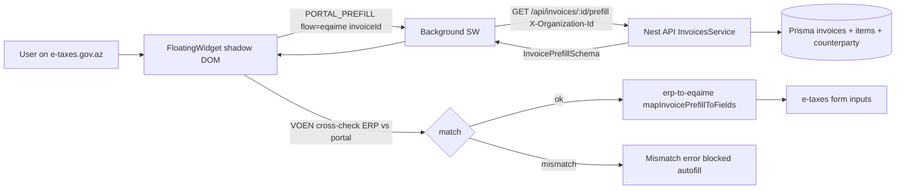

# Phase 9: DVX (e-taxes) Integration

Реализуем второй портальный коннектор DayDay Assistant поверх существующих инвариантов: `PortalConnector`, VÖEN Cross-Check, `FloatingWidget`, single `chrome.runtime` message protocol, multi-tenant gating через подписку. Основной flow — `e-qaime` (электронная счёт-фактура), источник данных — инвойс ERP.

## Архитектура: data flow для e-qaimə

## Архитектурные решения, принятые до плана

- **Entitlement DVX:** новый `tax_pro` в `ModuleEntitlementKeySchema` + `taxPro: boolean` (default `false`) в `OrganizationModuleEntitlementsSchema`. Это стабилизирует gating popup и не размывает семантику `banking_pro` / `nas`.
- **Прoтокол prefill:** `MSG.PORTAL_PREFILL` обобщается через дискриминатор `flow: 'emuqavile' | 'eqaime'` с раздельным payload (`employeeId` | `invoiceId`). Background маршрутизирует по `flow`, widget парсит ответ соответствующей Zod-схемой.
- **Реальный route API:** контроллер инвойсов смонтирован как `@Controller("invoices")` (см. [apps/api/src/invoices/invoices.controller.ts](apps/api/src/invoices/invoices.controller.ts)), глобальный префикс `/api`, итог: `GET /api/invoices/:id/prefill` (а не `/api/sales/invoices/...` из примера в запросе).
- **Content script:** `etaxes.content.tsx` (а не `.ts`) — JSX обязателен для монтирования React-виджета.
- **Виджет:** делается портало-агностичным (выбирает коннектор через `registry.matchPortal(window.location.href)`), плюс новый prop `flow`.

## A. API Contracts (`@dayday/api-contracts`)

- В [packages/api-contracts/src/subscription.ts](packages/api-contracts/src/subscription.ts):
  - В `ModuleEntitlementKeySchema` добавить literal `"tax_pro"`.
  - В `OrganizationModuleEntitlementsSchema` добавить `taxPro: z.boolean()`.
- Новый файл `packages/api-contracts/src/invoices.ts`:
  - `InvoicePrefillCounterpartySchema` — `{ id, name, taxId (10 digits, nullable), legalForm?, address?, isVatPayer? }`.
  - `InvoicePrefillLineSchema` — `{ name, sku?, quantity, unit, unitPriceAzn, vatRatePct, totalNetAzn, totalVatAzn, totalGrossAzn }` (числа — `z.number().nonnegative()` или `.transform(String)` если в БД лежат `Decimal`).
  - `InvoicePrefillSchema` — `{ id, number, issueDate, currency: z.literal("AZN"), counterparty, items: array, totals: { netAzn, vatAzn, grossAzn }, notes? }`.
  - Экспорт TS-типов.
- В `packages/api-contracts/src/index.ts` добавить re-export нового модуля.

## B. Backend API (`apps/api`)

- [apps/api/src/invoices/invoices.controller.ts](apps/api/src/invoices/invoices.controller.ts):
  - Зарегистрировать `@Get(":id/prefill")` **до** других `:id`-роутов, по аналогии с `[apps/api/src/hr/employees.controller.ts](apps/api/src/hr/employees.controller.ts)` (там `:id/prefill` стоит до `:id`).
  - Гварды/декораторы как у `getOne`: `@OrganizationId()`, `@RequiresPermission(...)` соответствующего инвойсам уровня (без расширения матрицы прав).
- [apps/api/src/invoices/invoices.service.ts](apps/api/src/invoices/invoices.service.ts):
  - Новый метод `getExtensionPrefill(organizationId: string, invoiceId: string): Promise<InvoicePrefillDto>`.
  - Внутри — `prisma.invoice.findFirst({ where: { id, organizationId }, include: { items: true, counterparty: true } })`, маппинг в `InvoicePrefillSchema`, NotFound при отсутствии.
  - Логирование без сырых строк портала; PII контрагента — обычное поле, без дополнительной маскировки (это уже data-of-record).
- Subscription mapping: в источнике `/api/subscription/me` (например `apps/api/src/subscription/subscription.service.ts`) добавить поле `taxPro: false` в выдаваемый объект `modules`, чтобы Zod-схема контракта не падала на парсинге у клиентов; реальный biz-логика gating (`tax_pro` → когда `true`) — в отдельном тикете подписки, вне Phase 9.

## C. DVX Connector (`apps/extension/src/connectors/etaxes/`)

- `apps/extension/src/connectors/etaxes/index.ts`:
  - `etaxesConnector: PortalConnector` с `id: "etaxes"`, `entitlement: "tax_pro"`.
  - `matches(url)`: `url.hostname === "new.e-taxes.gov.az"` или `url.hostname === "login.e-taxes.gov.az"` или `url.hostname.endsWith(".e-taxes.gov.az")`.
  - `detectAuthState(doc)` / `detectActiveVoen(doc)` — из `auth-detect`.
  - `listFlows(_url)`: `[{ id: "e-qaime", titleKey: "extension.portal.flowEqaime", entitlement: "tax_pro" }]`.
- `apps/extension/src/connectors/etaxes/auth-detect.ts`:
  - `detectEtaxesAuthState(doc)` — placeholder, как в `[apps/extension/src/connectors/emas/auth-detect.ts](apps/extension/src/connectors/emas/auth-detect.ts)`, но против `EtaxesSelectors.authIndicators`.
  - `detectEtaxesActiveVoen(doc)` — поиск 10 цифр в кандидатах + fallback по `body.innerText`, единый `normalizeVoen`.
- `apps/extension/src/connectors/etaxes/selectors.ts`:
  - `EtaxesSelectors` с `authIndicators`, `activeVoenCandidates`, `formInputs`, `eqaimeFields` — все с TODO-комментариями для уточнения на боевом портале.
- `apps/extension/src/connectors/etaxes/flows/e-qaime.ts`:
  - Pure описание шагов flow (id ↔ titleKey ↔ ожидаемые поля formкарты), без DOM-мутаций. Используется UI-слоем для подсказок и логов. Mapping остаётся в адаптере.
- `apps/extension/src/connectors/etaxes/adapters/erp-to-eqaime.ts`:
  - `mapInvoicePrefillToFields(prefill: InvoicePrefill, doc: Document): { applied: HTMLElement[] }` — best-effort по образцу `[apps/extension/src/connectors/emas/adapters/erp-to-muqavile.ts](apps/extension/src/connectors/emas/adapters/erp-to-muqavile.ts)`: контрагент (name, VÖEN, address), items (если есть редактируемая таблица — отдельная стратегия в TODO), totals (net, vat, gross), номер/дата.

## D. Content script + регистрация

- Новый `apps/extension/entrypoints/etaxes.content.tsx`:
  - `defineContentScript({ matches: ["https://new.e-taxes.gov.az/*", "https://login.e-taxes.gov.az/*"], runAt: "document_idle", main: ... })`.
  - Монтирование `FloatingWidget` в closed Shadow DOM — как в [apps/extension/entrypoints/emas.content.tsx](apps/extension/entrypoints/emas.content.tsx).
  - Передаёт `flow="eqaime"` в виджет.
- Шаренный helper (вынести из `emas.content.tsx`): `apps/extension/src/shared/erp-active-org.ts` — экспортирует `getErpActiveOrganization()`; оба content-скрипта используют его (DRY).
- [apps/extension/src/connectors/registry.ts](apps/extension/src/connectors/registry.ts):
  - В `all` добавить `etaxesConnector`.
- [apps/extension/wxt.config.ts](apps/extension/wxt.config.ts):
  - `host_permissions` уже включает `https://*.e-taxes.gov.az/*`; добавить явно `https://new.e-taxes.gov.az/*` и `https://login.e-taxes.gov.az/*` для предсказуемости.
  - `externally_connectable` не трогаем (DVX не общается с extension через postMessage).

## E. Generalize prefill protocol

- [apps/extension/src/shared/messages.ts](apps/extension/src/shared/messages.ts):
  - Добавить дискриминированный тип `PortalPrefillMsg`:
    - `{ type: MSG.PORTAL_PREFILL, flow: "emuqavile", employeeId: string }`
    - `{ type: MSG.PORTAL_PREFILL, flow: "eqaime", invoiceId: string }`
  - Старое сообщение без `flow` считать deprecated; обработчик в background — fallback на `emuqavile` для совместимости в течение Phase 9.
- [apps/extension/src/background/auth-flow.ts](apps/extension/src/background/auth-flow.ts):
  - Сохранить `getEmployeePrefill(employeeId)`, добавить `getInvoicePrefill(invoiceId)` → `apiFetch("/api/invoices/:id/prefill", { organizationId: getActiveOrganizationId() })`.
- [apps/extension/entrypoints/background.ts](apps/extension/entrypoints/background.ts):
  - Внутри ветки `MSG.PORTAL_PREFILL` маршрутизировать по `message.flow` и вызывать соответствующий helper.
- [apps/extension/src/widget/steps/AutofillStep.tsx](apps/extension/src/widget/steps/AutofillStep.tsx):
  - Обобщить: prop `flow: "emuqavile" | "eqaime"`, выбор Zod-схемы и адаптера от `flow`. Лейблы input/кнопки берутся из i18n по `flow`.
- [apps/extension/src/widget/FloatingWidget.tsx](apps/extension/src/widget/FloatingWidget.tsx):
  - Заменить хардкод `emasConnector` на `matchPortal(window.location.href)` и принять prop `flow` (пробрасывается в `AutofillStep`). VÖEN cross-check продолжает работать через выбранный коннектор.

## F. Popup Hub UI

- [apps/extension/entrypoints/popup/App.tsx](apps/extension/entrypoints/popup/App.tsx):
  - Расширить локальный `SubMe`: `{ modules?: { hrFull?: boolean; taxPro?: boolean } }`.
  - Передавать в `PortalContextView` единый объект `entitlements`, например `{ hrFull, taxPro }`.
- [apps/extension/entrypoints/popup/views/PortalContextView.tsx](apps/extension/entrypoints/popup/views/PortalContextView.tsx):
  - Заменить хардкод `props.connector.entitlement === "hr_full"` на map: `const enabled = entitlements[ENTITLEMENT_TO_FLAG[connector.entitlement]]` и paywall, если `enabled === false`. Map: `hr_full → hrFull`, `tax_pro → taxPro`, прочие — пока `true` (или паркуем под will-be-extended).
- [apps/extension/entrypoints/popup/views/HubView.tsx](apps/extension/entrypoints/popup/views/HubView.tsx):
  - Уже содержит ссылку на `e-taxes.gov.az`; никаких изменений, кроме мелкого визуального бейджа (не критично).

## G. i18n (`@dayday/i18n`)

- В [packages/i18n/src/extension.ts](packages/i18n/src/extension.ts) добавить RU/AZ:
  - `extension.portal.flowEqaime` — `"Электронная счёт-фактура (e-qaimə)" / "Elektron qaimə-faktura (e-qaimə)"`.
  - `extension.widget.stepFillInvoice` — заголовок шага для invoice flow.
  - `extension.widget.selectInvoice` — лейбл input.
  - `extension.widget.fillButtonInvoice` — текст кнопки (или переиспользовать `fillButton`).
- `npm run i18n:audit` (он уже сканирует `apps/extension/src/**`) должен пройти.

## H. Documentation

- [apps/extension/README.md](apps/extension/README.md):
  - В разделе Architecture добавить пункт **DVX (e-taxes)** с `etaxes.content.tsx`, селекторами и `flow="eqaime"`.
  - В разделе API surface добавить `GET /api/invoices/:id/prefill`.
  - Зафиксировать обобщение протокола `PORTAL_PREFILL` через `flow`-дискриминатор.
- [TZ.md](TZ.md):
  - **§13.6** — добавить в список flows коннектора DVX `e-qaime`; описать обобщённый message protocol; указать новый endpoint и entitlement `tax_pro`; перекрёстно сослаться на §13.2.
  - **§13.2** — ссылка вниз на §13.6 «реализация фазы 2 RPA».
- [.cursor/rules/dayday-module-map.mdc](.cursor/rules/dayday-module-map.mdc):
  - В строке Assistant добавить `apps/extension/src/connectors/etaxes/**`.

## I. Verification

- `npm run build:ext` — расширение собирается с двумя content-скриптами и обновлёнными контрактами.
- `npm run i18n:audit` — проходит (extension сканируется, RU/AZ синхронны).
- `npm run build` — проходит полный аудит + database + api + web (контракты подписки добавили поле `taxPro`, мapper API его эмитит).

## Out of scope (явно отложено)

- Реальные селекторы DVX и формальная привязка `eqaimeFields` к боевому DOM — будет уточнено после получения тестовых доступов (placeholders/TODO остаются).
- Бизнес-логика «когда `tax_pro` становится `true`» в подписке — отдельный тикет в Phase Subscription.
- Поддержка items-grid в e-qaimə (если форма управляется не нативными inputs, а кастомным виджетом) — отмечено в `selectors.ts` / адаптере как TODO-pilot.
- e2e-тестирование через CI на боевом портале — после получения доступов.
