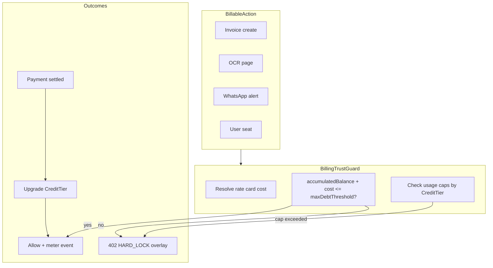

# Post-paid Credit Tier Pivot

## Текущее состояние

| Область | Факт |
|---------|------|
| **PRD Phase 15** | Уже есть [PRD.md](PRD.md) **§15** + Task `FEAT-SEC-CRYPTO-001` в §14.2 — нужна **сверка/дополнение**, не дублирование |
| **PRD Phase 16** | **Отсутствует**; §16 сейчас — «История версий» → новый продуктовый блок вставить **перед** историей, историю сдвинуть в **§17** |
| **TZ** | [TZ.md](TZ.md) **§23** (crypto) заполнен; **§24 отсутствует** — добавить перед «Конец документа» |
| **Pricing UI** | [apps/web/app/pricing/page.tsx](apps/web/app/pricing/page.tsx) — legacy: `GET /api/public/pricing`, годовая скидка, модули/бандлы, `STARTER/BUSINESS/ENTERPRISE` |
| **БД** | `OrganizationSubscription.tier: SubscriptionTier`; квоты в [apps/api/src/constants/quotas.ts](apps/api/src/constants/quotas.ts); prepaid WhatsApp balance на `Organization.whatsappOutboundMessagesBalance` |
| **Биллинг** | Post-paid monthly invoice уже есть ([`billing-monthly.service.ts`](apps/api/src/billing/billing-monthly.service.ts)); `SOFT_BLOCK`/`HARD_BLOCK` + **402** — переиспользовать, не переписывать с нуля |



---

## TASK 1 — PRD ([PRD.md](PRD.md))

### Phase 15 (существующий §15)
- Подтвердить статус **`[ ] PLANNED`**, Task **`FEAT-SEC-CRYPTO-001`** в §14.2 (уже есть ~стр. 1328, 1363).
- Сверить с требованиями: DEK/KEK envelope, `UserOrganizationKey`, Tier 1 seed / Tier 2 OMRK / Tier 3 ASAN-SİMA escrow — дополнить только пробелы (без переписывания §15 целиком).
- Перекрёстные ссылки: §7.7 → §15, §6.8 (WhatsApp) → новая модель Phase 16.

### Phase 16 — новый §16 «Usage-Based Credit/Trust Tier Architecture»
**Статус:** `[~] PARTIAL` — UI `/pricing` + copy; backend meter/guard — planned в том же релизе по вашему ответу.

Зафиксировать в PRD:
- **Полный отказ** от prepaid message packs и жёстких «коробочных» тарифов STARTER/BUSINESS/ENTERPRISE как **источника лимитов**.
- **Operational Core 0 AZN base**: NAS/MMUS + IFRS/MHBS ledger, Treasury, Supply Chain + auto reconciliation acts, Warehouse FIFO, HR/Payroll, Manufacturing 203 WIP — без ежемесячной абонплаты; оплата только за **metered** действия.
- **Credit Tier ladder (TIER_1…TIER_4)**:
  - **Debt thresholds (AZN):** 10 / 50 / 200 / custom (Enterprise).
  - **Usage caps (оригинальный ladder):** WhatsApp contextual alerts 100→500→2000→custom; OCR pages 50→250→1000→custom.
  - **Escalation:** mid-month **hard-lock** при превышении cap **или** debt threshold; оплата счёта → сброс `accumulatedBalance` + авто-апгрейд tier (T1→T2→T3).
- **Rate card (micro-costs):** User 2.00/mo, extra org workspace 5.00/mo, WhatsApp 0.04, OCR 0.05, Invoice 0.01 (UTC month) — единый running balance.
- **Anti-spam:** alerts только из контекста Invoice/Act → verified counterparty; Tier 2+ shared channel «ERA Finance Alerts»; Tier 3 custom WABA via Meta Cloud API.
- **Удалить/пометить deprecated:** §6.8 prepaid `whatsappOutboundMessagesBalance`; §7.12 формулировки про tier-квоты employees/invoices как hard caps.

### Ренумерация
- Текущий **§16 История версий** → **§17**; обновить карту разделов в метаданных (стр. ~21) и якоря в changelog.

### §14.2 Task registry
- Добавить **`FEAT-BIL-POSTPAID-001`** | Phase 16 | `[~] PARTIAL` | ссылки на PRD §16 и TZ §24.

---

## TASK 2 — TZ ([TZ.md](TZ.md))

### §23 (crypto)
- Точечно дополнить, если в PRD появятся новые поля; иначе оставить §23 как есть.

### Новый §24 — Post-paid Credit Tier & Advanced Metering

**24.0** Status, `FEAT-BIL-POSTPAID-001`, связь с PRD §16.

**24.1 Data model (Prisma placeholders + JSON shapes)**

| Сущность / поле | Назначение |
|-----------------|------------|
| `enum CreditTier` | `TIER_1` … `TIER_4` |
| `Organization.currentCreditTier` | default `TIER_1` |
| `Organization.accumulatedBalance` | `Decimal(12,2)` AZN, текущий биллинг-период |
| `Organization.billingPeriodKey` | `YYYY-MM` UTC для сброса счётчиков |
| `OrganizationSubscription.creditTier` | замена `tier: SubscriptionTier` |
| `usage_meter_events` (новая таблица, рекомендуется) | `{ organizationId, actionType, quantity, unitCostAzn, balanceAfter, createdAt }` — аудит и reconciliation |
| Monthly counters (denorm) | `whatsappAlertsUsed`, `ocrPagesUsed` на org или агрегат из events |

**Миграция enum:** `STARTER→TIER_1`, `BUSINESS→TIER_2`, `ENTERPRISE→TIER_4`; drop `SubscriptionTier`.

**24.2 Rate card** — константы в `apps/api/src/billing/billing-rate-card.ts` (и зеркало для публичного marketing copy).

**24.3 BillingTrustGuard** — единый guard/interceptor:
- Вызывается до billable мутаций (invoice POST, OCR enqueue, WhatsApp send, user invite, org create).
- Алгоритм: `projectedBalance = accumulatedBalance + actionCost`; reject if `projectedBalance > tierMaxDebt` **OR** usage cap exceeded.
- Response: **402** + code `CREDIT_HARD_LOCK` / `USAGE_CAP_EXCEEDED` (расширить [quota-exceeded.exception.ts](apps/api/src/quota/quota-exceeded.exception.ts) или новый `CreditExceededException`).
- Интеграция с существующим `billingStatus: HARD_BLOCK` — settlement cron/gateway webhook сбрасывает balance и поднимает tier.

**24.4 Settlement state machine**

```
ACTIVE → (threshold breach) → HARD_LOCK (402 on writes)
HARD_LOCK → (payment confirmed) → ACTIVE + tierUpgrade + balance=0 + reset monthly counters
```

Связать с [`billing-monthly.service.ts`](apps/api/src/billing/billing-monthly.service.ts) `runHardBlockEscalationCron` — перепрофилировать под debt threshold, не только неоплаченный счёт.

**24.5 ManufacturingOrder** — зафиксить: billable trigger на `POST …/start` (material issue 201→203) как manufacturing WIP unit; статусы `DRAFT→IN_PROGRESS→COMPLETED` без изменения NAS-проводок, только hook для meter (placeholder cost TBD или 0 в v1 — явно пометить в TZ).

**24.6 Public API** — обновить контракт `GET /api/public/pricing` (или новый `/api/public/credit-tiers`) для marketing; до готовности API pricing page может использовать static copy (см. Task 4).

**24.7 Deprecations** — `TIER_QUOTAS`, `maxInvoicesPerMonth` checks, prepaid WhatsApp balance decrement.

Обновить оглавление TZ (стр. 5) и таблицу истории версий.

---

## TASK 3 — Database ([packages/database/prisma/schema.prisma](packages/database/prisma/schema.prisma))

1. Добавить `enum CreditTier { TIER_1 TIER_2 TIER_3 TIER_4 }`.
2. На `Organization`: `currentCreditTier`, `accumulatedBalance`, `billingPeriodKey`, опционально `whatsappAlertsUsed`, `ocrPagesUsed`.
3. `OrganizationSubscription`: переименовать `tier` → `creditTier` (миграция SQL с idempotent `DO` blocks per repo rules).
4. Удалить `enum SubscriptionTier` после data migration.
5. Новая таблица `UsageMeterEvent` (рекомендуется для audit).
6. Пометить `whatsappOutboundMessagesBalance` **deprecated** (nullable, stop writing) или удалить в follow-up migration после guard refactor.
7. Миграция: `packages/database/prisma/migrations/YYYYMMDD_credit_tier_postpaid/migration.sql`.
8. Seeds: [demo-organizations.ts](packages/database/prisma/seeds/demo/demo-organizations.ts), [seed-tivi.ts](packages/database/prisma/scripts/ops/demo/seed-tivi.ts) → `TIER_2`/`TIER_4` вместо ENTERPRISE.

`prisma generate` + обновить [packages/api-contracts](packages/api-contracts/src/subscription.ts).

---

## TASK 4 — Backend guard & services

**Новые модули**
- `BillingRateCardService` — тарифы и tier thresholds (часть в `SystemConfig` key `billing.credit_tier_v1` для Tier 4 custom).
- `BillingTrustService` — `assertBillable(orgId, actionType, qty)`, `recordUsage()`, `getProjectedBalance()`.
- `BillingSettlementService` — on payment: zero balance, bump `currentCreditTier`, set `billingStatus=ACTIVE`.

**Рефакторинг (30+ файлов с `SubscriptionTier`)** — приоритет:
- [quota.service.ts](apps/api/src/quota/quota.service.ts) — заменить employee/invoice/whatsapp/ocr atomic checks на trust guard.
- [subscription-access.service.ts](apps/api/src/subscription/subscription-access.service.ts) — ENTERPRISE full-module rule → `TIER_4` или entitlement flag.
- [admin.service.ts](apps/api/src/admin/admin.service.ts) — `getPublicPricingSnapshot`, tier quotas admin.
- [auth.service.ts](apps/api/src/auth/auth.service.ts) — default subscription on org create → `TIER_1`.
- Super-admin DTOs: [set-tier-quotas.dto.ts](apps/api/src/admin/dto/set-tier-quotas.dto.ts) → credit tier config.

**Frontend 402 handling:** [upgrade-required-modal.tsx](apps/web/components/upgrade-required-modal.tsx), [api-client.ts](apps/web/lib/api-client.ts) — новые коды + redirect на settlement overlay.

---

## TASK 5 — Pricing UI ([apps/web/app/pricing/page.tsx](apps/web/app/pricing/page.tsx))

**Паттерн локали** — как лендинг: client shell + `packages/i18n/src/pricing-postpaid-copy.ts` (subpath export в [packages/i18n/package.json](packages/i18n/package.json), `sideEffects`, shim [apps/web/lib/i18n/pricing-postpaid-copy.ts](apps/web/lib/i18n/pricing-postpaid-copy.ts)) — избежать tree-shake.

**Удалить:** annual toggle, `yearlyDiscountPercent`, modules table, legacy bundles, `TIER_ORDER` STARTER/BUSINESS/ENTERPRISE, зависимость от старого `PublicPricingResponse` (опционально оставить fetch только для live rate card sync позже).

**Новая структура компонентов** (`apps/web/components/pricing/`):
- `pricing-page-shell.tsx` — dark grid `bg-[#EBEDF0]` + slate orbs (как [landing-page-shell.tsx](apps/web/components/landing/landing-page-shell.tsx))
- `pricing-language-toggle.tsx` — reuse [landing-language-toggle.tsx](apps/web/components/landing/landing-language-toggle.tsx) or shared `PublicLanguageToggle`
- `pricing-trust-ladder.tsx` — 4 cards `rounded-2xl border-slate-800/80 bg-slate-950/95`, progressive escalation visual (vertical mobile / horizontal desktop)
- `pricing-rate-card.tsx` — transparent grid: 0.04 / 0.05 / 2.00 / 5.00 / 0.01 AZN
- `pricing-operational-core-banner.tsx` — 0 AZN core suite notice
- `pricing-anti-spam-notice.tsx` — permanent disclaimer

**i18n:** полные RU/AZ строки в `pricing-postpaid-copy.ts`; `npm run i18n:audit` + при необходимости legacy keys в `resources.ts` для `pricingPage.*` (deprecate or alias).

**Default locale:** AZ (cookie `erafinance_i18n_lang`, без `Accept-Language` → ru).

---

## TASK 6 — Hygiene & build

- `npm run build` (root — уже включает i18n:audit + api + web).
- Проверить [middleware.ts](apps/web/middleware.ts) `/pricing` public.
- [layout.tsx](apps/web/app/layout.tsx) `barePublicLayout` для `/pricing`.
- Sidebar: `/pricing` не в ERP shell (OK); super-admin `/super-admin/billing/quotas` — планируемый рефактор под Credit Tier (отдельный подпункт, можно Phase 16.1).
- Grep broken imports `SubscriptionTier` после миграции.
- **Sync Master:** не трогать `.cursorignore` PRD/TZ — правки напрямую в файлах.

---

## Риски и порядок выполнения

| Риск | Митигация |
|------|-----------|
| Широкий blast radius `SubscriptionTier` | Сначала Prisma + generate + type aliases `CreditTier`; затем API; затем web |
| Двойная блокировка quota + trust | Feature flag `billing.credit_trust_v1` в SystemConfig на период cutover |
| PRD §16 vs §16 History | Ренумерация истории в §17 одним коммитом с новым §16 |
| WhatsApp prepaid balance | Deprecate field; guard uses meter only |

**Рекомендуемый порядок PR:** (1) PRD/TZ docs → (2) schema + migration → (3) rate card + trust service + critical guards → (4) pricing UI + i18n → (5) admin/subscription UI sweep → (6) full build.

---

## Критерии готовности

- PRD §16 + §17 history; TZ §24; Phase 15/16 в §14.2.
- `SubscriptionTier` удалён из schema; orgs на `CreditTier`.
- Billable actions проходят через `BillingTrustGuard`; 402 при hard-lock.
- `/pricing` — ladder T1–T4, rate card, anti-spam, AZ/RU toggle, без annual/prepaid UI.
- `npm run build` green.
