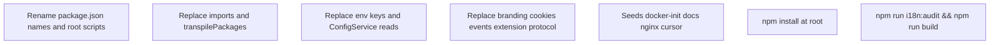

# Ребрендинг DayDay → ERA ERP (full stack)

## Scope (по вашему выбору)

- **Пакеты:** все workspace-пакеты с [`@dayday/*`](package.json) → **`@era/*`** (9 пакетов: [`apps/api/package.json`](apps/api/package.json), [`apps/web/package.json`](apps/web/package.json), [`apps/extension/package.json`](apps/extension/package.json), [`apps/docs/package.json`](apps/docs/package.json), [`packages/database/package.json`](packages/database/package.json), [`packages/i18n/package.json`](packages/i18n/package.json), [`packages/ui/package.json`](packages/ui/package.json), [`packages/api-contracts/package.json`](packages/api-contracts/package.json), корневой [`package.json`](package.json) `name: dayday-erp` → `era-erp` и все `-w @dayday/...` в скриптах).
- **Импорты:** глобальная замена `from "@dayday/` / `require("@dayday/` во всех `*.ts`, `*.tsx`, `*.js`, `*.mjs`, `*.cjs`, `jest.config`, [`apps/web/next.config.ts`](apps/web/next.config.ts) `transpilePackages`, Dockerfile COPY путей если есть текстовые ссылки на workspace.
- **Переменные окружения:** `DAYDAY_*` → **`ERA_*`** (например [`DAYDAY_BULLMQ_ALERT_WEBHOOK_URL`](apps/api/src/banking/bank-sync.worker.ts), [`DAYDAY_STORAGE_HOST_PATH`](docker-compose.prod.yml), [`DAYDAY_CHROME_BIN`](tools/md_to_pdf.py)); `NEXT_PUBLIC_DAYDAY_*` → **`NEXT_PUBLIC_ERA_*`** ([`apps/web/.env.example`](apps/web/.env.example), [`apps/web/components/public-legal-footer.tsx`](apps/web/components/public-legal-footer.tsx), [`apps/web/app/help/page.tsx`](apps/web/app/help/page.tsx)). Константа [`DAYDAY_MAINTENANCE_HTML`](apps/web/lib/maintenance-page-html.ts) → `ERA_MAINTENANCE_HTML` + импорт в [`middleware.ts`](apps/web/middleware.ts).
- **Сессия и клиентский state (осознанный breaking change):** cookie [`dayday_access_token`](apps/web/lib/session-keys.ts), заголовок [`x-dayday-pathname`](apps/web/middleware.ts), `localStorage`/`sessionStorage` ключи (`dayday_i18n_lang`, `dayday_sidebar_*`, `daydayAssistant*`, события `dayday:api-error` и т.д.), [`extension-bridge.tsx`](apps/web/components/extension-bridge.tsx) поле `__dayday` → согласованная схема **`era_*` / `__era` / `era:`** (везде, включая [`apps/extension`](apps/extension) `messages.ts`, `erp-bridge.content.ts`, `background.ts` alarms). После деплоя все пользователи и установки расширения выйдут из сессии до обновления расширения.
- **Docker / compose:** комментарии и дефолты путей `/var/lib/dayday/storage` → **`/var/lib/era/storage`**, монтирование [`docker-compose.prod.yml`](docker-compose.prod.yml); при необходимости `container_name` (`dayday-postgres` → `era-postgres`), том [`docker-compose.yml`](docker-compose.yml) `dayday-prisma-migrations` → `era-prisma-migrations`, [`packages/database/prisma/docker-init/00-run-prisma-migrations.sh`](packages/database/prisma/docker-init/00-run-prisma-migrations.sh). **Дефолты Postgres** `POSTGRES_USER` / `POSTGRES_DB` `dayday` → **`era`** (или оставить логин БД `dayday` только для совместимости существующих volume — зафиксировать в [`docs/deploy/deploy.ru.md`](docs/deploy/deploy.ru.md) / [`deploy.md`](docs/deploy/deploy.md) один выбранный вариант; рекомендация: **новые прод-стенды** — `era`, старые `.env` обновить вручную).
- **Домены-примеры** в расширении ([`wxt.config.ts`](apps/extension/wxt.config.ts), `HubView.tsx`, `auth-flow.ts`): `erp.dayday.az` / `api.dayday.az` → **плейсхолдеры** (`https://erp.example.com`) или ваш целевой домен, чтобы не тащить старый бренд в manifest.

## 1) Фронт (web)

- Продуктовые строки: [`Sidebar.tsx`](apps/web/components/layout/Sidebar.tsx), [`layout.tsx`](apps/web/app/layout.tsx) metadata, [`DESIGN.md`](DESIGN.md) если упоминается бренд, сгенерированные/статические HTML в `docs/` где уместно.
- i18n: канон — [`packages/i18n/src/resources.ts`](packages/i18n/src/resources.ts) (все `DayDay` / `DayDay ERP` в RU/AZ строках и `mailto:sales@dayday.az` при необходимости заменить на контакт ERA или нейтральный `mailto:`). [`apps/web/lib/i18n/resources.ts`](apps/web/lib/i18n/resources.ts) реэкспортирует пакет — правки только в `packages/i18n` (или удалить дубликат в [`apps/web/lib/i18n/resources.js`](apps/web/lib/i18n/resources.js) если это артефакт сборки — не коммитить сгенерённое, если в git).
- Tailwind/CSS в web: классы вида `dayday-sidebar-scroll` → `era-sidebar-scroll` для единообразия (необязательно все utility, но публичные/логируемые — да).
- После правок строк: **`npm run i18n:audit`**, затем **`npm run i18n:catalog`** и коммит [`apps/api/src/admin/i18n-default-catalog-data.json`](apps/api/src/admin/i18n-default-catalog-data.json) по правилам репо.

## 2) Бэкенд (API)

- OpenAPI: [`main.ts`](apps/api/src/main.ts) `setTitle("ERA ERP API")`.
- PDF/отчёты/уведомления: все вхождения `DayDay` в сервисах (например [`billing-platform.service.ts`](apps/api/src/billing/billing-platform.service.ts), [`early-access.service.ts`](apps/api/src/early-access/early-access.service.ts), [`cbar-fx.service.ts`](apps/api/src/fx/cbar-fx.service.ts) User-Agent).
- Шаблоны: [`dispute-notice-ru.md`](apps/api/src/platform-recovery/dispute/legal-templates/dispute-notice-ru.md), `dispute-notice-az.md`, [`ownership-dispute-notification.copy.ts`](apps/api/src/notifications/ownership-dispute-notification.copy.ts).
- `ConfigService` ключи: все чтения `DAYDAY_` → `ERA_`.

## 3) БД (Prisma)

- В [`schema.prisma`](packages/database/prisma/schema.prisma) **нет** строкового бренда — менять нечего, кроме комментариев при желании.

## 4) Сиды и docker-init

- [`packages/database/prisma/seeds/core/system-users.ts`](packages/database/prisma/seeds/core/system-users.ts): `*@dayday.local` → `*@era.local` (или оставить как внутренний dev-only идентификатор — в плане по умолчанию **переименовать** согласованно).
- [`packages/database/prisma/docker-init/01-seed-data.sql`](packages/database/prisma/docker-init/01-seed-data.sql): строки `translation_overrides` / `appTitle` / `seo.title` и т.д. — заменить на **ERA ERP**; проще **перегенерировать** через [`export-seed-data.ts`](packages/database/prisma/docker-init/export-seed-data.ts) после обновления БД из `resources.ts`, либо точечный SQL-реплейс.
- [`template-ifrs-mapping.v1.json`](packages/database/prisma/catalog/national/template-ifrs-mapping.v1.json) поле `source`.
- Комментарии в скриптах с `@dayday/database` → `@era/database`.

## 5) Документация

- Корневой [`README.md`](README.md), [`PRD.md`](PRD.md), [`TZ.md`](TZ.md), [`CHANGELOG.md`](CHANGELOG.md), все [`docs/deploy/*`](docs/deploy/), [`docs/launch/*`](docs/launch/), [`docs/nginx-dayday-production.example.conf`](docs/nginx-dayday-production.example.conf) → переименовать файл в **`docs/nginx-era-production.example.conf`** и обновить все ссылки в репо.
- Cursor: [`.cursorrules`](.cursorrules), [`.cursor/rules/*.mdc`](.cursor/rules/) — переименовать файлы `dayday-*.mdc` → `era-*.mdc` и обновить внутренние ссылки и текст (в т.ч. [`dayday-module-map.mdc`](.cursor/rules/dayday-module-map.mdc)).
- [`env.production.example`](env.production.example), [`.env.example`](.env.example): новые имена переменных и комментарии `COMPOSE_PROJECT_NAME` при необходимости (`era_prod`).

## 6) Прочее

- **Расширение:** manifest name, popup titles, [`packages/i18n/src/extension.ts`](packages/i18n/src/extension.ts), селекторы `data-dayday-*` / классы `.dayday-*` → **`data-era-*` / `.era-*`** в [`selectors.ts`](apps/extension/src/connectors/customs/selectors.ts), [`injection.ts`](apps/extension/src/connectors/customs/injection.ts), content scripts `dayday-assistant-host` → `era-assistant-host`; tailwind theme [`apps/extension/tailwind.config.ts`](apps/extension/tailwind.config.ts) `dayday` → `era` и классы в HTML entrypoints.
- **Инструменты:** [`tools/playwright-screenshots`](tools/playwright-screenshots), [`scripts/generate-1c-mapping-report.mjs`](scripts/generate-1c-mapping-report.mjs), [`tools/md_to_pdf.py`](tools/md_to_pdf.py) env для Chrome.
- **CI:** [`.github/workflows/ci.yml`](.github/workflows/ci.yml) если есть текстовые ссылки на workspace (обычно только `npm run` — обновятся с корневым `package.json`).
- **Глобальный поиск:** после массовых замен прогнать `rg -i "dayday|DayDay|DAYDAY|@dayday"` по репо и вручную разобрать остатки (в т.ч. `.cursor/plans`, `node_modules` не трогать).

## Порядок выполнения и проверки

1. Массовые замены по шаблонам (сначала `@dayday` → `@era`, затем env, затем остаточные строки), затем точечные правки (расширение manifest, юридические шаблоны).
2. **`npm install`** в корне — обновление [`package-lock.json`](package-lock.json).
3. **`npm run i18n:audit`**, **`npm run build`**, выборочно **`npm run test -w @dayday/api`** → после переименования **`@era/api`**.

## Риски (кратко)

- Все клиенты вылогинены; расширение нужно пересобрать и перевыкатить в Chrome Web Store / корпоративный policy.
- Существующие `.env` на серверах и у разработчиков нужно **обновить вручную** (чеклист в `deploy.ru.md`).
- Папка репозитория на диске может оставаться `dayday_erp` — это не мешает npm `name`; переименование каталога — отдельное действие пользователя.
