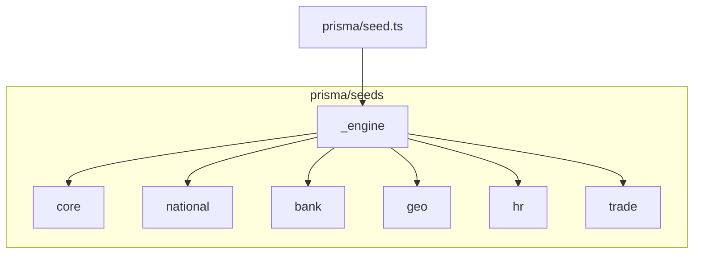

# Реструктуризация `prisma/seeds/` (core / national / bank / geo / trade + hr)

## Целевая структура

- **[`packages/database/prisma/seed.ts`](packages/database/prisma/seed.ts)** — без смены контракта: по-прежнему вызывает `_engine/runner.ts`.
- **`seeds/_engine/`** — остаётся (раннер, CLI, `upsert`); в [`seeds/README.md`](packages/database/prisma/seeds/README.md) явно описать роль `_engine` и целевые папки слоёв.
- **`prisma/catalog/`** — без изменений логики; только при необходимости поправить относительные импорты, если какой-то файл под `seeds/` сослался на старый путь (сейчас банки тянут каталог из [`national/az/banks.ts`](packages/database/prisma/seeds/national/az/banks.ts) — перенесём вызов в `bank/`).

## 1. Новый слой `seeds/bank/`

- Добавить [`packages/database/prisma/seeds/bank/index.ts`](packages/database/prisma/seeds/bank/index.ts) с `export async function seedBank(ctx)` — перенести туда содержимое текущего [`national/az/banks.ts`](packages/database/prisma/seeds/national/az/banks.ts) (glossary + `BANK_BRANCH_SEED_ROWS`).
- Удалить (или оставить тонкий re-export на время миграции — лучше удалить) [`national/az/banks.ts`](packages/database/prisma/seeds/national/az/banks.ts).
- Обновить [`national/az/index.ts`](packages/database/prisma/seeds/national/az/index.ts): оставить только **NAS (chart)** и **налоги (tax-rates)**; вызов банков убрать.

## 2. Переименование `geo-light` → `geo`

- Переименовать каталог [`seeds/geo-light/`](packages/database/prisma/seeds/geo-light/) → `seeds/geo/`.
- Обновить [`_engine/runner.ts`](packages/database/prisma/seeds/_engine/runner.ts):
  - импорт `seedGeo` из `../geo`;
  - ключ слоя **`geo`**;
  - для обратной совместимости зарегистрировать **алиас** `geo-light` → тот же handler (чтобы старые `--layers=geo-light` и скрипты не ломались сразу).
- Обновить [`_engine/cli.ts`](packages/database/prisma/seeds/_engine/cli.ts): дефолтный список слоёв заменить на согласованный порядок зависимостей, например **`core → national → hr → bank → geo → trade`** (банки после `core`/`national` не обязаны, но так HR остаётся рядом с «орг»-данными; при необходимости порядок можно сузить до вашего: `core, national, bank, geo, hr, trade` — зафиксируем в PR при реализации).
- Обновить [`packages/database/package.json`](packages/database/package.json): `db:seed:geo` → `--layers=geo`; добавить **`db:seed:bank`** → `--layers=bank`.
- Обновить корневой [`package.json`](package.json) passthrough для `db:seed:bank` (по аналогии с другими `db:seed:*`).

## 3. Слой `hr/` — без перемещения (по вашему выбору)

- Каталог [`seeds/hr/`](packages/database/prisma/seeds/hr/) и экспорт `seedHr` остаются; только поправить возможные относительные импорты, если затронут переезд `geo`.

## 4. Документация

- [`seeds/README.md`](packages/database/prisma/seeds/README.md) — актуальная схема папок и порядок слоёв.
- [`PRD.md`](PRD.md) / [`TZ.md`](TZ.md) — заменить перечисление слоёв (`geo-light` → `geo`, добавить `bank`), строки про `db:seed:*`.
- План в [`.cursor/plans/smart_seeding_architecture_475f9ae0.plan.md`](.cursor/plans/smart_seeding_architecture_475f9ae0.plan.md) вы просили раньше не редактировать — **не трогаем**, если вы снова не разрешите.

## 5. Проверки после рефакторинга

- `grep` по репо на `geo-light` (кроме алиаса в раннере и исторических упоминаний при желании).
- `npm test -w @dayday/database` (как минимум существующие тесты сидов / banks-md).
- Сухой прогон: `tsx prisma/seed.ts --dry-run` (если поддерживается) или локальный `db:seed` на пустой БД по вашему процессу.

## Риски

- Любые внешние скрипты с `--layers=...` нужно обновить на `geo` / добавить `bank`; алиас `geo-light` снимает часть боли.
- Перенумерация порядка слоёв по умолчанию может изменить **порядок** прогона относительно старого `geo-light` до `national` — при реализации сверимся с зависимостями (сейчас банки не завязаны на geo; chart/tax не завязаны на bank).
