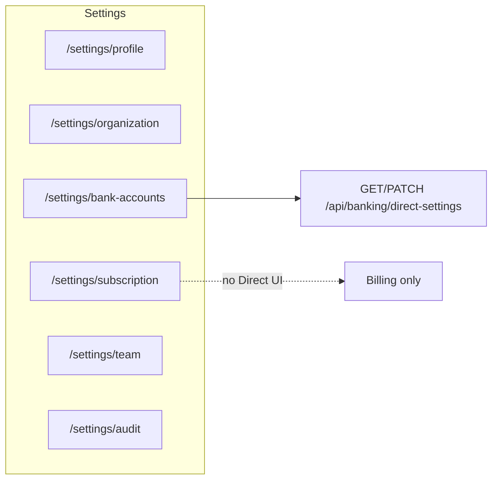

# Settings and Profile Refactoring Plan

## Baseline (already in repo)

- **Global audit:** [`AuditMutationInterceptor`](apps/api/src/audit/audit-mutation.interceptor.ts) is registered as `APP_INTERCEPTOR` in [`AuditModule`](apps/api/src/audit/audit.module.ts), imported by [`AppModule`](apps/api/src/app.module.ts). `PATCH /users/me` and `PATCH /organization/settings` are already covered for mutation audit (no duplicate interceptor needed unless you narrow scope later).
- **Audit log API:** [`GET /api/audit/logs`](apps/api/src/audit/audit.controller.ts) supports `page`, `pageSize`, `userId`, `from`, `to`, `entityType`, `action`; response `{ items, total, page, pageSize }` when paginated.
- **VÖEN in UI:** [`organization/page.tsx`](apps/web/app/settings/organization/page.tsx) already shows `taxId` as **read-only**; DTO [`PatchOrganizationSettingsDto`](apps/api/src/organizations/dto/patch-organization-settings.dto.ts) does **not** allow changing tax id via settings PATCH (lock is effectively server-side).

## Step 1 — Documentation updates (PRD.md / TZ.md)

**PRD** (Section around user profile / §7 or roadmap profile bullet ~line 136):

- Document **`User.emailVerifiedAt`** (nullable): when set, **self-service email change is disabled**; UI shows email as read-only with hint.
- Document **Settings → Bank Accounts** as the **primary place for Direct Banking (Open Banking / REST sync)** configuration; **remove** user-facing promise that Direct Banking lives only under Subscription (align with [`TZ.md`](TZ.md) §6.0 reference to `/settings/subscription` — change to **`/settings/bank-accounts`** + API unchanged `GET|PATCH /api/banking/direct-settings`).
- Briefly describe **profile layout**: two (or three) rounded-2xl cards — personal data, password change, optional integrity block unchanged if any.

**TZ.md** (§2.2 profile, §6.0 banking direct-settings):

- Update web path for Direct Banking UI from **`/settings/subscription`** to **`/settings/bank-accounts`** (shared component; subscription page no longer embeds it).
- Specify **`GET /api/users/me`** returns **`emailVerifiedAt: string | null` (ISO)**; **`PATCH /api/users/me`** rejects **`email`** change when `emailVerifiedAt != null` (409 or domain code — pick one and document).
- Note **VÖEN**: 10-digit validation at onboarding / register; **post-creation** changes are **out of scope** for self-service settings (display-only in org profile); optional future admin/support flow — do not imply “verification” flag beyond existing cipher + blind index.

Optional **schema comment** in [`schema.prisma`](packages/database/prisma/schema.prisma) next to `User`: `emailVerifiedAt` semantics (set by future verification job or admin).

## Step 2 — Backend

### 2.1 User email verification field

- Migration: add `emailVerifiedAt DateTime? @map("email_verified_at")` to [`User`](packages/database/prisma/schema.prisma).
- [`AuthService.getMeProfile`](apps/api/src/auth/auth.service.ts) / DTO response: include `emailVerifiedAt` (serialized ISO or null).
- [`UpdateMeDto`](apps/api/src/auth/dto/update-me.dto.ts) + `updateMe`: if `user.emailVerifiedAt != null` and client sends **`email`** different from current → **BadRequestException** or **Conflict** with stable `code` (document in TZ).
- **Seeding / existing users:** leave `null` (emails remain editable until verification is implemented elsewhere).

### 2.2 Organization (only if gaps found)

- No change required for VÖEN patch if DTO never exposed `taxId` (confirm no other endpoint allows org tax id mutation from tenant).

### 2.3 Direct banking data model (minimal for per-account UX)

Current [`bankingDirect`](apps/api/src/banking/banking-direct-settings.service.ts) is **org-level** (pasha/abb/kapital). To show **“Connect” per row** on [`OrganizationBankAccount`](packages/database/prisma/schema.prisma):

- **Preferred MVP:** extend JSON shape under `organization.settings.bankingDirect` with optional **`linkedOrganizationBankAccountId`** (single UUID) meaning “this org bank account is the integration anchor”, **or** per-provider map if product requires different accounts per bank (document chosen shape in TZ).
- **Alternative (lighter):** no schema change — bank-accounts page shows **one** Direct Banking card (reuse [`DirectBankingSection`](apps/web/app/settings/subscription/direct-banking-section.tsx) content) **above** the table; each row only shows **indirect** status (e.g. “Active” if global `syncActive` and row is primary) — weaker but faster.

**Recommendation in implementation:** start with **relocate UI + org-level section**; add `linkedOrganizationBankAccountId` only if you need true row-level linkage in v1.

## Step 3 — Web UI (`apps/web/app/settings`)

### 3.1 Profile [`profile/page.tsx`](apps/web/app/settings/profile/page.tsx)

- **Layout:** wrap blocks in **`CARD_CONTAINER_CLASS`** (rounded-2xl) per DESIGN.md:
  - Card A: name, email (disabled + helper when `emailVerifiedAt`), phone with **+994** mask (reuse or add small helper in [`apps/web/lib`](apps/web/lib)), locale **AZ/RU toggle** (segmented control or two buttons) instead of plain `<select>`.
  - Card B: **password only** — current password, new password, confirm; submit calls same `PATCH /api/users/me` with `passwordChange` only (optional: split submit buttons — “Save profile” vs “Change password” to avoid accidental password clears).
- **Forms:** prefer [`FORM_INPUT_CLASS`](apps/web/lib/form-styles.ts) / `FORM_LABEL_CLASS` for consistency with manufacturing refactor pattern.
- **Remove** collapsing password accordion if replaced by dedicated card.

### 3.2 Organization [`organization/page.tsx`](apps/web/app/settings/organization/page.tsx)

- Re-group **General** tab into three **rounded-2xl** cards:
  - **Legal Info:** name (if editable), legal address, **VÖEN** (read-only, 10-digit display).
  - **Company Details:** director, phone, valuation/toggles that belong with operations (keep period lock in separate section or fourth card as today).
  - **Identity:** logo preview + upload (`POST /api/organization/settings/logo`) + `logoUrl` display.
- Keep existing RBAC (`OWNER`/`ADMIN`/`ACCOUNTANT`) behavior.

### 3.3 Subscription [`subscription/page.tsx`](apps/web/app/settings/subscription/page.tsx)

- **Remove** import/render of [`DirectBankingSection`](apps/web/app/settings/subscription/direct-banking-section.tsx) (and `bankingPro` gating duplicated there — keep **only** subscription/billing UI).

### 3.4 Bank accounts [`bank-accounts/page.tsx`](apps/web/app/settings/bank-accounts/page.tsx)

- **Add** Direct Banking block (extract to e.g. [`apps/web/components/settings/direct-banking-panel.tsx`](apps/web/components/settings/direct-banking-panel.tsx) — move from subscription folder).
- **Table:** add column **“Direct sync”** or actions cell: **Connect / Connected / Read-only** driven by `GET /api/banking/direct-settings` + optional `linkedOrganizationBankAccountId` (see backend choice).
- Preserve existing [`OrganizationBankAccountModal`](apps/web/components/settings/organization-bank-account-modal.tsx) flows.

### 3.5 Team [`team/page.tsx`](apps/web/app/settings/team/page.tsx)

- Ensure table uses **Design system** tokens (`DATA_TABLE_*`, `text-[13px]` for body) consistently.
- **Invite:** move **email + role + submit** into **modal** (`Dialog` + `MODAL_DIALOG_CONTENT_CLASS`); primary action on `PageHeader` opens modal (pattern like [`employee-modal.tsx`](apps/web/app/employees/employee-modal.tsx)).
- Columns: **Name, Email, Role (Badge), Status (Badge), Actions** — map `MemberRow` + derive status (e.g. active membership vs pending invite if API provides; if not, badge “Active” only and invites in separate section).

### 3.6 Audit [`audit/page.tsx`](apps/web/app/settings/audit/page.tsx)

- Move **Date range** and **User** filters into [`PageHeader.actions`](apps/web/components/layout/page-header.tsx) (compact inputs / `TOOLBAR_MONTH_INPUT_CLASS` or date inputs per DESIGN.md).
- Keep table **high density** (`py-2 px-4` on cells as specified).
- Replace fixed `take=100` with **`parsePaginatedList`** + [`ListPaginationFooter`](apps/web/components/list-pagination-footer.tsx); call `GET /api/audit/logs?page=&pageSize=&...`.
- Retain integrity / detail modal behavior.

### 3.7 Sidebar

- No route changes needed ([`Sidebar.tsx`](apps/web/components/layout/Sidebar.tsx) already lists profile, subscription, team, organization, bank-accounts, audit).

## Step 4 — i18n and catalog

- New strings (RU/AZ) for: email verified hint, password card title, direct banking on bank accounts page, invite modal title, audit filter labels in header.
- Run **`npm run i18n:catalog`** and ensure **`npm run i18n:audit`** passes.

## Verification

- `npx tsc --noEmit` in `apps/web` and `apps/api`.
- Manual: profile save, password change, verified-email read-only (set `emailVerifiedAt` manually in DB for one user to verify), subscription page has no direct banking, bank accounts shows direct banking, audit pagination and filters.

## Mermaid — settings navigation after change

