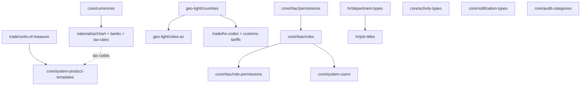

# Smart Seeding — Clean ERP

Idempotent layered seed engine that respects existing seeds (`bank-glossary-seed.ts`, `chart-seed.ts`, `pricing-module-seed.ts`, `seed-customs-tariff-rates.ts`, `prod-init.ts`) and adds the missing global catalogs as real Prisma models, all wired through one orchestrator with a region switch and per-layer CLI.

## 1. Schema additions (one Prisma migration)

New global (no `organization_id`) models in [packages/database/prisma/schema.prisma](packages/database/prisma/schema.prisma). All have `code` natural unique key and `nameAz/Ru/En` for i18n consistency with `ChartOfAccountsEntry`.

- `Role` — `code` unique (`OWNER/ADMIN/ACCOUNTANT/USER/...`), `legacyEnumRole UserRole?`, `isSystem Boolean`, `nameAz/Ru/En`. Existing `UserRole` enum stays (no breakage of `OrganizationMembership.role`); new `Role` is the source of truth for permission grants and future custom roles.
- `Permission` — `code` unique (`<module>.<action>`, e.g. `invoices.create`, `accounting.post`, `billing.manage`), `category`, `description`.
- `RolePermission` — `(roleId, permissionId)` composite PK.
- `Currency` — ISO-4217 `code` unique, `decimals`, `symbol`, `nameAz/Ru/En`, `isActive`, `sortOrder`. FK enforcement on existing `*.currency` columns is Phase 9 (separate migration after seed lands).
- `UnitOfMeasure` — `code` unique (`pcs/kg/m/m2/pack/litre/hour`), `kind` enum (`COUNT/WEIGHT/LENGTH/AREA/VOLUME/PACK/TIME`), `baseCode`, `factor` (decimal).
- `Country` — `iso2` unique, `iso3`, `dialingCode`, `currencyCode`, `nameAz/Ru/En`, `sortOrder`.
- `City` — `code` unique, `countryIso2`, `nameAz/Ru/En`, `isCapital`, `region`.
- `JobTitleCatalog` — `code` unique, `departmentTypeCode`, `nameAz/Ru/En` (universal global list; tenant `JobPosition` keeps a free `name`).
- `DepartmentTypeCatalog` — `code` unique, `nameAz/Ru/En`.
- `ActivityType` — `code` unique (`created/updated/deleted/commented/mentioned/posted/approved/rejected/...`), maps existing free `EntityActivity.verb` strings (no FK in this migration; soft contract via app code).
- `NotificationType` — `code` unique (e.g. `invoice.overdue`, `payroll.run.posted`), `defaultSeverity NotificationSeverity`, `nameAz/Ru/En`.
- `AuditCategory` — `code` unique (e.g. `auth/billing/accounting/payroll/inventory/integration`), `nameAz/Ru/En`.
- `TaxRate` — `code` unique (`EDV_18/EDV_0/EDV_EXEMPT/EXCISE_TOBACCO/...`), `kind` enum (`VAT/EXCISE/INCOME/SOCIAL`), `percent Decimal(7,4)`, `region` (`AZ`), `effectiveFrom`, `isActive`.
- `SystemProductTemplate` — global catalog of placeholder/system products (`code` like `__PSA_HOUR__`, `__DELIVERY__`), `kind` enum (`SERVICE/GOODS`), `defaultUomCode`, `defaultVatRateCode`, `nameAz/Ru/En`. Cloned into tenant `Product` rows on org onboarding (replaces inline ensure in [apps/api/src/psa/psa.service.ts](apps/api/src/psa/psa.service.ts) line 25).

Migration command sequence (per `dayday-local-dev.mdc`):

```bash
npm run db:migrate:dev -w @dayday/database   # single migration: 2026XXXX_smart_seeding_catalogs
npm run db:seed                                # run new orchestrator
```

## 2. File layout

```
packages/database/prisma/seeds/
  _engine/
    runner.ts                # layered orchestrator with timing + counts
    cli.ts                   # parses --layers, --region, --skip; reads SEED_REGION
    upsert.ts                # upsertByCode<T>() helper, used by all layers
    region.ts                # region resolver (default 'AZ')
  core/
    index.ts                 # seedCore(prisma)
    currencies.ts (+ currencies.data.ts)
    rbac/
      permissions.ts (+ permissions.data.ts)
      roles.ts (+ roles.data.ts)
      role-permissions.ts (+ matrix.data.ts)
    system-users.ts          # technical accounts only; super-admin stays in prod-init
    activity-types.ts (+ data)
    notification-types.ts (+ data)
    audit-categories.ts (+ data)
    system-product-templates.ts (+ data)
  national/
    az/
      index.ts               # seedNationalAz(prisma)
      chart-of-accounts.ts   # delegates to existing chart-seed.ts
      banks.ts               # delegates to existing bank-glossary-seed.ts
      tax-rates.ts (+ az.data.ts)   # EDV 18/0/exempt + excise samples
  hr/
    index.ts                 # seedHr(prisma)
    department-types.ts (+ data)
    job-titles.ts (+ data)
  trade/
    index.ts                 # seedTrade(prisma)
    units-of-measure.ts (+ data)
    hs-codes.ts              # 2-digit chapters (existing JSON), 4-digit extension hook
    customs-tariffs.ts       # delegates to existing seed-customs-tariff-rates.ts
  geo-light/
    index.ts                 # seedGeoLight(prisma)
    countries.ts (+ countries.data.json: ISO list)
    cities-az.ts (+ data)
```

`packages/database/prisma/seed.ts` becomes a thin entry that calls `_engine/runner.ts`. Existing scripts (`seed-tivi.ts`, `seed-nas-accounts.ts`, `prod-init.ts`, `seed-customs-tariff-rates.ts`) stay as-is and are re-imported from the new layer modules; no behavior change to docker-init or `prod-init.ts` (super-admin path).

## 3. Dependency matrix and execution order



Runner order (sequential, all idempotent):
1. `core/currencies` → `core/rbac` (permissions → roles → role_permissions) → `core/system-users` → `core/activity-types` → `core/notification-types` → `core/audit-categories`
2. `geo-light/countries` → `geo-light/cities-az`
3. `national/<region>` (chart-of-accounts → banks → tax-rates)
4. `hr/department-types` → `hr/job-titles`
5. `trade/units-of-measure` → `trade/hs-codes` → `trade/customs-tariffs`
6. `core/system-product-templates` (depends on UoM + tax codes)

## 4. Idempotency engine

Single helper in `_engine/upsert.ts`:

```ts
export async function upsertByCode<T extends { code: string }>(
  prisma: PrismaClient,
  model: keyof PrismaClient,
  rows: ReadonlyArray<T>,
  uniqueKey = "code",
): Promise<{ created: number; updated: number; total: number }>
```

- Every catalog row uses `prisma.<model>.upsert({ where: { [uniqueKey]: row.code }, create, update })`.
- For `RolePermission` and other M:N: diff-and-apply (compute desired set, `createMany` the missing pairs, `deleteMany` the obsolete ones — only inside `isSystem` rows so user customizations survive).
- `BankGlossary` two-phase pattern (already in [bank-glossary-seed.ts](packages/database/prisma/bank-glossary-seed.ts) lines 278–344) is the reference for handling unique-constraint shuffles.
- Test: a Jest spec runs the runner twice against an empty Postgres and asserts row counts unchanged on the second pass per layer.

## 5. CLI / npm scripts

In [packages/database/package.json](packages/database/package.json) (per-workspace) — add:

```json
{
  "db:seed": "tsx prisma/seed.ts",
  "db:seed:core": "tsx prisma/seed.ts --layers=core",
  "db:seed:national": "tsx prisma/seed.ts --layers=national",
  "db:seed:hr": "tsx prisma/seed.ts --layers=hr",
  "db:seed:trade": "tsx prisma/seed.ts --layers=trade",
  "db:seed:geo": "tsx prisma/seed.ts --layers=geo-light",
  "db:seed:placeholders": "tsx prisma/seed.ts --layers=core --only=system-product-templates"
}
```

In root [package.json](package.json) — passthrough:

```json
{
  "db:seed:core": "npm run db:seed:core -w @dayday/database",
  "db:seed:national": "dotenv -e .env -o -- npm run db:seed:national -w @dayday/database",
  "db:seed:hr": "npm run db:seed:hr -w @dayday/database",
  "db:seed:trade": "npm run db:seed:trade -w @dayday/database",
  "db:seed:geo": "npm run db:seed:geo -w @dayday/database"
}
```

CLI flags (parsed in `_engine/cli.ts`):
- `--layers=core,national,hr,trade,geo-light` (default: all)
- `--region=AZ` (default: `process.env.SEED_REGION ?? "AZ"`)
- `--skip=trade,hr`
- `--only=<module>` (e.g. `system-product-templates`)
- `--dry-run` (logs counts without writing)

## 6. Region toggle

`SEED_REGION` env (default `AZ`) drives `national/<region>/index.ts` dynamic import; if missing, runner logs `[seed] national region "<X>" not implemented, skipping` and continues. Adding `SK/RU/etc.` later is a new sibling folder, no engine changes.

## 7. Coexistence with existing seeds

- `prisma/seed.ts` keeps its current name (used by `prisma db seed` per [packages/database/package.json](packages/database/package.json) line 27); the body delegates to `_engine/runner.ts`.
- `bank-glossary-seed.ts`, `chart-seed.ts`, `pricing-module-seed.ts`, `seed-customs-tariff-rates.ts` are re-exported by the new layer modules; no logic moved or rewritten in this PR.
- `prod-init.ts` (super-admin, `system_config`, `template_ifrs_mappings`) is **NOT** touched — `core/system-users.ts` only adds technical accounts (e.g. `system+integrations@dayday.local`).
- `db:dev-bootstrap` and `db:prod-init` pipelines stay valid (they call `db:seed` which now hits the orchestrator).

## 8. Phase 9 — Enforce Currency FK on existing `currency String` columns

After seed Phase 1 lands and the `currencies` catalog is populated, lock all currency columns to FK references. Touched columns (13 total) in [packages/database/prisma/schema.prisma](packages/database/prisma/schema.prisma):

- `organizations.currency` (line 16)
- `organization_bank_accounts.currency` (line 185)
- `payment_orders.currency` (line 498)
- `bank_payment_drafts.currency` (line 895)
- `approval_policies.currency` (line 1177)
- `prepaid_expenses.currency` (line 1245)
- `psa_projects.currency` (line 1316)
- `accounts.currency` (line 1458)
- `counterparty_bank_accounts.currency` (line 1668)
- `invoices.currency` (line 1874)
- `customs_declarations.currency` (line 1974)
- `cash_orders.currency` (line 2186)
- `holdings.base_currency` (line 2444)

Steps:

1. **Audit script** [packages/database/prisma/audit-currency-codes.ts](packages/database/prisma/audit-currency-codes.ts) (new) — `SELECT DISTINCT currency, COUNT(*)` per table, then diff against `currencies(code)`. Exits non-zero on unknown codes unless `--allow-unknowns` is passed.
2. **Backfill / cleanup** in the same script: empty/null values normalized to org default (`AZN`); rare valid codes (e.g. `KZT`, `UAH`) appended to `core/currencies.data.ts` and re-seeded **before** the FK migration runs.
3. **Migration** `2026XXXX_currency_fk_enforcement` (Postgres allows text→text FK, no column shape change):

   ```sql
   ALTER TABLE organizations ADD CONSTRAINT organizations_currency_fkey
     FOREIGN KEY (currency) REFERENCES currencies(code) ON UPDATE CASCADE;
   -- repeat for the other 12 columns; holdings.base_currency keeps its name
   ```

4. **Schema sync**: add `currencyRef Currency @relation(...)` line to each model — column names stay (`currency` / `baseCurrency`), so app code is unchanged.
5. **App-level guard**: `Currency` rows can only be deactivated (`isActive=false`), never `DELETE`'d, while any FK rows reference them.

Risk: production may hold values not in the seed list — the audit script is the gate, CI fails if mismatches without an explicit override.

## 9. Phase 10 — UnitOfMeasure FK on tenant tables

Today `Product` has **no** UoM column at all — it's a DTO-only field appended into the product name in [apps/api/src/products/products.controller.ts](apps/api/src/products/products.controller.ts) line 103. The only persisted UoM string is `customs_declaration_items.unit String?` (schema line 2021). Phase 10 introduces the column properly as an FK from day one.

Migration `2026XXXX_uom_fk_enforcement`:

1. **Add column** `unit_of_measure_code String?` to:
   - `products`
   - `invoice_items`
   - `inventory_audit_lines`
2. **Rename + map** `customs_declaration_items.unit` → `unit_of_measure_code` (text→text). Backfill via lowercase-trim lookup table:
   - `шт|штук|pcs|piece|ədəd → pcs`
   - `kg|kq|кг|kilogram → kg`
   - `m|метр|metr → m`
   - `m2|m²|кв.м → m2`
   - `litr|литр|l → litre`
   - `paçka|pack → pack`
   - Unknowns logged, left `NULL`.
3. **Add FK** on all four columns:

   ```sql
   ALTER TABLE products
     ADD CONSTRAINT products_unit_of_measure_code_fkey
     FOREIGN KEY (unit_of_measure_code) REFERENCES units_of_measure(code) ON UPDATE CASCADE;
   ```

4. **App rewire**:
   - [apps/api/src/products/dto/create-product.dto.ts](apps/api/src/products/dto/create-product.dto.ts) — `unitOfMeasure?: string` → `unitOfMeasureCode?: string`, validated against the catalog.
   - [apps/api/src/products/products.controller.ts](apps/api/src/products/products.controller.ts) line 103 — stop merging UoM into `displayName`; write `unitOfMeasureCode` directly.
   - [apps/web/components/ui/product-combobox.tsx](apps/web/components/ui/product-combobox.tsx) — free input swapped for catalog dropdown driven by `GET /api/system/units-of-measure`.
   - Customs purchase modal — same swap.
5. **i18n**: `units_of_measure.nameAz/Ru/En` drives dropdown labels (consistent with `ChartOfAccountsEntry`).

Risk: existing product display names contain UoM in parentheses (`"Услуга (час)"`); the migration leaves names untouched — only adds the structured FK, so PDFs and reconciliation reports keep their historical wording.

## 10. Out of scope (explicitly deferred)

- `OrganizationMembership.customRoleId` (custom per-tenant roles) — schema field reserved but app code unchanged; tenant assignments still go through `UserRole` enum.
- 4–6 digit HS codes beyond existing 2-digit chapters — engine ready, data extension is a follow-up.
- District-level GEO (Baku rayonlari) — explicitly excluded by user TZ.
