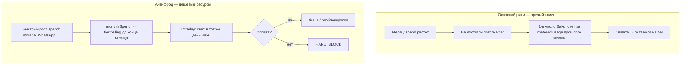

# Spend-tier billing pivot (зафиксировано)

## Продуктовые решения (LOCKED)

### Регистрация и trial

| Правило | Значение |
|---------|----------|
| Старт | `currentTier = TIER_0`, `isTrial = true` |
| Длительность trial | **3 календарных месяца** по дате регистрации в **Asia/Baku** (не 90 суток). Код уже близок: [`computeTrialExpiresAtBaku`](apps/api/src/subscription/trial-package.util.ts) |
| **Вариант B (LOCKED)** | Trial **не отключает** meter и tier-потолки. «3 месяца бесплатно» в маркетинге = **нет абонплаты Foundation (ERA Core)** + старт с **TIER_0**, а **не** «нулевой расход по всем осям» |
| Расход в trial | Metered usage **начисляется**; при накоплении (напр. 7 AZN без потолка) — **month-start счёт**; при достижении **потолка tier** — **intraday счёт** (см. антифрод) |
| Premium в trial | **Не входят** в trial (как и задумано): `tax_pro`, `trade_pro`, `compliance_pro` исключены в [`TRIAL_EXCLUDED_MODULE_SLUGS`](apps/api/src/subscription/trial-package.util.ts). Tier ladder и metered core — **в trial**; premium — только после коммерческой активации |

### Metered usage (вместо QUOTA_EXCEEDED / hard caps)

Цена за единицу в месяц (Super-Admin, `billing.quota_unit_pricing_v1` или successor):

- 1 user / month (seat)
- 1 GB storage / month
- 1 WhatsApp alert
- 1 invoice (Baku month)
- 1 OCR page

Операции **не режутся** жёстким `maxEmployees` → **402**. Накопление `monthlySpendAzn` в рамках `billingPeriodKey` (Baku). Блок — только при **неоплаченном долге** (`HARD_BLOCK`).

### TariffTier = потолок накопленного расхода за месяц

| Tier | Потолок расхода за текущий месяц (старт, editable) |
|------|-----------------------------------------------------|
| TIER_0 | 0 AZN (стартовая ступень) |
| TIER_1 | 10 AZN |
| TIER_2 | 50 AZN |
| TIER_3 | 200 AZN |

`currentTier` на org = **какой потолок сейчас действует**. Один tier на org (не per-axis).

### Два ритма выставления счетов

1. **Month-start (основной):** 1-го числа календарного месяца (**Asia/Baku**) — счёт за **фактический metered расход прошлого месяца**, если **не был** выставлен intraday tier-счёт (потолок не достигнут). Оплата → **tier не меняется**. Со временем большинство клиентов живут в этом ритме.

2. **Intraday tier invoice (антифрод):** если **до конца месяца** накопленный расход **достиг потолка** текущего tier (память и WhatsApp дешёвы → риск злоупотребления) — **счёт в тот же день**, уведомление, при неоплате **HARD_BLOCK**. При оплате — **следующий tier** (потолок 10 → 50 → 200).

**Не путать:** intraday — про **смену ступени потолка**; month-start — про **оплату usage-хвоста** без смены tier.

### Premium-модули (вне trial)

- Фиксированная **AZN/мес.** из `PricingModules`.
- **Не** входят в trial bundle.
- Строки в **month-start** счёте (или отдельная активация `activate-premium`) — **не** смешивать с tier ceiling meter.

### Foundation (ERA Core)

- В trial (`isTrial = true`, 3 календарных месяца Baku): **0 AZN** абонплата.
- После trial (`isTrial = false`): **Foundation** (если `foundationMonthlyAzn > 0`) — строка в **month-start** счёте 1-го числа; metered usage + tier ceilings **без изменений** (LOCKED).

---

## Что писать в PRD.md (черновик §16)

Заменить/переписать **§16 Hybrid Limits** на **§16 Spend-tier metering + debt ceilings**:

1. **§16.1 Principles** — вариант B trial; 3 calendar months Baku; premium excluded from trial; Asia/Baku billing period.
2. **§16.2 Unit price catalog** — 5 осей + Super-Admin; ссылка на `quota_unit_pricing`.
3. **§16.3 Tier spend ceilings** — таблица 0/10/50/200; `currentTier` semantics.
4. **§16.4 Billing rhythm** — month-start primary; intraday anti-fraud; HARD_BLOCK.
5. **§16.5 Premium add-ons** — вне trial; month-start lines.
6. **§16.6 Deprecations** — отменить «hard cap matrix» Phase 16 как enforcement; `maxWorkspaces` removed; `QUOTA_EXCEEDED` legacy.
7. **§16.7 Public storefront** — `/pricing` shows unit prices + tier ladder (not resource cap grid).
8. Синхронизировать **§7.6.5**, **§7.12**, маркетинг «3 месяца» = Foundation waiver + meter may bill.

**§17 Changelog** — запись 2026.06.x spend-tier pivot.

TZ **§24** — mirror: `BillingMeterService`, cron 1st Baku, intraday invoice API, поля Prisma.

---

## Противоречия с текущим кодом (ожидаемо, закрывается pivot)

| Сейчас | Цель |
|--------|------|
| Register `TIER_1` | `TIER_0` |
| `DEFAULT_TRIAL_DURATION_DAYS = 90` fallback | Всегда `computeTrialExpiresAtBaku(..., 3)` |
| `QuotaService.assert*` → 402 | Meter + block on debt |
| PRD §16.5 deprecates `accumulatedBalance` | Вернуть как source of truth для monthly spend |
| Cap matrix admin + `/pricing` | Unit prices + tier ceilings |
| `nextTariffTierAfterSettlement` on any pay | Tier++ только intraday tier invoice |

---

## Открытые вопросы

**Нет блокирующих.** Все продуктовые решения зафиксированы (trial B, 3 calendar months, premium вне trial, intraday = anti-fraud, month-start = основной ритм, Foundation после trial в month-start).

---

## Порядок реализации

1. **PRD + TZ** (этот алгоритм) — до кода.
2. Prisma + meter + invoices + auth TIER_0.
3. Super-Admin + `/pricing` + remove workspaces.
4. `npm run build` + сценарии steady + fraud spike.
