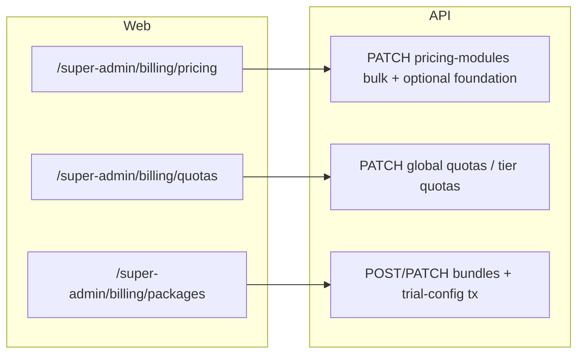

# Super-Admin Billing UI/UX Refactor

## Контекст кода (факты)

- Биллинг сейчас в [`apps/web/app/super-admin/page.tsx`](apps/web/app/super-admin/page.tsx): `SubsSubTab = "pricing" | "quotas" | "bundles" | "trial" | "referrals"`. Экран **Trial** — отдельная вкладка с `trialBundleId`, JSON `trialQuotas`, `PATCH /api/admin/pricing-bundles/:id/trial-config` (~2148–2281).
- **Прайс-лист:** Foundation сохраняется `PATCH /api/admin/config/billing/foundation`; модули — по одному [`PATCH /api/admin/pricing-modules/:idOrKey`](apps/api/src/admin/admin.controller.ts) → [`patchPricingModulePrice`](apps/api/src/admin/admin.service.ts) (один `update`, без транзакции).
- **Квоты:** дублируется блок Foundation (те же `foundationStr` + `PATCH .../foundation`, ~1454–1499); имена tier через [`tierLabel`](apps/web/app/super-admin/page.tsx) → `t("superAdmin.tierSTARTER")` и т.д. Поле **инвойсов в месяц** уже есть: `maxInvoicesPerMonth` / `superAdmin.tierQuotaFieldInvoicesMonth`.
- **Пакеты:** инлайн-форма создания + список с инлайн-редактированием (`editingBundleId`, ~1821–2146).
- Схема: [`PricingModule`](packages/database/prisma/schema.prisma) (`key`, `name`, `pricePerMonth`), Foundation — `SystemConfig` (`billing.foundation_monthly_azn` через [`SystemConfigService.setJson`](apps/api/src/system-config/system-config.service.ts)). Типа **`PricingKind`** в Prisma **нет**; в плане/доке формулировать «каталог `pricing_modules`».

## Документация (Step 1)

Обновить согласованно:

| Документ | Что зафиксировать |
|----------|-------------------|
| [PRD.md](PRD.md) §7.6 (таблица «Управление тарифами и ценами») | Три подраздела UI: **Прайс-лист** (`/super-admin/billing/pricing`) — Foundation + каталог модулей, **одно** сохранение цен модулей транзакционно; **Квоты** (`/quotas`) — без дублирования Foundation на этом экране; карточки по **STARTER / BUSINESS / ENTERPRISE** с **оригинальными** именами tier (не через i18n); модалка **редактирования** tier (legacy `billing.price.*` + квоты оси); **Пакеты** (`/packages`) — только список + модалка создания/редактирования; **Trial** настраивается **внутри** модалки пакета (флаги `isTrialDefault`, `trialDurationDays`, `trialQuotas`); отдельной вкладки Trial **нет**. |
| [TZ.md](TZ.md) §15.1–15.2, при необходимости §14.x про admin billing | Новые/изменённые маршруты API: bulk `PATCH` для цен модулей (и при необходимости bulk tier quotas); перечень UI-маршрутов `/super-admin/billing/...`; правило: **имена tier в админке — литералы enum**, имена **модулей/пакетов** — как в БД (`PricingModule.name`, `PricingBundle.name`) без перевода в этом разделе. |
| Changelog в PRD/TZ | Одна строка с датой по правилам репо. |

**Интегрити (API):** все новые/расширенные мутации, затрагивающие несколько строк БД, оформить через **`prisma.$transaction`**: bulk обновление `pricing_modules`, при объединении с Foundation — `systemConfig` upsert + `pricingModule.update` в одной транзакции (передача `tx` в хелперы или инлайн `tx.systemConfig` / `tx.pricingModule` в `AdminService`). Существующий [`patchPricingBundleTrialConfig`](apps/api/src/admin/admin.service.ts) (`updateMany` + `update`) — обернуть в **`$transaction`** для атомарности.

## UI-архитектура (Step 2)

Следовать [DESIGN.md](DESIGN.md): панели **`rounded-2xl`**, контролы **`rounded-lg`**, таблицы/поля **`text-[13px]`**, модалки по §Modal (без `border-t` на футере), токены из [`apps/web/lib/design-system.ts`](apps/web/lib/design-system.ts) / `form-classes` где уже используются.

**Маршрутизация (как Data hub):**

- Добавить сегмент [`apps/web/app/super-admin/billing/`](apps/web/app/super-admin/billing/) с **`layout.tsx`** (общая оболочка вкладок + загрузка `GET /api/admin/config/billing` через контекст или общий client layout), дочерние страницы:
  - `pricing/page.tsx` — Screen 1
  - `quotas/page.tsx` — Screen 2
  - `packages/page.tsx` — Screen 3
- С главной [`apps/web/app/super-admin/page.tsx`](apps/web/app/super-admin/page.tsx): ссылка «Подписка / биллинг» → `/super-admin/billing/pricing` (и при необходимости редирект старых якорей). Вкладку **`trial`** и связанный state убрать. Блок **referrals** оставить на `/super-admin` **или** вынести позже — в этом плане минимально: не дублировать referrals внутри `billing/` без запроса.
- Обновить [`Sidebar.tsx`](apps/web/components/layout/Sidebar.tsx): активное состояние для `/super-admin/billing`.

**Screen 1 — Tariffs (Pricing):**

- Одна карточка Foundation + таблица модулей; **одна** primary-кнопка «Сохранить» вызывает **новый** bulk endpoint с телом `{ foundationMonthlyAzn?: number, modules: { key: string, pricePerMonth: number }[] }` (или обязательно оба слоя — по согласованной валидации DTO).
- Убрать поштучные иконки сохранения строк (или оставить только как дубль — лучше убрать для единообразия).

**Screen 2 — Quotas:**

- Удалить дублирующий блок **Foundation** с этой вкладки (Foundation остаётся только на Screen 1).
- Заголовки tier: **`STARTER` / `BUSINESS` / `ENTERPRISE`** строкой, **без** `tierLabel` / `t("superAdmin.tier*")`.
- Карточки по образцу пакетов: для каждого tier — **`rounded-2xl`** карточка: legacy цена (`billing.price.*`), поля **`maxEmployees`**, **`maxInvoicesPerMonth`** (подпись i18n для «Hesab-fakturalar / invoices» в RU/AZ), **`maxStorageGb`**; кнопка **«Редактировать»** открывает **модалку** с тем же набором полей + явное «Сохранить» (без концепции «нового» tier — по уточнению пользователя).
- Глобальный блок (OCR, unit pricing, yearly discount, legacy tier prices если остаются в одном save): сохранение либо оставить одной кнопкой с последовательностью, либо (предпочтительно для integrity) один **`PATCH`** bulk на API в транзакции — см. API ниже.

**Screen 3 — Packages:**

- Список пакетов как сейчас, но **без** верхней инлайн-формы; кнопка **«+ Новый пакет»** (i18n) открывает **модалку** создания (имя, скидка, модули, превью).
- **Edit** — та же модалка с предзаполнением из `billing.pricingBundles` + `GET` уже в payload.
- **Trial:** в модалке — чекбокс «пакет по умолчанию для trial», число дней, поле `trialQuotas` (лучше структурированные поля под `maxEmployees` / `maxInvoicesPerMonth` / `maxStorageGb` + опционально raw JSON как advanced, либо только JSON если быстро) + вызов существующего **`PATCH .../trial-config`** при сохранении (в одной транзакции с `update` bundle, если объединяете PATCH bundle + trial — спроектировать один use-case в сервисе).
- Визуально: **badge/border** для `isTrialDefault` / trial bundle (токены DESIGN, без кастомных цветов вне палитры).

**Локализация:** новые/изменённые строки в [`packages/i18n/src/resources.ts`](packages/i18n/src/resources.ts) (ru + az); **`npm run i18n:catalog`** и коммит [`apps/api/src/admin/i18n-default-catalog-data.json`](apps/api/src/admin/i18n-default-catalog-data.json) в том же PR. **Имена tier в UI** — литералы, не ключи i18n.

## API (Step 3)

| Изменение | Детали |
|-----------|--------|
| **Bulk module prices** | `PATCH /api/admin/config/billing/pricing-modules` (или аналогичное имя): DTO массива `{ key, pricePerMonth }[]`; `AdminService` внутри **`this.prisma.$transaction`** — для каждого элемента `tx.pricingModule.update({ where: { key }, data: { pricePerMonth } })`. Опционально в том же endpoint: `foundationMonthlyAzn` → `tx` + upsert `system_config` (если объединяете с экраном 1). |
| **Опционально bulk quotas / global billing** | Если на Quotas остаётся одна кнопка «Сохранить глобальные лимиты»: `PATCH /api/admin/config/billing/global-quotas-settings` с телом, покрывающим yearly discount, `billing.price.*` для трёх tier, OCR, quota unit pricing — все `system_config` upsert в **одной** `$transaction`. Альтернатива меньшего scope: оставить существующие эндпоинты, но вызывать их последовательно только с UI-объединением (хуже для integrity) — **не рекомендовать**, если PO настаивает на транзакции. |
| **`patchPricingBundleTrialConfig`** | Обернуть в **`prisma.$transaction`**. При объединении с `updatePricingBundle` в одном запросе из модалки — один метод сервиса с `tx`. |

Контроллер: расширить [`admin.controller.ts`](apps/api/src/admin/admin.controller.ts); логика — [`admin.service.ts`](apps/api/src/admin/admin.service.ts); DTO в [`apps/api/src/admin/dto/`](apps/api/src/admin/dto/). **`AuditMutationInterceptor`** уже на мутациях админки — сохранить.

## Риски и проверки

- **Размер `page.tsx`:** перенос вынесет сотни строк — проверить, что `loadBilling` и типы `BillingPayload` шарятся (общий модуль `apps/web/lib/super-admin/billing-types.ts` или рядом с компонентами).
- **Регрессия referrals:** не ломать текущий таб `referrals` на `/super-admin`.
- **Тесты:** при наличии e2e/contract тестов на admin billing — обновить пути/тела запросов.

## Краткая схема потока после рефакторинга

